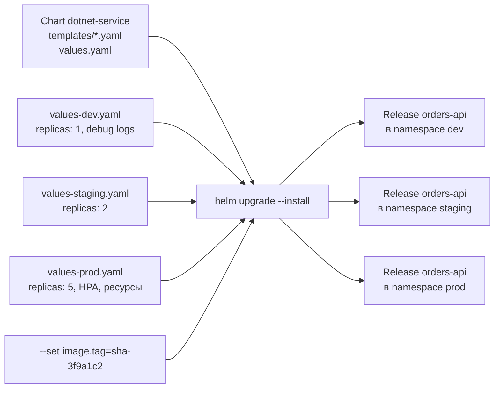
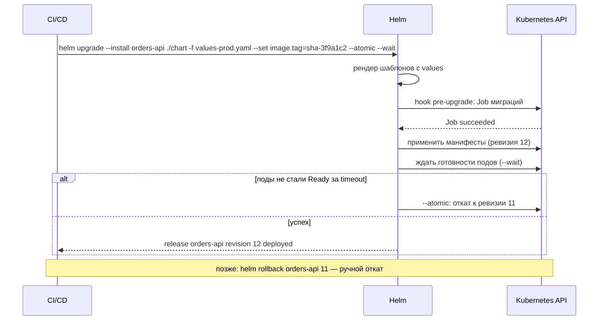
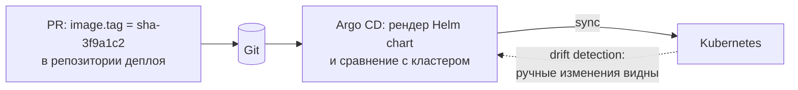

:::tldr
- **Helm** — пакетный менеджер Kubernetes. **Chart** — пакет: набор **шаблонов** манифестов (Deployment, Service, Ingress, ConfigMap, HPA...) + файл параметров **`values.yaml`** + метаданные (`Chart.yaml`).
- Проблема без Helm: десятки YAML-файлов, копипаста для каждого окружения (dev/staging/prod) и каждого сервиса, ручной `kubectl apply`, нет понятия «версия развёртывания» и отката.
- Helm **рендерит** шаблоны (Go templates) с значениями для конкретного окружения (`-f values-prod.yaml`, `--set image.tag=...`) и устанавливает их как **release** с **историей ревизий**: `helm upgrade --install`, `helm rollback`, `helm history`.
- Возможности: **зависимости** (chart PostgreSQL/Redis из репозитория), **hooks** (например, `pre-upgrade` Job с миграциями БД), `--atomic` (автооткат при неудаче), `--wait`, общие **library charts** для однотипных сервисов, OCI-реестры для хранения chart-ов.
- Альтернативы: **Kustomize** (патчи поверх базовых манифестов, встроен в kubectl), GitOps-инструменты **Argo CD / Flux** (часто рендерят Helm/Kustomize и синхронизируют из Git).
:::

## Проблема и решение



## Структура chart-а

```text
charts/orders-api/
├── Chart.yaml              # имя, версия chart-а, appVersion, зависимости
├── values.yaml             # значения по умолчанию
├── values-prod.yaml        # переопределения для окружения (часто хранятся рядом с деплой-конфигом)
├── templates/
│   ├── _helpers.tpl        # именованные шаблоны: имена, метки
│   ├── deployment.yaml
│   ├── service.yaml
│   ├── ingress.yaml
│   ├── configmap.yaml
│   ├── hpa.yaml
│   ├── migrations-job.yaml # hook: pre-upgrade
│   └── NOTES.txt           # подсказка после установки
└── charts/                 # скачанные зависимости
```

```yaml Chart.yaml
apiVersion: v2
name: orders-api
version: 1.3.0            # версия chart-а (шаблонов)
appVersion: "1.4.2"       # версия приложения по умолчанию
dependencies:
  - name: redis
    version: 20.x.x
    repository: oci://registry-1.docker.io/bitnamicharts
    condition: redis.enabled
```

```yaml values.yaml
replicaCount: 2
image:
  repository: registry.example.uz/orders-api
  tag: ""                       # по умолчанию — appVersion
resources:
  requests: { cpu: 250m, memory: 256Mi }
  limits: { memory: 512Mi }
env:
  ASPNETCORE_ENVIRONMENT: Production
ingress:
  enabled: true
  host: shop.example.uz
  path: /api/orders
autoscaling:
  enabled: false
  minReplicas: 2
  maxReplicas: 10
  targetCPU: 70
migrations:
  enabled: true
redis:
  enabled: false
```

## Шаблоны

```yaml templates/deployment.yaml
apiVersion: apps/v1
kind: Deployment
metadata:
  name: {{ include "orders-api.fullname" . }}
  labels: {{- include "orders-api.labels" . | nindent 4 }}
spec:
  {{- if not .Values.autoscaling.enabled }}
  replicas: {{ .Values.replicaCount }}
  {{- end }}
  selector:
    matchLabels: {{- include "orders-api.selectorLabels" . | nindent 6 }}
  template:
    metadata:
      labels: {{- include "orders-api.selectorLabels" . | nindent 8 }}
      annotations:
        checksum/config: {{ include (print $.Template.BasePath "/configmap.yaml") . | sha256sum }}   # перезапуск подов при изменении конфигурации
    spec:
      containers:
        - name: app
          image: "{{ .Values.image.repository }}:{{ .Values.image.tag | default .Chart.AppVersion }}"
          ports: [{ containerPort: 8080 }]
          envFrom: [{ configMapRef: { name: {{ include "orders-api.fullname" . }} } }]
          resources: {{- toYaml .Values.resources | nindent 12 }}
          readinessProbe: { httpGet: { path: /health/ready, port: 8080 } }
          livenessProbe: { httpGet: { path: /health/live, port: 8080 } }
```

```yaml templates/migrations-job.yaml — hook
{{- if .Values.migrations.enabled }}
apiVersion: batch/v1
kind: Job
metadata:
  name: {{ include "orders-api.fullname" . }}-migrations
  annotations:
    "helm.sh/hook": pre-install,pre-upgrade           # выполнить ДО обновления Deployment
    "helm.sh/hook-delete-policy": before-hook-creation,hook-succeeded
spec:
  backoffLimit: 1
  template:
    spec:
      restartPolicy: Never
      containers:
        - name: migrate
          image: "{{ .Values.image.repository }}-migrations:{{ .Values.image.tag | default .Chart.AppVersion }}"
          args: ["--connection", "$(ConnectionStrings__Default)"]   # EF migration bundle
          envFrom: [{ secretRef: { name: orders-api-secrets } }]
{{- end }}
```

## Жизненный цикл релиза



```bash Основные команды
helm lint ./charts/orders-api
helm template orders-api ./charts/orders-api -f values-prod.yaml   # посмотреть итоговый YAML без установки
helm upgrade --install orders-api ./charts/orders-api -n shop --create-namespace \
  -f values-prod.yaml --set image.tag=sha-3f9a1c2 --atomic --wait --timeout 10m
helm list -n shop
helm history orders-api -n shop
helm rollback orders-api 11 -n shop
helm diff upgrade orders-api ./charts/orders-api -f values-prod.yaml   # плагин helm-diff: что изменится
helm push orders-api-1.3.0.tgz oci://registry.example.uz/charts     # хранение в OCI-реестре
```

## Helm vs Kustomize vs GitOps

| | Helm | Kustomize | Argo CD / Flux |
|---|---|---|---|
| Подход | Шаблоны + значения | Базовые манифесты + патчи (overlays) | Синхронизация кластера с Git |
| Логика | Условия, циклы, функции | Нет шаблонов — декларативные патчи | Использует Helm/Kustomize для рендера |
| Релизы и откат | Да, история ревизий | Нет (через Git) | Да (через Git + UI) |
| Зависимости | Да | Нет | — |
| Сложность | Шаблоны читать сложнее | Проще | Дополнительная система |
| Когда | Переиспользуемые пакеты, сторонние приложения | Небольшие отличия окружений | Декларативный CD, аудит, drift detection |



## Хорошие практики

- Один **общий chart** (или library chart) для однотипных .NET-сервисов, различия — в values.
- Секреты — **не в values** в Git: External Secrets Operator, sealed-secrets, helm-secrets (SOPS), CSI driver.
- Тег образа — **неизменяемый** (SHA), `pullPolicy: IfNotPresent`.
- `checksum/config`-аннотация — перезапуск подов при изменении ConfigMap.
- `--atomic --wait` в CI; `helm diff` в PR для ревью изменений.
- Версионировать chart (SemVer) отдельно от приложения.

## Вопросы на засыпку

:::qa Чем version отличается от appVersion в Chart.yaml?
`version` — версия самого chart-а (шаблонов); меняется при изменении манифестов. `appVersion` — версия приложения, которое chart разворачивает по умолчанию (часто используется как тег образа). Один chart может развернуть разные версии приложения.
:::

:::qa Где Helm хранит информацию о релизах?
В Helm 3 — в Secret-ах (по умолчанию) в namespace релиза: каждая ревизия — отдельный Secret с отрендеренными манифестами и values. Tiller из Helm 2 больше не используется.
:::

:::qa Что делает флаг --atomic?
Если установка или обновление не завершились успешно (ошибка применения, поды не стали готовыми за `--timeout`), Helm автоматически откатывает релиз к предыдущей ревизии. Подразумевает `--wait`.
:::

:::qa Почему миграции БД через Helm hook могут быть опасны?
Hook выполняется при каждом `upgrade`; при неудаче релиз не обновится, но изменения схемы могут быть частично применены. Миграции должны быть идемпотентными и обратно совместимыми (expand/contract), а откат приложения (`helm rollback`) не откатывает схему. Некоторые команды выносят миграции в отдельный шаг пайплайна.
:::

## Итог

Helm упаковывает манифесты Kubernetes в параметризуемые chart-ы и управляет их развёртыванием как релизами с историей и откатом. Шаблоны + values убирают копипасту между окружениями и сервисами, hooks позволяют выполнять миграции, `--atomic` — безопасно откатываться. В связке с GitOps (Argo CD/Flux) Helm становится основой декларативного CD.
