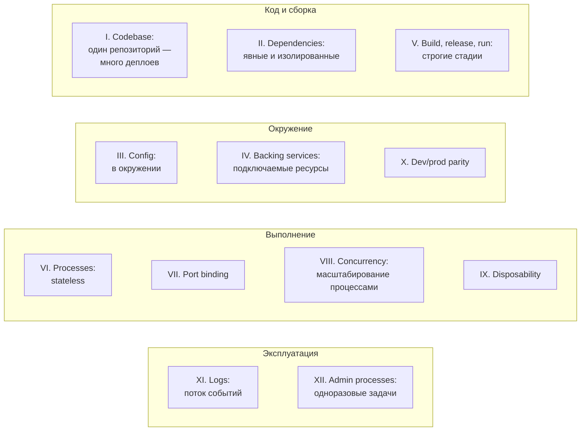
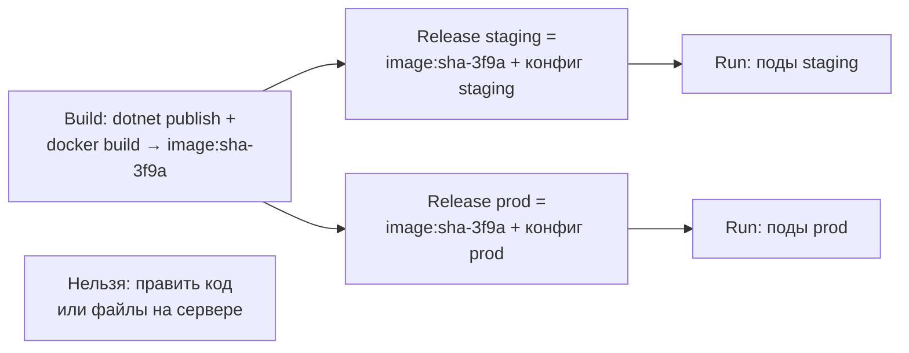

:::tldr
- **The Twelve-Factor App** (Heroku, 2011) — набор принципов для облачных сервисов: переносимость между окружениями, горизонтальное масштабирование, непрерывный деплой.
- Ключевые для .NET: **конфигурация в окружении** (переменные среды поверх `appsettings.json`, `Section__Key`), **backing services как подключаемые ресурсы** (строки подключения), **строгое разделение build/release/run** (один образ — разные конфиги), **stateless процессы** (никакого состояния в памяти/на диске между запросами — сессии и кэш в Redis/БД, Data Protection keys в общем хранилище), **port binding** (Kestrel сам слушает порт), **concurrency** через масштабирование процессов, **disposability** (быстрый старт, graceful shutdown по SIGTERM), **dev/prod parity** (Docker, Testcontainers), **логи как поток событий** в stdout, **admin processes** (миграции — отдельные одноразовые процессы).
- Современные дополнения («beyond 12 factor»): API-first, телеметрия (метрики, трассировка), безопасность и аутентификация.
:::

## Двенадцать факторов



| № | Фактор | Суть | Как в .NET |
|---|---|---|---|
| I | **Codebase** | Один репозиторий на приложение, много развёртываний | Один repo (или монорепо с отдельными сервисами), ветки/теги, не копии кода на окружение |
| II | **Dependencies** | Явное объявление и изоляция | NuGet `PackageReference`, lock-файлы, `global.json`, self-contained/контейнеры |
| III | **Config** | Конфигурация — в окружении, не в коде | `IConfiguration`: переменные среды `ConnectionStrings__Default` переопределяют `appsettings.json` |
| IV | **Backing services** | БД, кэш, брокер — подключаемые ресурсы по URL | Смена PostgreSQL на managed — только строка подключения |
| V | **Build, release, run** | Сборка → релиз (сборка + конфиг) → запуск | Образ собирается один раз, окружения различаются конфигурацией, релизы неизменяемы |
| VI | **Processes** | Stateless, share-nothing | Нет in-memory сессий и файлов между запросами; Redis, БД, blob storage |
| VII | **Port binding** | Приложение само экспортирует HTTP | Kestrel слушает `ASPNETCORE_HTTP_PORTS=8080` |
| VIII | **Concurrency** | Масштабирование добавлением процессов | Реплики в Kubernetes, отдельные worker-процессы для фоновых задач |
| IX | **Disposability** | Быстрый старт, корректная остановка | ReadyToRun/AOT, graceful shutdown по SIGTERM, `ShutdownTimeout`, идемпотентные задачи |
| X | **Dev/prod parity** | Окружения максимально похожи | Docker Compose с теми же PostgreSQL/Redis, Testcontainers, те же версии |
| XI | **Logs** | Логи — поток событий в stdout | Console/JSON-логирование, сбор агентами (Fluent Bit, OTel Collector) |
| XII | **Admin processes** | Разовые задачи — отдельными процессами того же релиза | EF migration bundle как Job, CLI-команды того же образа |

## III. Конфигурация в окружении

```csharp
// Одинаковый код во всех окружениях
builder.Services.AddOptions<SmtpOptions>().BindConfiguration("Smtp").ValidateDataAnnotations().ValidateOnStart();
var conn = builder.Configuration.GetConnectionString("Default");
```

```bash Различия — в окружении
# staging
ConnectionStrings__Default="Host=pg-staging;Database=shop;..."
Smtp__Host=smtp.staging.internal
# production
ConnectionStrings__Default="Host=pg-prod;Database=shop;..."
Smtp__Host=smtp.sendgrid.net
```

Тест на соблюдение фактора: можно ли прямо сейчас опубликовать репозиторий в open source, не раскрыв ни одного секрета? Если нет — конфигурация (или секреты) в коде.

## V. Build, release, run



## VI. Stateless процессы

```csharp Что ломает stateless в ASP.NET Core и как исправить
// Сессии в памяти → при балансировке пользователь «теряет» корзину
builder.Services.AddStackExchangeRedisCache(o => o.Configuration = redis);   // IDistributedCache
builder.Services.AddSession();                                               // сессии в распределённом кэше

// Ключи Data Protection (cookie аутентификации, antiforgery) — должны быть общими для всех экземпляров
builder.Services.AddDataProtection()
    .PersistKeysToStackExchangeRedis(ConnectionMultiplexer.Connect(redis), "DataProtection-Keys")
    .SetApplicationName("shop");

// Файлы пользователей — не в локальную файловую систему контейнера, а в blob/S3
```

## IX. Disposability

```csharp
builder.Services.Configure<HostOptions>(o => o.ShutdownTimeout = TimeSpan.FromSeconds(25));

public sealed class Worker(ILogger<Worker> log) : BackgroundService
{
    protected override async Task ExecuteAsync(CancellationToken stoppingToken)
    {
        await foreach (var job in queue.ReadAllAsync(stoppingToken))   // SIGTERM → отмена → корректный выход
            await ProcessAsync(job, stoppingToken);
    }
}
```

- Быстрый старт — важен для автомасштабирования и восстановления (ReadyToRun, AOT, лёгкая инициализация, прогрев в startup probe).
- Kubernetes посылает SIGTERM и ждёт `terminationGracePeriodSeconds` — приложение должно закончить текущие запросы и сообщения.
- Задачи должны переживать внезапную смерть процесса: очередь вернёт неподтверждённые сообщения — обработчики идемпотентны.

## XI. Логи как поток

```csharp
builder.Logging.ClearProviders();
builder.Logging.AddJsonConsole(o => o.IncludeScopes = true);   // структурные логи в stdout
// Маршрутизация, хранение, ротация — забота платформы (Fluent Bit → Loki/Elastic), не приложения
```

## XII. Административные процессы

```bash
# Миграции — тем же релизом, отдельным процессом
kubectl create job migrate-3f9a --image=registry/orders-api-migrations:sha-3f9a -- ./efbundle --connection "$CONN"

# Разовые команды — CLI-режим того же приложения
dotnet Shop.Api.dll seed-demo-data   # System.CommandLine / отдельный entry point
```

## За пределами 12 факторов

Кевин Хоффман («Beyond the Twelve-Factor App») добавил: **API first**, **телеметрия** (метрики, трассировка, health checks), **аутентификация и авторизация** как часть дизайна. Для .NET — OpenTelemetry, health checks, OIDC.

## Вопросы на засыпку

:::qa Нарушает ли appsettings.json фактор III?
Нет, если в нём только значения по умолчанию и неконфиденциальные настройки, а всё, что различается между окружениями (строки подключения, адреса, секреты), приходит из окружения. Система конфигурации .NET изначально устроена по этому принципу — переменные среды переопределяют файлы.
:::

:::qa Почему нельзя хранить загруженные файлы на диске контейнера?
Контейнер эфемерен: при перезапуске или переносе пода файлы исчезают, а другие реплики их не видят. Файлы — в объектное хранилище (S3, Azure Blob, MinIO) как backing service.
:::

:::qa Что будет с cookie-аутентификацией при нескольких экземплярах без общих ключей Data Protection?
Каждый экземпляр сгенерирует свои ключи шифрования. Cookie, выданная одним подом, не расшифруется другим — пользователя будет «разлогинивать» при попадании на другой под, antiforgery-токены станут невалидными. Ключи нужно хранить в общем месте (Redis, БД, blob + Key Vault).
:::

:::qa Все ли факторы применимы к микросервисам на Kubernetes?
Да, и платформа во многом помогает: ConfigMap/Secret (III), Services и DNS (IV), образы и Helm (V), реплики и HPA (VIII), SIGTERM и probes (IX), сбор stdout (XI), Jobs (XII). Приложение должно лишь не мешать: быть stateless, читать конфигурацию из окружения и корректно завершаться.
:::

## Итог

12 факторов — чек-лист облачного сервиса: конфигурация в окружении, один неизменяемый артефакт, stateless-процессы с внешними backing services, быстрый старт и корректная остановка, логи в stdout, административные задачи — отдельными процессами. ASP.NET Core и Kubernetes поддерживают эти принципы из коробки — важно не нарушать их in-memory состоянием и конфигурацией в коде.
