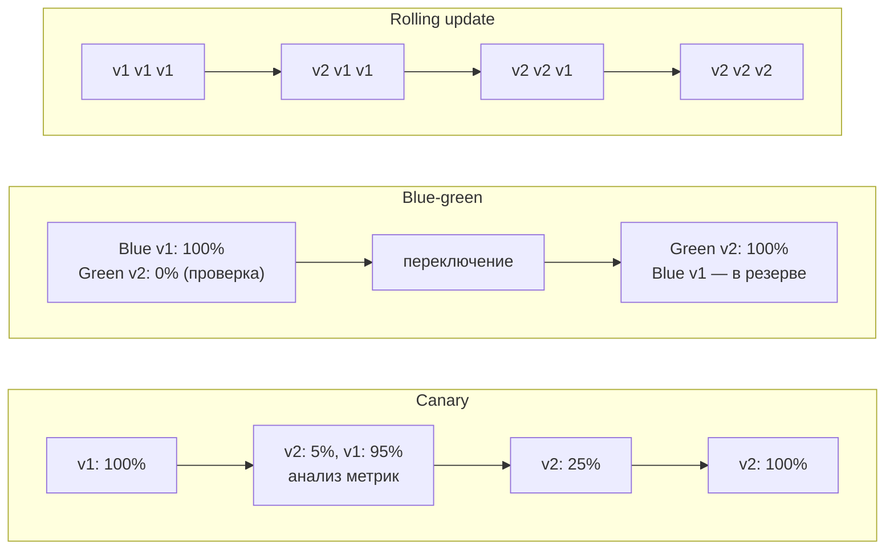
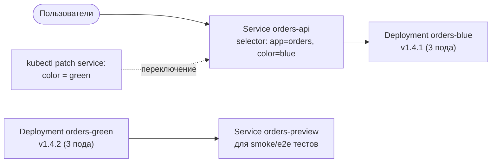
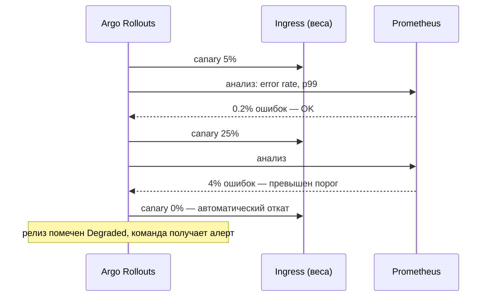
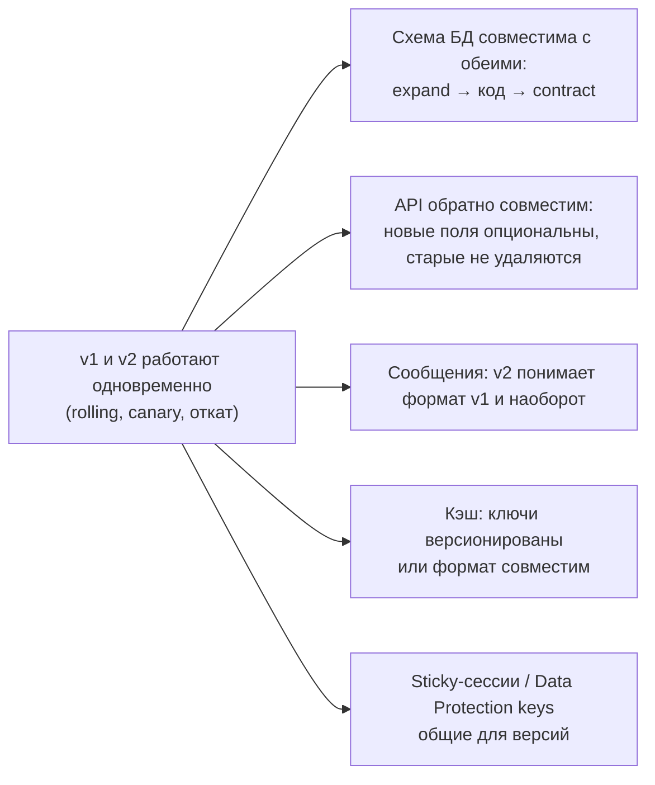

:::tldr
- **Rolling update** (по умолчанию в Kubernetes) — поды заменяются постепенно; старая и новая версии работают **одновременно**; откат — такой же постепенный.
- **Blue-green** — два полных окружения: **blue** (текущая версия, весь трафик) и **green** (новая). Green разворачивается и проверяется **без трафика**, затем трафик **переключается целиком** (балансировщик/Service/DNS). Откат — мгновенное переключение обратно. Цена — двойные ресурсы на время релиза.
- **Canary** — новая версия получает **небольшую долю трафика** (1% → 5% → 25% → 100%), на каждом шаге сравниваются **метрики** (ошибки, латентность, бизнес-показатели); при ухудшении — **автоматический откат**. Ограничивает «радиус поражения».
- Реализация в Kubernetes: два Deployment + переключение selector Service (blue-green), Ingress/Gateway API с весами, service mesh (Istio, Linkerd), **Argo Rollouts** / **Flagger** (автоматический canary по метрикам Prometheus). Облака: слоты Azure App Service, AWS CodeDeploy.
- Обязательное условие любой стратегии — **совместимость версий**: схема БД и контракты API/сообщений должны работать одновременно со старой и новой версией (expand/contract).
- **Feature flags** дополняют стратегии: деплой кода отделяется от **включения** функции.
:::

## Стратегии развёртывания



| | Rolling | Blue-green | Canary |
|---|---|---|---|
| Трафик на новую версию | Постепенно (по числу подов) | 0% → 100% разом | Контролируемая доля |
| Одновременная работа версий | Да | Коротко (или нет) | Да, долго |
| Ресурсы | +1 под (maxSurge) | ×2 на время релиза | Немного больше |
| Откат | Постепенный (новая раскатка) | **Мгновенный** | Быстрый (доля → 0) |
| Проверка до трафика | Только readiness | **Полная** (smoke/e2e на green) | На реальном трафике малой доли |
| Радиус поражения при баге | Растёт с раскаткой | 100% после переключения | **Минимальный** |
| Сложность | Встроено | Средняя | Выше: маршрутизация по весам, анализ метрик |

## Blue-green в Kubernetes



```bash
# 1. Развернуть green рядом с blue
helm upgrade --install orders-green ./chart --set color=green --set image.tag=1.4.2
# 2. Проверить через preview-сервис
./smoke-tests.sh http://orders-preview.shop.svc
# 3. Переключить трафик
kubectl patch service orders-api -p '{"spec":{"selector":{"app":"orders","color":"green"}}}'
# 4. Откат (если нужно) — вернуть selector на blue; blue удаляют после периода наблюдения
```

В Azure App Service — **deployment slots**: развернуть в слот `staging`, прогреть, **swap** со слотом `production`.

## Canary с Argo Rollouts

```yaml rollout.yaml
apiVersion: argoproj.io/v1alpha1
kind: Rollout
metadata: { name: orders-api }
spec:
  replicas: 10
  selector: { matchLabels: { app: orders-api } }
  template: { ... }                                   # как в Deployment
  strategy:
    canary:
      canaryService: orders-api-canary
      stableService: orders-api-stable
      trafficRouting:
        nginx: { stableIngress: orders-api }            # или istio / Gateway API
      steps:
        - setWeight: 5
        - pause: { duration: 10m }
        - analysis: { templates: [ { templateName: error-rate } ] }
        - setWeight: 25
        - pause: { duration: 10m }
        - analysis: { templates: [ { templateName: error-rate } ] }
        - setWeight: 50
        - pause: { duration: 10m }
---
apiVersion: argoproj.io/v1alpha1
kind: AnalysisTemplate
metadata: { name: error-rate }
spec:
  metrics:
    - name: error-rate
      interval: 1m
      failureLimit: 2
      successCondition: result[0] < 0.01             # < 1% ошибок 5xx
      provider:
        prometheus:
          address: http://prometheus:9090
          query: |
            sum(rate(http_server_request_duration_seconds_count{service="orders-api-canary",http_response_status_code=~"5.."}[2m]))
            / sum(rate(http_server_request_duration_seconds_count{service="orders-api-canary"}[2m]))
```



Что сравнивать на canary: долю 5xx, латентность p95/p99, насыщение (CPU, память), **бизнес-метрики** (конверсия оформления заказа, число оплат). Для честного сравнения — canary против baseline той же численности.

## Условия безопасного релиза



- **Миграции** — expand/contract: добавить столбец (nullable) → выкатить код, пишущий в оба → перевести чтение → удалить старое следующим релизом.
- **Откат приложения ≠ откат БД**: новая версия схемы должна поддерживать старую версию кода.
- **Наблюдаемость**: метрики и трассировки с тегом версии (`service.version`) — чтобы видеть разницу canary vs stable.

## Feature flags

```csharp Microsoft.FeatureManagement
builder.Services.AddFeatureManagement();

app.MapPost("/checkout", async (IFeatureManager features, CheckoutRequest req) =>
    await features.IsEnabledAsync("NewCheckout")
        ? await newCheckout.HandleAsync(req)
        : await oldCheckout.HandleAsync(req));
```

```json appsettings.json — постепенное включение
{
  "FeatureManagement": {
    "NewCheckout": {
      "EnabledFor": [ { "Name": "Microsoft.Percentage", "Parameters": { "Value": 10 } } ]
    }
  }
}
```

Флаги позволяют деплоить код «выключенным», включать функцию для процента пользователей, тестировщиков или региона и мгновенно выключать без деплоя. Важно удалять флаги после завершения раскатки — иначе накапливается технический долг.

## Вопросы на засыпку

:::qa Чем canary отличается от A/B-тестирования?
Canary проверяет **техническое** качество новой версии (ошибки, производительность) и стремится к 100%. A/B-тест сравнивает **бизнес-эффект** двух вариантов функции (конверсия) на разных сегментах пользователей, часто долго и с продуктовым анализом. Технически оба используют разделение трафика и feature flags.
:::

:::qa Как в blue-green поступить с базой данных?
Обычно БД общая для blue и green, поэтому изменения схемы должны быть совместимы с обеими версиями (expand/contract). Две отдельные БД с синхронизацией — сложно и редко оправдано.
:::

:::qa Почему rolling update не всегда безопасен?
Во время раскатки часть запросов обслуживает v1, часть — v2; пользователь может попасть на разные версии в соседних запросах. Если v2 несовместима (API, формат сессии, схема), возникают ошибки. Кроме того, баг затрагивает всё больше пользователей по мере раскатки без автоматической проверки метрик.
:::

:::qa Что такое progressive delivery?
Общее название подходов, при которых изменения доставляются постепенно с автоматической проверкой: canary с анализом метрик, feature flags с процентным включением, blue-green с проверками, автоматический откат. Инструменты — Argo Rollouts, Flagger, LaunchDarkly/Unleash.
:::

## Итог

Rolling update — стратегия по умолчанию, blue-green даёт полную проверку до переключения и мгновенный откат ценой двойных ресурсов, canary минимизирует радиус поражения постепенной раскаткой с анализом метрик. Любая стратегия требует совместимости версий (БД, API, сообщения) и наблюдаемости, а feature flags отделяют деплой от включения функциональности.
