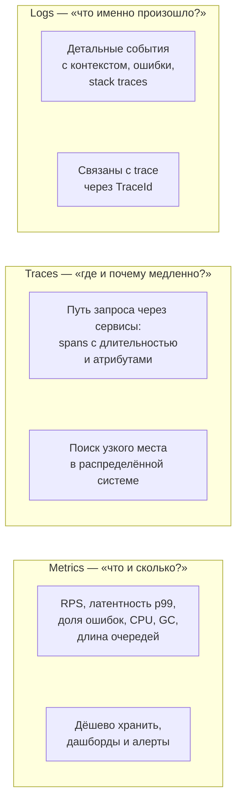
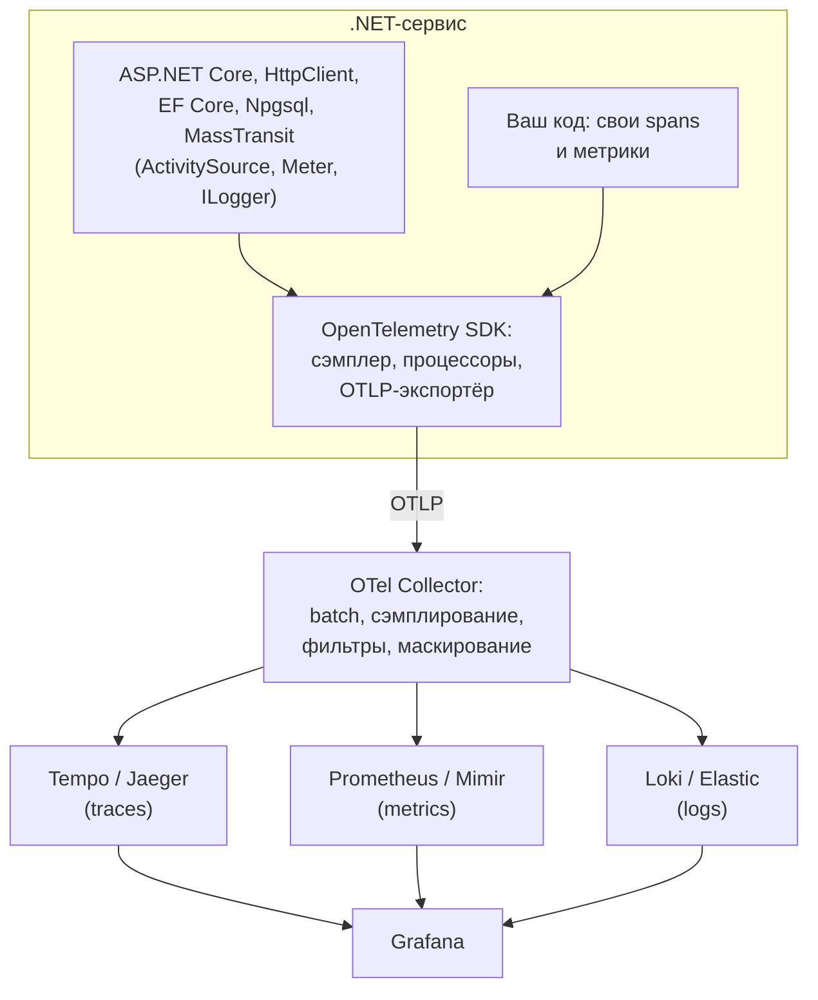

:::tldr
- **OpenTelemetry (OTel)** — открытый вендор-нейтральный стандарт (CNCF) и набор SDK для сбора **телеметрии**: **трассировок** (traces), **метрик** (metrics) и **логов** (logs). Один способ инструментирования — любой бэкенд: Jaeger, Tempo, Prometheus, Grafana, Loki, Elastic, Datadog, Azure Monitor, Honeycomb.
- В .NET OTel построен на **встроенных API платформы**: `System.Diagnostics.Activity`/`ActivitySource` (трассировка), `System.Diagnostics.Metrics.Meter` (метрики), `ILogger` (логи). Библиотеки (ASP.NET Core, HttpClient, EF Core, Npgsql, MassTransit, gRPC) уже публикуют данные — их нужно только **включить**.
- Подключение: пакеты `OpenTelemetry.Extensions.Hosting` + инструментации + экспортёр; `AddOpenTelemetry().WithTracing(...).WithMetrics(...)` и `logging.AddOpenTelemetry(...)`. Экспорт по протоколу **OTLP** (gRPC/HTTP).
- **OpenTelemetry Collector** — промежуточный агент/шлюз: принимает телеметрию, обрабатывает (сэмплирование, фильтрация, обогащение, маскирование), отправляет в один или несколько бэкендов. Приложение не знает о конечных системах.
- Важно: **resource**-атрибуты (`service.name`, `service.version`, `deployment.environment`), **сэмплирование** трассировок, распространение контекста **W3C Trace Context**, собственные spans и метрики для бизнес-операций. Для локальной разработки удобна **.NET Aspire Dashboard**.
:::

## Три сигнала наблюдаемости



Сила OTel — **корреляция**: алерт по метрике → exemplar-ссылка на конкретный trace → логи этого trace по `TraceId`.

## Архитектура



## Подключение

```xml Пакеты
<PackageReference Include="OpenTelemetry.Extensions.Hosting" />
<PackageReference Include="OpenTelemetry.Exporter.OpenTelemetryProtocol" />
<PackageReference Include="OpenTelemetry.Instrumentation.AspNetCore" />
<PackageReference Include="OpenTelemetry.Instrumentation.Http" />
<PackageReference Include="OpenTelemetry.Instrumentation.Runtime" />
<PackageReference Include="Npgsql.OpenTelemetry" />
```

```csharp Program.cs
var serviceName = "orders-api";

builder.Services.AddOpenTelemetry()
    .ConfigureResource(r => r
        .AddService(serviceName, serviceVersion: typeof(Program).Assembly.GetName().Version?.ToString())
        .AddAttributes(new Dictionary<string, object> { ["deployment.environment"] = builder.Environment.EnvironmentName }))
    .WithTracing(t => t
        .AddAspNetCoreInstrumentation(o => o.Filter = ctx => !ctx.Request.Path.StartsWithSegments("/health"))
        .AddHttpClientInstrumentation()
        .AddNpgsql()                                          // spans для SQL-команд
        .AddSource("MassTransit")                             // spans брокера
        .AddSource(OrdersTelemetry.ActivitySourceName)        // свои spans
        .SetSampler(new ParentBasedSampler(new TraceIdRatioBasedSampler(0.1))))   // 10% новых трассировок
    .WithMetrics(m => m
        .AddAspNetCoreInstrumentation()                       // http.server.request.duration
        .AddHttpClientInstrumentation()
        .AddRuntimeInstrumentation()                          // GC, потоки, память
        .AddMeter(OrdersTelemetry.MeterName))
    .UseOtlpExporter();                                       // OTEL_EXPORTER_OTLP_ENDPOINT из окружения

builder.Logging.AddOpenTelemetry(o =>
{
    o.IncludeFormattedMessage = true;
    o.IncludeScopes = true;                                   // логи уходят по OTLP вместе с TraceId/SpanId
});
```

Настройка через стандартные переменные окружения:

```bash
OTEL_EXPORTER_OTLP_ENDPOINT=http://otel-collector:4317
OTEL_SERVICE_NAME=orders-api
OTEL_RESOURCE_ATTRIBUTES=deployment.environment=production,service.namespace=shop
```

## Собственная инструментация

```csharp
public static class OrdersTelemetry
{
    public const string ActivitySourceName = "Shop.Orders";
    public const string MeterName = "Shop.Orders";

    public static readonly ActivitySource Source = new(ActivitySourceName);
    private static readonly Meter Meter = new(MeterName);

    public static readonly Counter<long> OrdersPlaced = Meter.CreateCounter<long>("shop.orders.placed", description: "Оформленные заказы");
    public static readonly Histogram<double> OrderAmount = Meter.CreateHistogram<double>("shop.orders.amount", unit: "UZS");
}

public async Task<Guid> Handle(PlaceOrder cmd, CancellationToken ct)
{
    using var activity = OrdersTelemetry.Source.StartActivity("PlaceOrder");     // новый span (null, если не сэмплируется)
    activity?.SetTag("order.items_count", cmd.Items.Count);
    activity?.SetTag("customer.tier", cmd.CustomerTier);

    try
    {
        var order = await PlaceAsync(cmd, ct);
        OrdersTelemetry.OrdersPlaced.Add(1, new KeyValuePair<string, object?>("payment.method", cmd.PaymentMethod));
        OrdersTelemetry.OrderAmount.Record((double)order.Total);
        return order.Id;
    }
    catch (Exception ex)
    {
        activity?.SetStatus(ActivityStatusCode.Error, ex.Message);
        activity?.AddException(ex);
        throw;
    }
}
```

:::warning Высокая кардинальность
Не используйте в тегах **метрик** уникальные значения (`order.id`, `user.id`, email): каждая комбинация тегов — отдельный временной ряд, и хранилище метрик «взорвётся». Для spans уникальные атрибуты допустимы (но не персональные данные!).
:::

## OpenTelemetry Collector

```yaml otel-collector.yaml
receivers:
  otlp:
    protocols: { grpc: { endpoint: 0.0.0.0:4317 }, http: { endpoint: 0.0.0.0:4318 } }
processors:
  batch: {}
  memory_limiter: { check_interval: 1s, limit_percentage: 80 }
  attributes/redact:
    actions:
      - { key: http.request.header.authorization, action: delete }   # не хранить токены
  tail_sampling:                         # решать о сохранении трассировки после её завершения
    policies:
      - { name: errors, type: status_code, status_code: { status_codes: [ERROR] } }
      - { name: slow, type: latency, latency: { threshold_ms: 1000 } }
      - { name: sample, type: probabilistic, probabilistic: { sampling_percentage: 5 } }
exporters:
  otlp/tempo: { endpoint: tempo:4317, tls: { insecure: true } }
  prometheusremotewrite: { endpoint: http://mimir:9009/api/v1/push }
  otlphttp/loki: { endpoint: http://loki:3100/otlp }
service:
  pipelines:
    traces:  { receivers: [otlp], processors: [memory_limiter, tail_sampling, batch], exporters: [otlp/tempo] }
    metrics: { receivers: [otlp], processors: [memory_limiter, batch], exporters: [prometheusremotewrite] }
    logs:    { receivers: [otlp], processors: [memory_limiter, attributes/redact, batch], exporters: [otlphttp/loki] }
```

Collector позволяет менять бэкенды, сэмплирование и фильтрацию без изменения кода сервисов. **Tail sampling** сохраняет все ошибочные и медленные трассировки и лишь долю «нормальных».

## Локальная разработка: .NET Aspire Dashboard

```bash
docker run --rm -p 18888:18888 -p 4317:18889 mcr.microsoft.com/dotnet/aspire-dashboard:9.0
# OTEL_EXPORTER_OTLP_ENDPOINT=http://localhost:4317 → логи, трассировки и метрики в браузере на :18888
```

## Сэмплирование

| Вид | Где решается | Плюсы | Минусы |
|---|---|---|---|
| **Head-based** (`TraceIdRatioBased`) | В начале трассировки, в SDK | Дёшево, простая настройка | Случайно теряются редкие ошибки |
| **ParentBased** | Уважает решение вызывающего сервиса | Цельные трассировки через сервисы | — |
| **Tail-based** | В Collector после завершения trace | Сохраняет все ошибки и медленные | Collector держит спаны в памяти, сложнее масштабировать |

## Вопросы на засыпку

:::qa Почему в .NET нет отдельного «OpenTelemetry API» для трассировки?
Команда .NET реализовала концепции OTel в самой платформе: `Activity` = span, `ActivitySource` = tracer, `Meter` = meter. Поэтому библиотеки инструментируются без зависимости от пакетов OTel, а SDK OpenTelemetry лишь подписывается на эти источники и экспортирует данные.
:::

:::qa Чем OpenTelemetry отличается от Prometheus-клиента или Application Insights SDK?
Это стандарт и SDK, не привязанные к бэкенду: инструментирование делается один раз, а данные можно отправить куда угодно через экспортёры или Collector. Специфичные SDK привязывают код к конкретному вендору. Azure Monitor, Datadog и другие сами поддерживают приём OTLP.
:::

:::qa Что такое resource в OTel?
Набор атрибутов, описывающих источник телеметрии: `service.name`, `service.version`, `service.instance.id`, `deployment.environment`, `k8s.pod.name` и т.п. Прикрепляется ко всем сигналам и позволяет фильтровать и группировать данные по сервисам, версиям и окружениям.
:::

:::qa Нужны ли логи, если есть трассировки?
Да: трассировка показывает структуру и время операций, логи — детали (сообщения об ошибках, решения бизнес-логики, контекст). OTel связывает их через TraceId/SpanId в каждой записи лога, поэтому из trace можно сразу открыть его логи.
:::

## Итог

OpenTelemetry — единый стандарт для трассировок, метрик и логов. В .NET он опирается на встроенные `Activity`, `Meter` и `ILogger`: подключите пакеты инструментаций, задайте resource и экспорт по OTLP, добавьте свои spans и метрики для бизнес-операций, а маршрутизацию, сэмплирование и маскирование вынесите в Collector.
