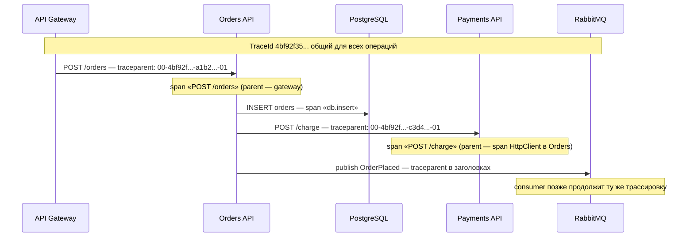
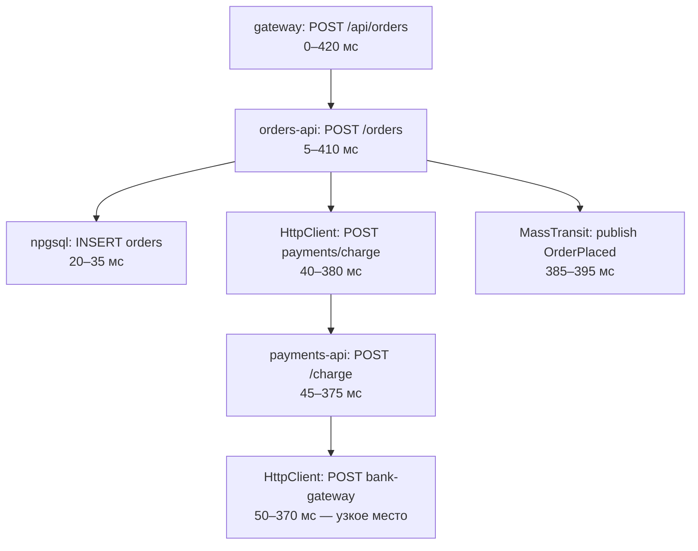
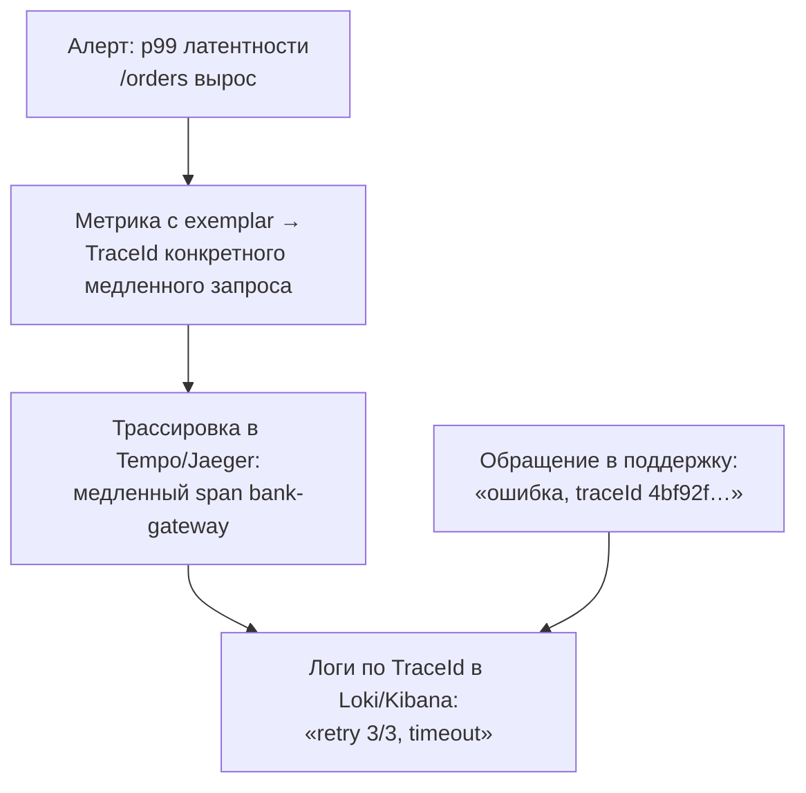

:::tldr
- **Трассировка (trace)** — полная история одного запроса через все сервисы; состоит из **spans** — операций с началом, длительностью, атрибутами и статусом (HTTP-обработка, SQL-запрос, вызов API, обработка сообщения). Spans образуют **дерево** через parent-child связи.
- **TraceId** (16 байт) — общий для всех spans одной трассировки; **SpanId** (8 байт) — уникален для каждой операции; **ParentSpanId** — связь с родителем.
- **Распространение контекста**: при вызове другого сервиса TraceId и SpanId передаются в заголовке **`traceparent`** (стандарт **W3C Trace Context**; ещё `tracestate`, `baggage`). В сообщениях брокера — в заголовках сообщения.
- В .NET span = **`Activity`**; ASP.NET Core создаёт Activity на каждый входящий запрос (продолжая `traceparent`), `HttpClient` автоматически добавляет заголовок в исходящие. `Activity.Current` доступна везде (через `AsyncLocal`).
- **Связь логов**: провайдеры логирования и OTel добавляют `TraceId`/`SpanId` к каждой записи → в Grafana/Kibana из trace переходят к логам и обратно. Отдайте `traceId` клиенту (в ProblemDetails) — поддержка найдёт всё по одному идентификатору.
:::

## Структура трассировки





## W3C Trace Context

```text
traceparent: 00-4bf92f3577b34da6a3ce929d0e0e4736-00f067aa0ba902b7-01
             │  │                                │                │
             │  └ trace-id (16 байт hex)         └ parent-id      └ flags (01 = sampled)
             └ версия                              (span-id вызывающего)
tracestate:  vendor1=value1,vendor2=value2        ← данные конкретных вендоров
baggage:     tenant.id=acme,user.tier=gold         ← пользовательский контекст, передаётся дальше
```

| Понятие | Размер | Смысл |
|---|---|---|
| TraceId | 128 бит | Идентификатор всей трассировки |
| SpanId | 64 бита | Идентификатор операции |
| ParentSpanId | 64 бита | Кто вызвал |
| Trace flags | 8 бит | Сэмплирована ли трассировка |
| Baggage | ключ-значение | Контекст, распространяемый по всей цепочке (осторожно с размером и ПДн) |

## Как это работает в .NET

```csharp
// Входящий запрос: ASP.NET Core сам читает traceparent и создаёт Activity
app.MapGet("/orders/{id}", (int id, ILogger<Program> log) =>
{
    var activity = Activity.Current;                          // span текущего запроса
    log.LogInformation("Загрузка заказа {OrderId}", id);      // запись получит TraceId/SpanId
    return Results.Ok(new { traceId = activity?.TraceId.ToString() });
});

// Исходящий HTTP: HttpClient автоматически добавляет traceparent
await httpClient.GetAsync("http://payments/charge");

// Свой span
using var span = MyTelemetry.Source.StartActivity("CalculateDiscount", ActivityKind.Internal);
span?.SetTag("discount.rule", "vip");
```

`Activity.Current` хранится в `AsyncLocal` — он «течёт» через `await`, поэтому вложенные операции автоматически становятся дочерними spans.

### Сообщения: продолжение трассировки у потребителя

MassTransit, NServiceBus, Azure Service Bus SDK и Confluent Kafka (с инструментацией) передают контекст в заголовках сообщения. Вручную:

```csharp
// Отправитель
var headers = new Dictionary<string, object?>();
Propagators.DefaultTextMapPropagator.Inject(new PropagationContext(Activity.Current!.Context, Baggage.Current),
    headers, (h, key, value) => h[key] = value);
// ... headers → BasicProperties.Headers

// Потребитель
var parent = Propagators.DefaultTextMapPropagator.Extract(default, ea.BasicProperties.Headers,
    (h, key) => h.TryGetValue(key, out var v) ? [Encoding.UTF8.GetString((byte[])v!)] : []);
using var activity = MyTelemetry.Source.StartActivity("process OrderPlaced", ActivityKind.Consumer, parent.ActivityContext);
```

Для асинхронных процессов, где «ребёнок» выполняется намного позже, иногда используют **span links** вместо parent-child — связь без вложенности.

## Связывание логов и трассировок



```json Запись лога с контекстом трассировки
{
  "Timestamp": "2025-09-30T10:15:22.431Z",
  "Level": "Warning",
  "Message": "Повтор вызова банка 3/3 для заказа 1042",
  "TraceId": "4bf92f3577b34da6a3ce929d0e0e4736",
  "SpanId": "c3d4e5f6a7b8c9d0",
  "OrderId": 1042,
  "service.name": "payments-api"
}
```

- Встроенное логирование: `builder.Logging.Configure(o => o.ActivityTrackingOptions = ActivityTrackingOptions.TraceId | ActivityTrackingOptions.SpanId)` — TraceId попадёт в scope каждой записи (для JSON-консоли включить `IncludeScopes`).
- Serilog: `Enrich.WithSpan()` (пакет Serilog.Enrichers.Span) или встроенная поддержка TraceId/SpanId в новых версиях.
- OTel-логирование (`AddOpenTelemetry`) добавляет контекст автоматически.

```csharp Отдать traceId клиенту в ошибке
builder.Services.AddProblemDetails(o => o.CustomizeProblemDetails = ctx =>
    ctx.ProblemDetails.Extensions["traceId"] = Activity.Current?.TraceId.ToString() ?? ctx.HttpContext.TraceIdentifier);
```

## Correlation ID и TraceId

Раньше каждая команда изобретала свой `X-Correlation-ID`. Сегодня его роль играет **TraceId** стандарта W3C: он автоматически генерируется, распространяется библиотеками и понимается всеми инструментами. Собственный correlation id имеет смысл, только если нужен идентификатор **бизнес-процесса**, охватывающего много трассировок (например, весь жизненный цикл заказа) — тогда его передают через **baggage** или атрибуты.

## Вопросы на засыпку

:::qa Что будет, если один из сервисов в цепочке не поддерживает трассировку?
Он не продолжит контекст: вызовы, которые он делает дальше, начнут **новую** трассировку, и цепочка разорвётся на две. Важно, чтобы все компоненты (включая прокси, шлюзы, брокеры) пробрасывали `traceparent`. Nginx, Envoy, YARP умеют это.
:::

:::qa Чем span отличается от лога?
Span — операция с длительностью, структурой (родитель/дети), статусом и атрибутами; из spans строится дерево и waterfall. Лог — точечное событие с сообщением. События внутри span можно записывать как span events (`activity.AddEvent`), но подробные сообщения удобнее в логах, связанных по SpanId.
:::

:::qa Почему не сохранять 100% трассировок?
Объём: на высоконагруженной системе трассировки — терабайты в день. Сэмплирование (head-based в SDK или tail-based в Collector) сохраняет репрезентативную долю плюс все ошибки и медленные запросы. Метрики при этом считаются по 100% трафика.
:::

:::qa Что такое ActivityKind?
Роль span-а: `Server` (обработка входящего запроса), `Client` (исходящий вызов), `Producer`/`Consumer` (отправка/обработка сообщения), `Internal` (внутренняя операция). Бэкенды используют его для построения карты сервисов и расчёта задержек.
:::

## Итог

Распределённая трассировка связывает все операции одного запроса через сервисы общим TraceId и деревом spans, передаваемым в `traceparent` по стандарту W3C. В .NET это `Activity`, которые ASP.NET Core и HttpClient создают и распространяют сами. Включите TraceId в логи, отдавайте его клиентам в ошибках — и путь от алерта до конкретной строки лога займёт минуты.
