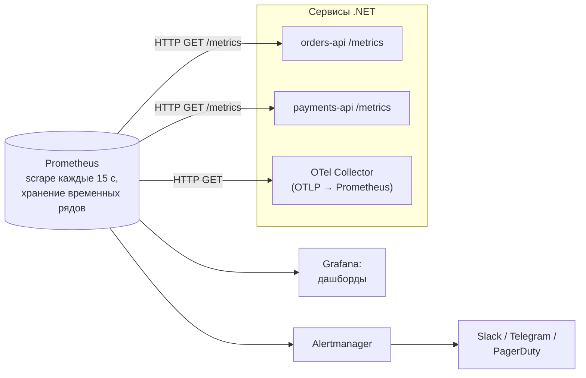
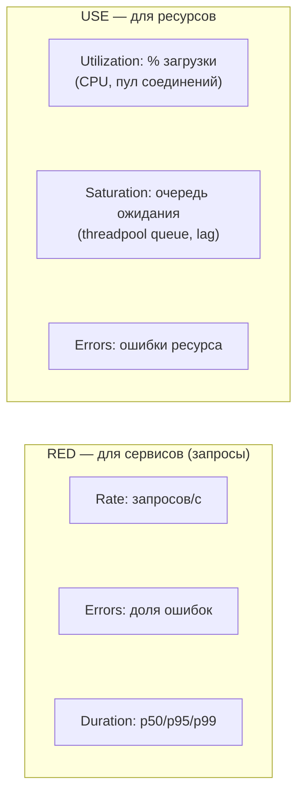
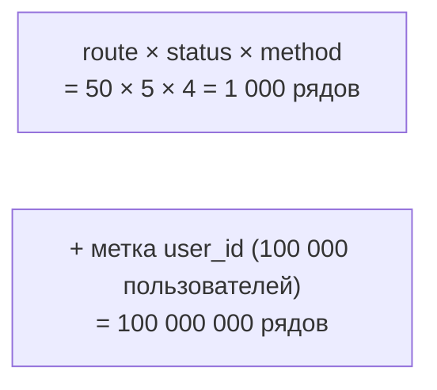

:::tldr
- **Метрика** — числовое измерение во времени с набором **меток** (labels/tags): `http_server_request_duration_seconds{route="/orders", status="500"}`. Дёшево хранить и агрегировать; основа дашбордов и алертов.
- **.NET Metrics API** (`System.Diagnostics.Metrics`): `Meter` → инструменты **Counter** (только растёт: число заказов), **UpDownCounter** (растёт и падает: активные соединения), **Histogram** (распределение: латентность, размер), **Gauge**/ObservableGauge (текущее значение: длина очереди). ASP.NET Core, HttpClient, Kestrel, runtime публикуют метрики сами.
- **Prometheus** — БД временных рядов с **pull-моделью**: периодически **скрейпит** HTTP-эндпоинт `/metrics` сервисов (или принимает remote write/OTLP). Запросы — **PromQL**: `rate()`, `sum by`, `histogram_quantile()`.
- **Grafana** — дашборды и алерты поверх Prometheus (и Loki, Tempo). Алертинг — **Alertmanager** / Grafana Alerting → Slack, Telegram, PagerDuty.
- Методологии: **RED** для сервисов (Rate, Errors, Duration), **USE** для ресурсов (Utilization, Saturation, Errors), **Four Golden Signals** (latency, traffic, errors, saturation), **SLO** и error budget для алертов по симптомам.
:::

## Как метрики попадают в Grafana



```text Формат /metrics (Prometheus exposition)
# HELP http_server_request_duration_seconds Duration of HTTP server requests.
# TYPE http_server_request_duration_seconds histogram
http_server_request_duration_seconds_bucket{http_route="/orders/{id}",http_response_status_code="200",le="0.05"} 8412
http_server_request_duration_seconds_bucket{http_route="/orders/{id}",http_response_status_code="200",le="0.1"} 9120
http_server_request_duration_seconds_bucket{http_route="/orders/{id}",http_response_status_code="200",le="+Inf"} 9301
http_server_request_duration_seconds_sum{http_route="/orders/{id}",http_response_status_code="200"} 412.7
http_server_request_duration_seconds_count{http_route="/orders/{id}",http_response_status_code="200"} 9301
# TYPE shop_orders_placed_total counter
shop_orders_placed_total{payment_method="card"} 15230
```

## .NET Metrics API

```csharp Свои бизнес-метрики
public sealed class OrderMetrics
{
    private readonly Counter<long> _placed;
    private readonly Histogram<double> _checkoutDuration;
    private readonly UpDownCounter<int> _activeCheckouts;

    public OrderMetrics(IMeterFactory meterFactory)                     // DI-friendly (.NET 8)
    {
        var meter = meterFactory.Create("Shop.Orders");
        _placed = meter.CreateCounter<long>("shop.orders.placed", unit: "{order}", description: "Оформленные заказы");
        _checkoutDuration = meter.CreateHistogram<double>("shop.checkout.duration", unit: "s");
        _activeCheckouts = meter.CreateUpDownCounter<int>("shop.checkout.active");
        meter.CreateObservableGauge("shop.outbox.pending", () => OutboxStats.Pending);   // значение читается при сборе
    }

    public void OrderPlaced(string paymentMethod) =>
        _placed.Add(1, new KeyValuePair<string, object?>("payment.method", paymentMethod));

    public IDisposable TrackCheckout()
    {
        _activeCheckouts.Add(1);
        var start = Stopwatch.GetTimestamp();
        return new Scope(() =>
        {
            _activeCheckouts.Add(-1);
            _checkoutDuration.Record(Stopwatch.GetElapsedTime(start).TotalSeconds);
        });
    }
    private sealed class Scope(Action onDispose) : IDisposable { public void Dispose() => onDispose(); }
}
```

| Инструмент | Поведение | Примеры |
|---|---|---|
| `Counter<T>` | Только увеличивается | Запросы, заказы, ошибки, отправленные письма |
| `UpDownCounter<T>` | Увеличивается и уменьшается | Активные соединения, элементы в работе |
| `Histogram<T>` | Распределение значений (бакеты) | Латентность, размер ответа, сумма заказа |
| `Gauge<T>` (.NET 9) / `ObservableGauge<T>` | Текущее значение | Длина очереди, температура кэша, размер пула |
| `ObservableCounter<T>` | Счётчик, читаемый при сборе | Значение из внешнего источника |

## Экспорт в Prometheus

```csharp
builder.Services.AddOpenTelemetry()
    .WithMetrics(m => m
        .AddAspNetCoreInstrumentation()          // http.server.request.duration, active requests
        .AddHttpClientInstrumentation()          // http.client.request.duration
        .AddRuntimeInstrumentation()             // GC, потоки, исключения, память
        .AddMeter("Shop.Orders")
        .AddPrometheusExporter());               // эндпоинт /metrics (пакет OpenTelemetry.Exporter.Prometheus.AspNetCore)

app.MapPrometheusScrapingEndpoint();             // лучше на отдельном внутреннем порту
```

Альтернатива: экспорт по OTLP в Collector, который пишет в Prometheus/Mimir (remote write) — сервису не нужно открывать `/metrics`.

## PromQL: основные запросы

```promql
# RPS по маршрутам
sum by (http_route) (rate(http_server_request_duration_seconds_count[5m]))

# Доля ошибок 5xx
sum(rate(http_server_request_duration_seconds_count{http_response_status_code=~"5.."}[5m]))
  / sum(rate(http_server_request_duration_seconds_count[5m]))

# p99 латентности по маршруту (из гистограммы)
histogram_quantile(0.99, sum by (le, http_route) (rate(http_server_request_duration_seconds_bucket[5m])))

# Заказы в минуту по способу оплаты
sum by (payment_method) (rate(shop_orders_placed_total[1m])) * 60

# Время в GC
rate(process_runtime_dotnet_gc_pause_time_seconds_total[5m])
```

`rate()` вычисляет скорость роста счётчика за окно и корректно обрабатывает сбросы при рестартах — счётчики всегда смотрят через `rate`/`increase`, а не «сырыми».

## RED, USE, Golden Signals



Для .NET-сервиса стандартный дашборд: RED по маршрутам, CPU и память подов, GC (частота Gen2, время пауз), thread pool (потоки, длина очереди), пулы соединений БД, длина очередей брокера и lag потребителей, бизнес-метрики (заказы/мин, платежи).

## Алерты по SLO

```yaml Prometheus rule: алерт по бюджету ошибок, а не по каждому всплеску
groups:
  - name: orders-slo
    rules:
      - alert: OrdersHighErrorRate
        expr: |
          (sum(rate(http_server_request_duration_seconds_count{service="orders-api",http_response_status_code=~"5.."}[5m]))
            / sum(rate(http_server_request_duration_seconds_count{service="orders-api"}[5m]))) > 0.02
        for: 10m
        labels: { severity: page }
        annotations:
          summary: "orders-api: более 2% ошибок 5xx в течение 10 минут"
          runbook: "https://wiki.example.uz/runbooks/orders-api-errors"
```

- **SLI** — измеряемый показатель (доля успешных запросов быстрее 300 мс). **SLO** — цель (99,9% за 30 дней). **Error budget** — допустимая доля неудач (0,1%).
- Алертить по **симптомам**, видимым пользователю (ошибки, латентность), а не по каждой причине (CPU 80%) — меньше шума, больше смысла. Причинные метрики — для диагностики.
- Каждый алерт — с **runbook**-ом: что проверить и что сделать.

## Кардинальность



Каждая уникальная комбинация меток — отдельный временной ряд в памяти Prometheus. Никогда не используйте в метках id пользователей, заказов, email, полный URL с параметрами, текст ошибки. Для таких деталей — трассировки и логи.

## Вопросы на засыпку

:::qa Почему Prometheus использует pull, а не push?
Pull упрощает обнаружение недоступных сервисов (не отвечает на scrape — `up == 0`), централизует контроль частоты сбора и не требует от сервисов знать адрес мониторинга. Для короткоживущих задач (batch jobs) используют Pushgateway или push через OTLP/remote write.
:::

:::qa Почему для латентности нужна гистограмма, а не среднее?
Среднее скрывает «хвосты»: 99% запросов за 50 мс и 1% за 10 с дают среднее ~150 мс, хотя каждый сотый пользователь ждёт 10 секунд. Гистограмма позволяет считать перцентили (p95, p99) и агрегировать их по экземплярам (в отличие от готовых перцентилей summary).
:::

:::qa Чем Counter отличается от Gauge?
Counter только растёт (сбрасывается при рестарте), смотрят его скорость — `rate()`. Gauge — мгновенное значение, может расти и падать (температура, длина очереди), смотрят само значение или `avg_over_time`.
:::

:::qa Где метрики, а где логи?
Метрики — агрегированные числа для трендов, дашбордов и алертов (дёшево, долго хранятся). Логи — детальные события для расследования (дорого, хранятся меньше). Не считайте метрики по логам в горячем пути и не пишите в логи то, что должно быть счётчиком.
:::

## Итог

Метрики — первая линия наблюдаемости: .NET публикует их через `System.Diagnostics.Metrics` (и сам — для ASP.NET Core, HttpClient, runtime), Prometheus собирает и хранит временные ряды, Grafana визуализирует и алертит. Стройте дашборды по RED/USE, алерты — по SLO и симптомам, следите за кардинальностью меток и используйте гистограммы для латентности.
