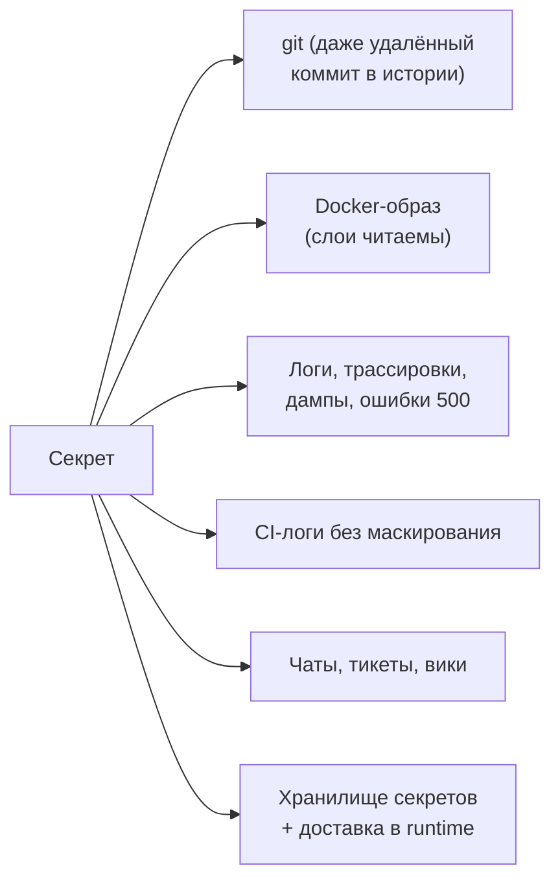
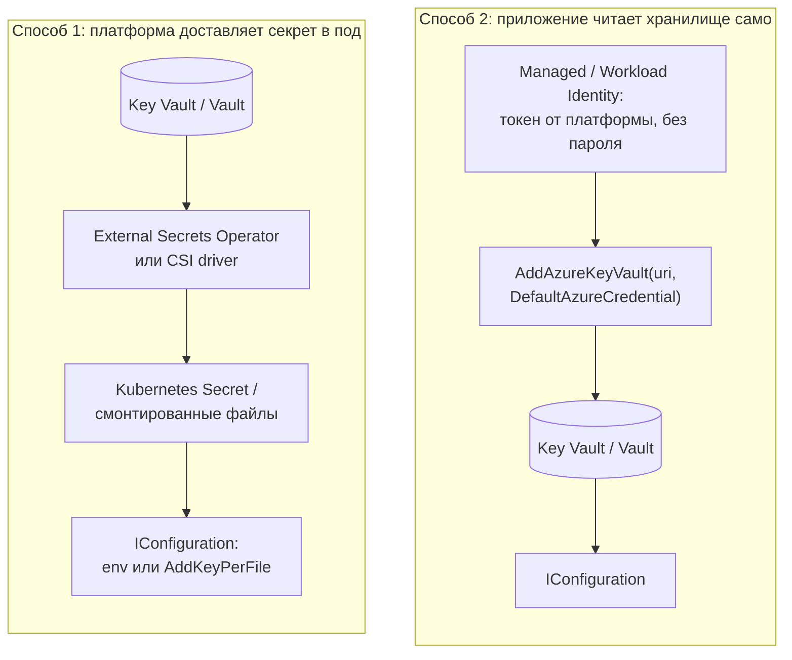
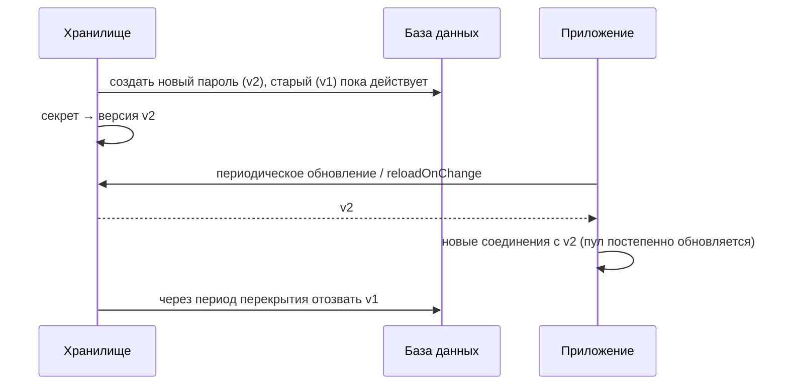

:::tldr
- **Секрет** — всё, что даёт доступ: пароли БД, API-ключи, строки подключения, сертификаты, ключи подписи JWT, ключи шифрования. Утечка = компрометация системы.
- Никогда: в **коде**, в **git** (даже в истории), в `appsettings.json`, в **Docker-образе**, в логах, в переменных CI без маскирования, в тикетах и чатах.
- **Разработка**: `dotnet user-secrets`. **Продакшен**: централизованное хранилище — **HashiCorp Vault**, **Azure Key Vault**, AWS Secrets Manager / Parameter Store, GCP Secret Manager — с аудитом, RBAC, версионированием, ротацией.
- **Kubernetes Secrets** по умолчанию — лишь base64 в etcd: нужны **шифрование etcd at rest**, строгий **RBAC**, и лучше синхронизация из внешнего хранилища (**External Secrets Operator**, **Secrets Store CSI Driver**, Vault Agent Injector) или sealed-secrets/SOPS для GitOps.
- **Аутентификация без секретов**: **Managed Identity** / Workload Identity (Azure, AWS IRSA, GCP), OIDC-федерация для CI — приложение получает токен от платформы, пароль не нужен вовсе.
- Принципы: **минимальные привилегии**, **ротация** (и приложение должно переживать смену секрета), **динамические секреты** (Vault выдаёт временные учётные данные БД), **сканирование** репозиториев (gitleaks, GitHub secret scanning).
:::

## Где секреты «живут» и утекают



## Модель доставки секретов в .NET-приложение



## Разработка: user-secrets

```bash
dotnet user-secrets init
dotnet user-secrets set "ConnectionStrings:Default" "Host=localhost;Database=shop;Username=dev;Password=dev"
dotnet user-secrets list
```

Хранятся в профиле пользователя вне репозитория, подключаются только в окружении Development. Не шифруются — это защита от случайного коммита, а не хранилище для продакшена.

## Azure Key Vault + Managed Identity

```csharp
using Azure.Identity;

if (!builder.Environment.IsDevelopment())
{
    builder.Configuration.AddAzureKeyVault(
        new Uri($"https://{builder.Configuration["KeyVaultName"]}.vault.azure.net/"),
        new DefaultAzureCredential());                  // Managed Identity в Azure, az login локально — без паролей в коде
}
// Секрет "ConnectionStrings--Default" в Key Vault становится ключом "ConnectionStrings:Default"
```

Ещё лучше — вообще без пароля к БД: **Azure AD (Entra ID) аутентификация** в Azure SQL/PostgreSQL через Managed Identity (`Authentication=Active Directory Default` / Npgsql с токеном). Секрета нет — нечему утечь.

## HashiCorp Vault

```csharp VaultSharp: динамические учётные данные БД
var vault = new VaultClient(new VaultClientSettings("https://vault.internal:8200",
    new KubernetesAuthMethodInfo("orders-api", File.ReadAllText("/var/run/secrets/kubernetes.io/serviceaccount/token"))));

var creds = await vault.V1.Secrets.Database.GetCredentialsAsync("orders-readwrite");   // Vault создаёт пользователя в PostgreSQL
var cs = $"Host=pg;Database=orders;Username={creds.Data.Username};Password={creds.Data.Password}";
// учётные данные живут, например, 1 час и затем автоматически отзываются
```

Возможности Vault: **динамические секреты** (временные пользователи БД, облачные ключи), **Transit** (шифрование как сервис — ключ не покидает Vault), PKI (выпуск сертификатов), аудит каждого доступа, аутентификация через Kubernetes service account.

## Kubernetes Secrets правильно

```yaml External Secrets Operator: синхронизация из Key Vault
apiVersion: external-secrets.io/v1beta1
kind: ExternalSecret
metadata: { name: orders-secrets, namespace: shop }
spec:
  refreshInterval: 1h
  secretStoreRef: { name: azure-keyvault, kind: ClusterSecretStore }
  target: { name: orders-secrets }                   # будет создан Kubernetes Secret
  data:
    - secretKey: db-connection
      remoteRef: { key: orders-db-connection }
```

```yaml Монтирование как файлы (предпочтительнее env: не видно в /proc/*/environ, обновляется без рестарта)
volumes:
  - name: secrets
    secret: { secretName: orders-secrets }
containers:
  - name: app
    volumeMounts: [{ name: secrets, mountPath: /run/secrets, readOnly: true }]
```

```csharp
builder.Configuration.AddKeyPerFile("/run/secrets", optional: true, reloadOnChange: true);   // файл = ключ, содержимое = значение
```

Минимум для Kubernetes Secrets: шифрование etcd (KMS provider), RBAC (кто может `get secrets` в namespace), не давать `list/watch secrets` широким ролям, отдельные service accounts на сервис.

## Ротация



Чтобы ротация не ломала приложение:
- Перечитывать конфигурацию (`IOptionsMonitor`, `reloadOnChange`, периодический refresh Key Vault провайдера) или перезапускать поды при смене секрета (Reloader, checksum-аннотации).
- Период **перекрытия**: старый секрет действует, пока все экземпляры не перешли на новый.
- Для JWT-ключей подписи — несколько ключей одновременно (JWKS с `kid`).

## Предотвращение утечек

- **Сканирование**: GitHub secret scanning + push protection, gitleaks/trufflehog в pre-commit и CI.
- Если секрет попал в git — считать его **скомпрометированным**: немедленно **ротировать** (удаление коммита не помогает — копии в форках, кэшах, у разработчиков).
- **Не логировать**: маскирование в логах (Redaction), не выводить `IConfiguration.GetDebugView()`, осторожно с исключениями, содержащими строки подключения.
- В CI: маскируемые переменные, секреты на уровне окружений, OIDC-федерация вместо статических ключей облака.
- **Минимальные привилегии**: отдельные учётные данные на сервис и окружение, только нужные права (read-only для отчётов).

## Сравнение хранилищ

| | Kubernetes Secrets | Azure Key Vault | HashiCorp Vault | AWS Secrets Manager |
|---|---|---|---|---|
| Где | В кластере (etcd) | Облако Azure | Self-hosted / HCP | Облако AWS |
| Шифрование | Нужно включить (KMS) | Да (HSM опционально) | Да | Да (KMS) |
| Аудит доступа | Audit log API-сервера | Да | Да, подробный | CloudTrail |
| Динамические секреты | Нет | Нет (ротация через функции) | **Да** | Ротация для RDS |
| Аутентификация приложения | Service account | Managed Identity | K8s auth, AppRole, OIDC | IAM роли (IRSA) |
| Для .NET | Env / файлы | `AddAzureKeyVault` | VaultSharp / Agent Injector | `AWSSDK` / config provider |

## Вопросы на засыпку

:::qa Почему base64 в Kubernetes Secret — это не шифрование?
Base64 — обратимое кодирование без ключа: `echo ... | base64 -d` раскрывает значение. Любой, кто может прочитать Secret через API или получил доступ к etcd/бэкапам, видит секрет. Защита — шифрование etcd, RBAC и внешние хранилища.
:::

:::qa Что лучше: секреты в переменных окружения или в файлах?
Файлы (tmpfs-том) немного безопаснее: переменные окружения видны в `/proc/<pid>/environ`, наследуются дочерними процессами, могут попасть в дампы и отчёты об ошибках; смонтированные секреты обновляются без перезапуска пода. Но переменные проще и широко используются — главное, чтобы они приходили из защищённого источника.
:::

:::qa Что такое Managed Identity и почему это лучше пароля?
Идентичность, которую облачная платформа выдаёт ресурсу (VM, App Service, поду через Workload Identity). Приложение получает короткоживущий токен у платформы и использует его для доступа к Key Vault, БД, хранилищам. Нет секрета, который нужно хранить, ротировать и который может утечь.
:::

:::qa Секрет случайно попал в публичный репозиторий. Что делать?
1) Немедленно отозвать/ротировать секрет (боты находят ключи за минуты). 2) Проверить журналы использования на предмет злоупотреблений. 3) Удалить из истории (git filter-repo/BFG) — вторично. 4) Разобрать причину и добавить сканирование в pre-commit/CI.
:::

## Итог

Секреты не должны жить в коде, образах и репозиториях. Локально — user-secrets, в продакшене — централизованное хранилище (Key Vault, Vault) с аудитом и ротацией, доставка в Kubernetes — через External Secrets/CSI с шифрованием etcd и RBAC, а лучше всего — аутентификация без секретов через Managed/Workload Identity. Планируйте ротацию, сканируйте репозитории и при утечке ротируйте немедленно.
