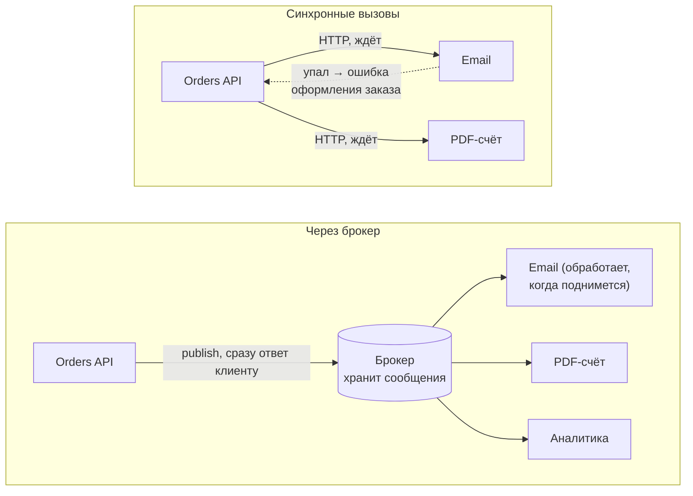
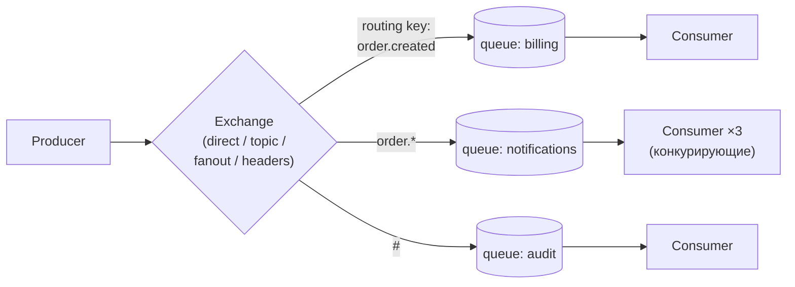
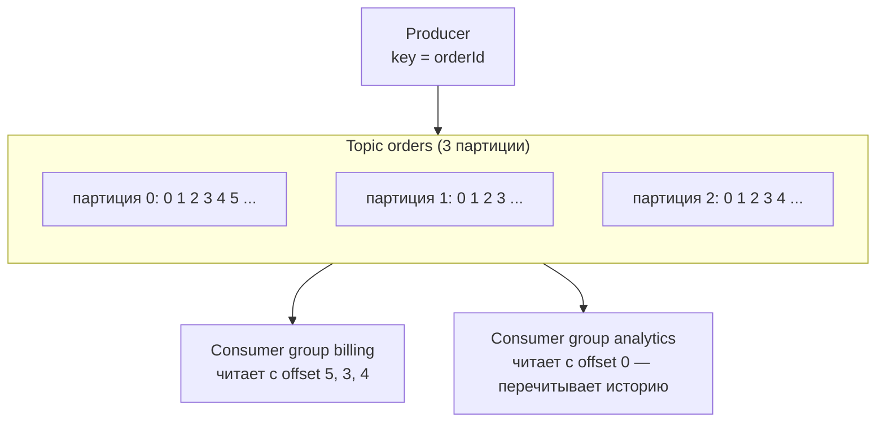

:::tldr
- **Брокер сообщений** — посредник, который принимает сообщения от производителей, **надёжно хранит** их и доставляет потребителям. Отправитель и получатель **не обязаны работать одновременно** и не знают друг о друге.
- Зачем: **развязка** сервисов (temporal и spatial decoupling), **асинхронная обработка** долгих задач (письма, отчёты, видео), **сглаживание пиков** (очередь как буфер), **надёжность** (сообщение не потеряется, если потребитель упал), **масштабирование** потребителей, **fan-out** события многим подписчикам.
- **RabbitMQ** — классический брокер (AMQP): гибкая **маршрутизация** через exchanges, сообщение удаляется после подтверждения, хорош для задач и команд.
- **Kafka** — распределённый **журнал событий**: сообщения хранятся заданное время, потребители читают по **offset** и могут перечитать; огромная пропускная способность, порядок внутри партиции; для потоков событий, аналитики, event sourcing.
- **Azure Service Bus** — управляемый облачный брокер: очереди и топики с подписками, сессии (порядок), DLQ, дубликаты, транзакции — без администрирования.
:::

## Синхронно против асинхронно



| Проблема | Синхронно | С брокером |
|---|---|---|
| Получатель недоступен | Ошибка у отправителя | Сообщение ждёт в очереди |
| Долгая операция | Клиент ждёт | Ответ сразу, обработка фоном |
| Пик нагрузки | Получатель перегружен, отказы | Очередь растёт, потребители разбирают в своём темпе |
| Добавить нового получателя | Менять код отправителя | Подписаться на событие |
| Масштабирование обработки | Балансировщик, всё синхронно | Добавить потребителей (competing consumers) |

## Типичные сценарии

- **Фоновые задачи**: отправка писем и SMS, генерация отчётов, обработка изображений/видео, импорт файлов.
- **Интеграция микросервисов** через события (`OrderPlaced` → склад, оплата, уведомления).
- **Сглаживание нагрузки**: всплеск заказов в «чёрную пятницу» — API принимает, воркеры обрабатывают.
- **Потоковая обработка**: клики, телеметрия, логи, CDC-изменения БД (Kafka).
- **Надёжные команды** между системами с повторами и DLQ.

## RabbitMQ



- Производитель публикует в **exchange**, тот по **bindings** и routing key раскладывает копии по **очередям**.
- Потребитель получает сообщение, обрабатывает и отправляет **ack** — только тогда сообщение удаляется. Нет ack (упал) → сообщение будет доставлено снова.
- **Prefetch** ограничивает число неподтверждённых сообщений на потребителя (backpressure).
- Сильные стороны: гибкая маршрутизация, приоритеты, TTL, DLX (dead letter exchange), низкая задержка. Quorum queues и streams — для надёжности и журнального режима.

## Kafka



- **Топик** разбит на **партиции** — упорядоченные неизменяемые журналы. Сообщения с одинаковым **ключом** попадают в одну партицию → **порядок по ключу**.
- Сообщения **не удаляются** после чтения — хранятся по времени/размеру (retention) или компактируются по ключу (compaction).
- Каждая **consumer group** хранит свои **offset-ы**; одна партиция читается одним потребителем группы → параллелизм = число партиций.
- Сильные стороны: миллионы сообщений в секунду, повторное чтение (replay), потоковая обработка (Kafka Streams, ksqlDB, Flink), CDC (Debezium).

## Azure Service Bus

- **Queues** (point-to-point) и **Topics + Subscriptions** (pub/sub с фильтрами).
- **Sessions** — упорядоченная обработка по ключу сессии; **duplicate detection** по MessageId; **scheduled messages**; встроенная **DLQ**; транзакции в пределах пространства имён.
- Полностью управляемый — нет серверов для обслуживания, интеграция с Azure AD/Managed Identity.

## Сравнение

| | RabbitMQ | Kafka | Azure Service Bus |
|---|---|---|---|
| Модель | Брокер с очередями | Распределённый журнал | Управляемый брокер |
| После обработки | Удаляется (ack) | Хранится (retention) | Удаляется (complete) |
| Повторное чтение истории | Нет (кроме streams) | **Да** | Нет |
| Порядок | В очереди (при одном потребителе) | Внутри партиции | В сессии |
| Маршрутизация | **Гибкая** (exchanges) | По топикам и ключам | Фильтры подписок |
| Пропускная способность | Десятки тысяч msg/s | **Миллионы** msg/s | Зависит от тарифа |
| Задержка | Очень низкая | Низкая (батчинг) | Низкая |
| Эксплуатация | Свой кластер или облако | Сложнее (или Confluent Cloud, Event Hubs) | Не нужна |
| Лучше для | Задачи, команды, RPC, сложная маршрутизация | Потоки событий, аналитика, event sourcing, CDC | Корпоративная интеграция в Azure |

## Работа из .NET

```csharp RabbitMQ.Client (низкоуровнево)
var factory = new ConnectionFactory { HostName = "rabbitmq" };
await using var connection = await factory.CreateConnectionAsync();
await using var channel = await connection.CreateChannelAsync();
await channel.QueueDeclareAsync("emails", durable: true, exclusive: false, autoDelete: false);

var body = JsonSerializer.SerializeToUtf8Bytes(new SendEmail("ann@x.uz", "Заказ принят"));
await channel.BasicPublishAsync("", "emails", mandatory: false, new BasicProperties { Persistent = true, MessageId = Guid.NewGuid().ToString() }, body);
```

```csharp Confluent.Kafka
using var producer = new ProducerBuilder<string, string>(new ProducerConfig { BootstrapServers = "kafka:9092", EnableIdempotence = true, Acks = Acks.All }).Build();
await producer.ProduceAsync("orders", new Message<string, string> { Key = order.Id.ToString(), Value = JsonSerializer.Serialize(evt) });
```

На практике в .NET чаще используют абстракцию над брокером — **MassTransit**, NServiceBus, Wolverine: сериализация, ретраи, outbox, саги, DLQ и тесты «из коробки» (см. отдельный вопрос).

## Вопросы на засыпку

:::qa Когда очередь не нужна?
Когда нужен немедленный ответ с результатом (проверка остатка при добавлении в корзину), операции быстрые и надёжные, система небольшая. Брокер добавляет инфраструктуру, eventual consistency и сложность отладки — это должно окупаться.
:::

:::qa Почему в Kafka порядок гарантирован только внутри партиции?
Партиции обрабатываются параллельно разными потребителями — глобальный порядок убил бы масштабирование. Если порядок важен для сущности, используйте её идентификатор как ключ сообщения — все её события попадут в одну партицию.
:::

:::qa Можно ли использовать Kafka как обычную очередь задач?
Можно, но неудобно: нет подтверждения отдельных сообщений (только offset), нет встроенных DLQ, задержанных сообщений и приоритетов, параллелизм ограничен числом партиций, а одно «тяжёлое» сообщение блокирует партицию. Для очередей задач естественнее RabbitMQ/Service Bus.
:::

:::qa Что такое competing consumers?
Несколько экземпляров потребителя читают из одной очереди, и каждое сообщение получает только один из них. Это горизонтальное масштабирование обработки: добавили воркеров — выросла пропускная способность.
:::

## Итог

Брокеры сообщений развязывают сервисы во времени и пространстве, превращают долгие операции в фоновые, сглаживают пики и делают доставку надёжной. RabbitMQ — гибкий брокер задач и команд, Kafka — журнал событий для потоков и повторного чтения, Azure Service Bus — управляемый вариант для облака. Выбирайте по модели использования, а не по моде.
