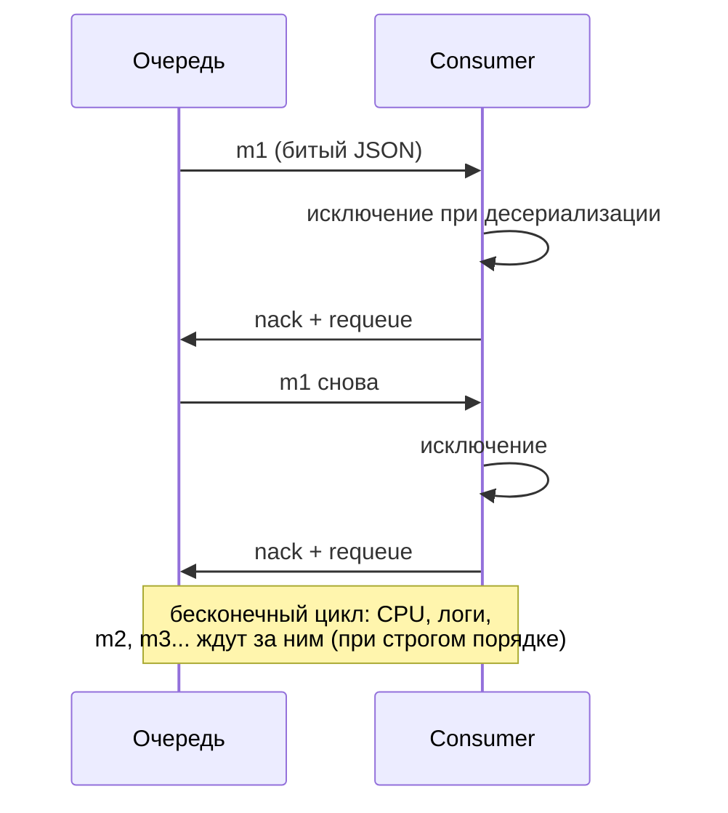
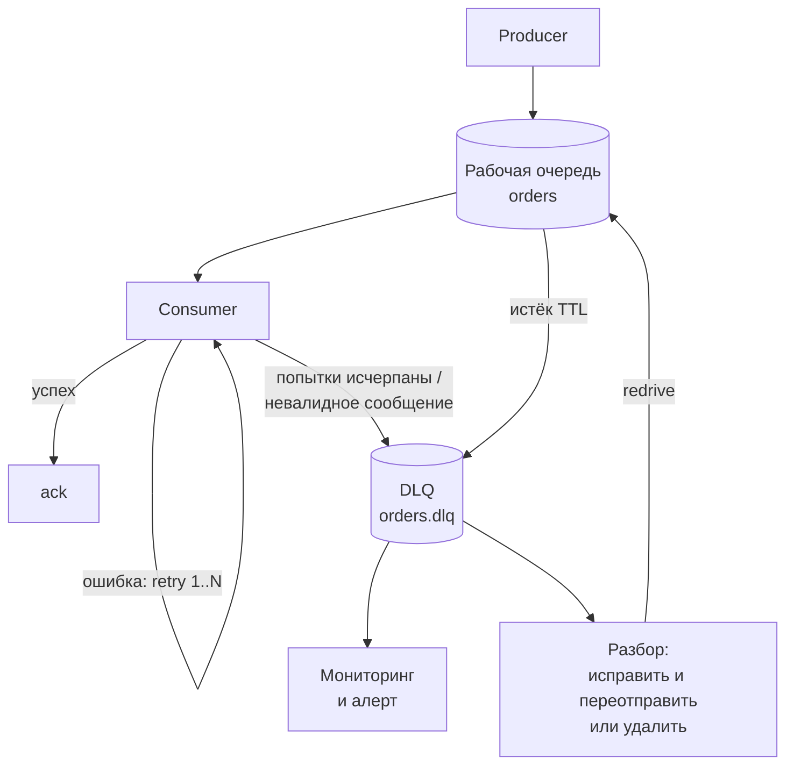
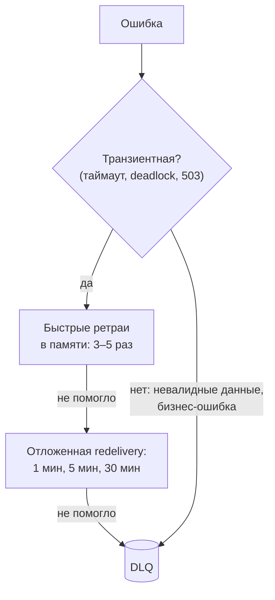

:::tldr
- **Dead Letter Queue (DLQ)** — отдельная очередь для сообщений, которые **не удалось обработать** после всех попыток, **истёк TTL**, превышен размер/лимит доставок или сообщение отклонено.
- Зачем: **ядовитое сообщение** (poison message — битый JSON, нарушенный контракт, баг) иначе будет бесконечно возвращаться в очередь, **блокируя** обработку остальных и нагружая систему. DLQ **изолирует** его и **сохраняет** для анализа — данные не теряются.
- Реализации: RabbitMQ — **DLX** (dead letter exchange) через аргументы очереди; Azure Service Bus — встроенная подочередь `$DeadLetterQueue` (MaxDeliveryCount); Amazon SQS — redrive policy; MassTransit — очереди `_error`; Kafka — DLQ-топик (паттерн, реализуется потребителем).
- DLQ бесполезна без процесса: **мониторинг и алерты** на рост, **анализ** причины, **исправление** и **переотправка** (redrive) или сознательное удаление.
:::

## Проблема ядовитого сообщения



## С DLQ



## Когда сообщение попадает в DLQ

| Причина | Пример |
|---|---|
| Исчерпаны попытки обработки | Внешний сервис недоступен дольше окна ретраев |
| Невозможно обработать в принципе | Битый формат, несовместимая версия контракта, нарушение валидации |
| Баг в обработчике | `NullReferenceException` на определённых данных |
| Истёк TTL | Сообщение устарело (напоминание о брони, которая уже закончилась) |
| Превышен лимит очереди | `x-max-length` в RabbitMQ с `overflow = reject-publish-dlx` |
| Явный отказ | Обработчик решил, что сообщение не должно обрабатываться (`reject` без requeue) |

## RabbitMQ: Dead Letter Exchange

```csharp
await ch.ExchangeDeclareAsync("orders.dlx", ExchangeType.Direct, durable: true);
await ch.QueueDeclareAsync("orders.dlq", durable: true, exclusive: false, autoDelete: false);
await ch.QueueBindAsync("orders.dlq", "orders.dlx", routingKey: "orders");

await ch.QueueDeclareAsync("orders", durable: true, exclusive: false, autoDelete: false, arguments: new Dictionary<string, object?>
{
    ["x-dead-letter-exchange"] = "orders.dlx",
    ["x-dead-letter-routing-key"] = "orders",
    ["x-message-ttl"] = 86_400_000,               // 24 часа
    ["x-queue-type"] = "quorum",
    ["x-delivery-limit"] = 5                      // quorum queue: после 5 доставок → DLX
});

// В потребителе: окончательный отказ без возврата в очередь → сообщение уйдёт в DLX
await ch.BasicRejectAsync(ea.DeliveryTag, requeue: false);
```

RabbitMQ добавляет заголовок `x-death` с причиной (`rejected`, `expired`, `maxlen`, `delivery_limit`), исходной очередью и счётчиком.

## Azure Service Bus

```csharp
// Автоматически: после MaxDeliveryCount (по умолчанию 10) неудачных доставок сообщение попадает в DLQ
await args.DeadLetterMessageAsync(args.Message,
    deadLetterReason: "ValidationFailed",
    deadLetterErrorDescription: "Отрицательное количество товара");   // явно, для заведомо невалидного

// Чтение DLQ
await using var receiver = client.CreateReceiver("orders", new ServiceBusReceiverOptions { SubQueue = SubQueue.DeadLetter });
```

## Kafka: DLQ как паттерн

В Kafka нет «неподтверждённых» сообщений — offset двигается вперёд. Потребитель сам отправляет проблемное сообщение в отдельный топик (например, `orders.dlq` или цепочку `orders.retry.1m` → `orders.retry.10m` → `orders.dlq`) с заголовками об ошибке и коммитит offset, чтобы не блокировать партицию.

## Retry до DLQ



Невалидное сообщение ретраить бессмысленно — сразу в DLQ (или опубликовать событие-отказ, если это ожидаемый бизнес-результат).

## Работа с DLQ

1. **Мониторинг**: метрика числа сообщений в DLQ, алерт при любом росте (или превышении порога). Нулевая DLQ — нормальное состояние.
2. **Контекст**: сохранять причину, исключение, стек, число попыток, исходную очередь, correlation/trace id — без этого разбор невозможен.
3. **Разбор**: баг → исправить и задеплоить; временная недоступность → переотправить; невалидные данные → исправить у источника или удалить с записью в журнал.
4. **Redrive**: переместить сообщения обратно в рабочую очередь (RabbitMQ shovel, `az servicebus` / Service Bus Explorer, SQS redrive, собственный инструмент). Обработчики должны быть **идемпотентными** — часть сообщений могла быть частично обработана.
5. **Срок хранения**: DLQ не архив — задайте TTL/политику и вовремя разбирайте.

## Вопросы на засыпку

:::qa Почему нельзя просто логировать ошибку и подтверждать сообщение?
Сообщение будет потеряно: в логе остаётся текст, но не само сообщение в пригодном для переотправки виде. После исправления бага данные уже не вернуть в обработку. DLQ сохраняет сообщение целиком.
:::

:::qa Чем DLQ отличается от retry-очереди?
Retry-очередь — временное место для **отложенной** повторной попытки (сообщение само вернётся через время). DLQ — место для сообщений, которые **не будут** обработаны автоматически и требуют внимания человека или специального процесса.
:::

:::qa Может ли DLQ нарушить порядок сообщений?
Да: сообщение m1 ушло в DLQ, а m2, m3 обработаны. После redrive m1 обработается позже. Если порядок важен (изменения одной сущности), обработчик должен учитывать версии, либо при ошибке блокировать обработку этого ключа (parking lot для всей последовательности).
:::

:::qa Что такое «parking lot»?
Отдельное хранилище для сообщений, которые откладываются для ручной обработки (часто синоним DLQ или её следующий уровень после автоматических повторных попыток из DLQ). Позволяет отделить «автоматически переотправляемые» сообщения от требующих ручного разбора.
:::

## Итог

DLQ изолирует сообщения, которые не удаётся обработать, чтобы они не блокировали очередь и не терялись. Настраивайте её в брокере (DLX, MaxDeliveryCount, error-очереди MassTransit), ретраите транзиентные ошибки до попадания в DLQ, сразу отправляйте туда невалидные сообщения, и главное — мониторьте DLQ и имейте процесс разбора и переотправки.
