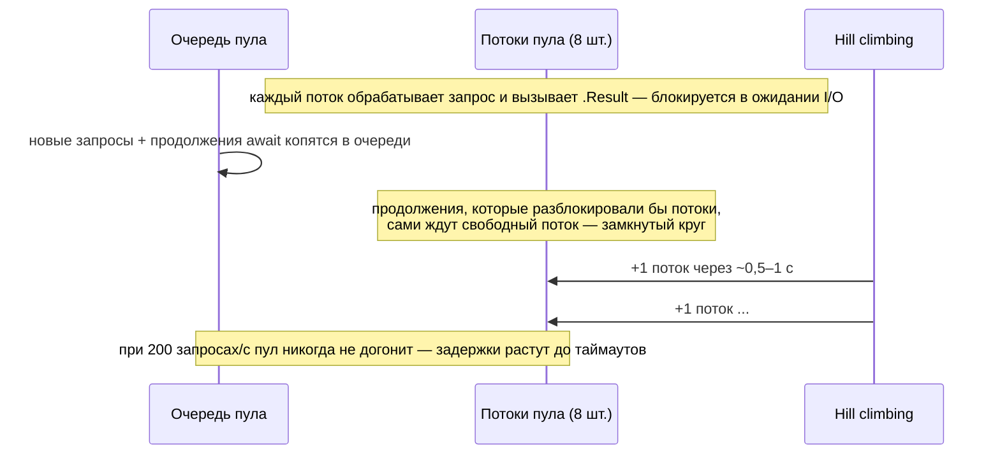

:::tldr
- **Thread pool starvation** — все потоки пула **заняты ожиданием** (заблокированы), а новые работы (обработка запросов, продолжения `await`) **стоят в очереди**. Пул добавляет потоки медленно (≈1–2 в секунду сверх минимума) → запросы висят секундами, таймауты, при этом **CPU низкий**.
- Главная причина — **sync-over-async**: `.Result`, `.Wait()`, `.GetAwaiter().GetResult()`, `Task.WaitAll` в коде запросов; синхронный I/O (`File.ReadAllText`, синхронные вызовы БД/HTTP), `Thread.Sleep`, долгие `lock` с I/O внутри.
- Симптомы: растёт **ThreadPool Queue Length** и **Thread Count** (ступеньками), латентность высокая при низком CPU, health checks падают, Kestrel перестаёт отвечать.
- Диагностика: `dotnet-counters` (threadpool-queue-length, threadpool-thread-count), `dotnet-stack report` / `dotnet-dump` → `clrstack -all` (сотни потоков в `Monitor.Wait`/`Task.Wait`/`GetResult`), трассировка событий ThreadPool.
- Лечение: **async до конца**, убрать блокировки, асинхронные API; временная мера — `ThreadPool.SetMinThreads` (лечит симптом, не причину).
:::

## Как работает пул и почему он «голодает»



- Пул сразу создаёт потоки до **минимума** (= число ядер). Сверх минимума алгоритм **hill climbing** добавляет потоки осторожно — чтобы не создавать сотни лишних потоков при коротких всплесках.
- Асинхронный код отдаёт поток на время I/O — нескольких потоков хватает на тысячи запросов. Блокирующий код держит поток всё время ожидания — нужно столько потоков, сколько одновременных ожиданий.
- Хуже всего sync-over-async: заблокированный поток ждёт `Task`, продолжение которого должно выполниться **в пуле** — но свободных потоков нет.

## Пример проблемы

```csharp
[HttpGet("{id}")]
public IActionResult Get(int id)
{
    var product = _http.GetFromJsonAsync<Product>($"/products/{id}").Result;   // блокирует поток пула на время HTTP-вызова
    var stock = _db.Stock.FirstOrDefaultAsync(s => s.ProductId == id).GetAwaiter().GetResult();   // и ещё раз
    return Ok(new { product, stock });
}
```

```csharp Исправление
[HttpGet("{id}")]
public async Task<IActionResult> Get(int id, CancellationToken ct)
{
    var productTask = _http.GetFromJsonAsync<Product>($"/products/{id}", ct);
    var stockTask = _db.Stock.FirstOrDefaultAsync(s => s.ProductId == id, ct);
    await Task.WhenAll(productTask, stockTask);          // поток свободен во время ожидания
    return Ok(new { product = productTask.Result, stock = stockTask.Result });   // Result после WhenAll — уже завершены, безопасно
}
```

## Симптомы в метриках

```bash
dotnet-counters monitor -p <pid> --counters System.Runtime,Microsoft.AspNetCore.Hosting
```

```text Голодание пула
CPU Usage (%)                               12          ← низкий CPU
ThreadPool Thread Count                    146          ← растёт ступеньками ~1–2 в секунду
ThreadPool Queue Length                  3 480          ← работа ждёт потоков
ThreadPool Completed Work Item Count / 1s  310
Current Requests                         2 900          ← запросы копятся
Requests / sec                              95          ← пропускная способность упала
```


Ключевой отличительный признак: **высокая латентность при низком CPU** и растущее число потоков. При CPU-bound перегрузке CPU был бы под 100%.

## Где именно блокируются потоки

```bash
# Стеки всех управляемых потоков без полного дампа
dotnet-stack report -p <pid> > stacks.txt

# Или полный дамп
dotnet-dump collect -p <pid>
dotnet-dump analyze core_*.dmp
> clrstack -all
> threadpool                                # состояние пула, длина очереди
> syncblk                                   # владельцы lock-ов
```

```text Типичные стеки при голодании (повторяются на сотнях потоков)
System.Threading.Monitor.Wait(...)
System.Threading.ManualResetEventSlim.Wait(...)
System.Threading.Tasks.Task.SpinThenBlockingWait(...)
System.Threading.Tasks.Task.InternalWaitCore(...)
System.Runtime.CompilerServices.TaskAwaiter.GetResult()
Shop.Catalog.PriceService.GetPrice(Int32)             ← вот виновник: синхронная обёртка над async
Shop.Catalog.ProductsController.Get(Int32)
```

Также: событие `ThreadPoolStarvation` / предупреждение в трассировке (`Microsoft-Windows-DotNETRuntime` ThreadPoolWorkerThreadAdjustment с reason Starvation) — `dotnet-trace collect --providers Microsoft-Windows-DotNETRuntime:0x10000:4`.

## Частые источники блокировок

| Источник | Замена |
|---|---|
| `.Result`, `.Wait()`, `GetAwaiter().GetResult()` | `await` |
| `Task.WaitAll`, `Task.WaitAny` | `await Task.WhenAll/WhenAny` |
| Синхронные API: `File.ReadAllText`, `Stream.Read`, `SqlCommand.ExecuteReader`, `HttpClient.Send` | `*Async`-версии |
| `Thread.Sleep` | `await Task.Delay` |
| `lock` вокруг I/O | `SemaphoreSlim.WaitAsync`, вынести I/O из критической секции |
| Синхронные конструкторы с I/O, синхронный вызов в `IOptions` фабрике, синхронный DI-фабрика с `.Result` | Инициализация при старте (hosted service), async-фабрики |
| Синхронное чтение тела запроса (`AllowSynchronousIO`) | Асинхронное чтение |
| `Parallel.For` / блокирующие вызовы внутри запроса | Не использовать в веб-запросах |
| Старые библиотеки без async (SOAP, Excel) | `Task.Run` на ограниченном пуле — компромисс, или отдельный воркер |

## Временная мера: SetMinThreads

```csharp
ThreadPool.GetMinThreads(out var worker, out var io);
ThreadPool.SetMinThreads(workerThreads: 200, completionPortThreads: io);   // потоки до 200 создаются без задержки
```

Это снимает задержку hill climbing и может «спасти» продакшен, пока идёт исправление, — ценой лишних потоков (память под стеки, переключения контекста). Причина (блокирующий код) остаётся. Настраивается и через `runtimeconfig.json` (`System.Threading.ThreadPool.MinThreads`) или переменную окружения.

## Профилактика

- **Анализаторы**: Microsoft.VisualStudio.Threading.Analyzers (VSTHRD002 — синхронное ожидание), `AsyncFixer`, правила CA2012/CA1849 («вызывайте асинхронный метод в асинхронном методе»).
- В Kestrel синхронный I/O запрещён по умолчанию (`AllowSynchronousIO = false`) — не включайте.
- **Нагрузочные тесты** (k6, NBomber) с резким ростом нагрузки — голодание проявляется именно при всплесках.
- Алерты на `ThreadPool Queue Length` и рост числа потоков.

## Вопросы на засыпку

:::qa Почему голодание проявляется только под нагрузкой?
При малой нагрузке заблокированных потоков немного, минимального размера пула хватает. При всплеске число одновременно ожидающих запросов превышает число потоков, а пул растёт медленно — очередь накапливается быстрее, чем добавляются потоки.
:::

:::qa Решает ли Task.Run проблему синхронного API?
Частично и дорого: `Task.Run(() => SyncCall())` просто занимает **другой** поток пула на время блокировки — давление на пул то же. Может быть оправдано для изоляции CPU-работы или единичных legacy-вызовов с ограничением параллельности (`SemaphoreSlim`), но не как общее решение.
:::

:::qa Чем голодание пула отличается от deadlock-а sync-over-async?
В UI/старом ASP.NET (есть `SynchronizationContext`) `.Result` может вызвать **вечный deadlock** одного запроса. В ASP.NET Core контекста нет, поэтому deadlock не возникает, но массовые блокировки исчерпывают пул и замедляют **все** запросы — это голодание.
:::

:::qa Могут ли голодать I/O completion threads?
В Windows IOCP-потоки — отдельный пул; в Linux (и с .NET 7 по умолчанию на Windows — portable thread pool) I/O-уведомления обрабатываются отдельным механизмом с передачей в рабочие потоки. Основная проблема практически всегда в worker threads из-за блокирующего кода.
:::

## Итог

Голодание пула — это блокирующий код в асинхронном мире: потоки ждут, работа копится, пул растёт слишком медленно. Узнаётся по высокой латентности при низком CPU и растущим очереди и числу потоков; виновник находится по стекам потоков (`dotnet-stack`, `clrstack`). Лечится только асинхронностью до конца; `SetMinThreads` — временная подпорка.
