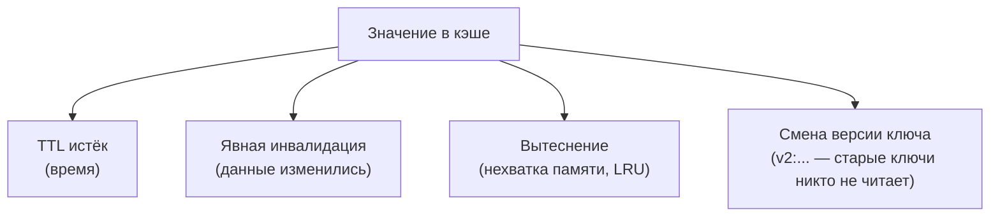
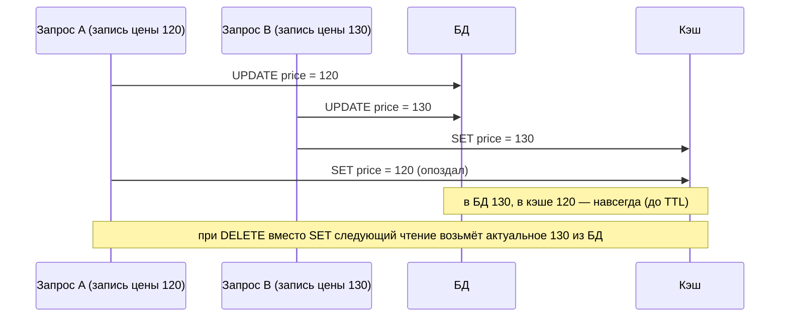
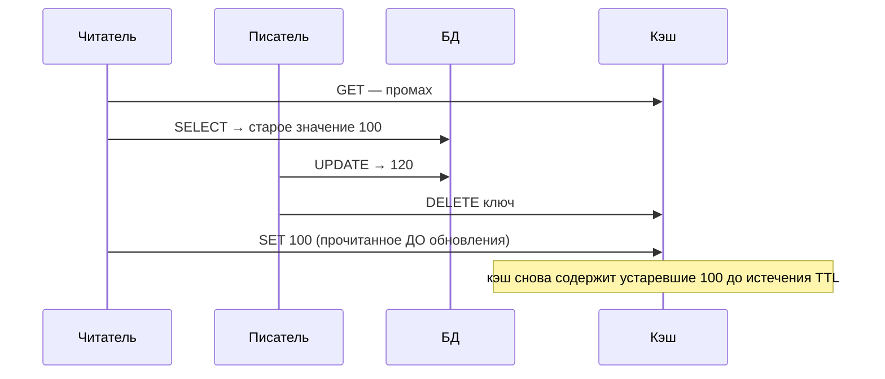
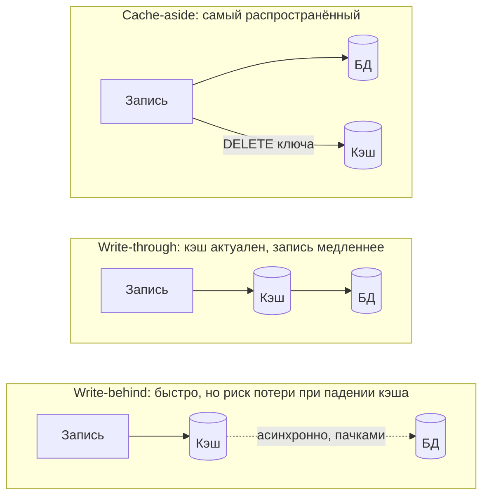
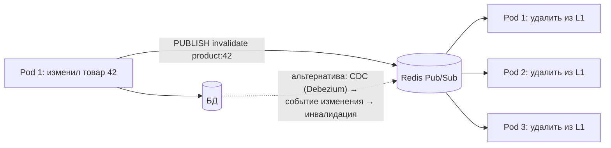

:::tldr
- «В информатике есть две сложные вещи: инвалидация кэша и именование» (Фил Карлтон). Инвалидация — решение, **когда кэшированное значение перестаёт быть верным**.
- **TTL (истечение по времени)** — простейшая стратегия: данные устаревают не дольше, чем на TTL. Выбор TTL = компромисс между свежестью и нагрузкой. Добавляйте **jitter**.
- **Явная инвалидация при записи**: после изменения данных **удалить** ключ (delete, а не update — безопаснее при гонках). Групповая — через **теги**/версии ключей.
- **Eviction (вытеснение)** — политика удаления при нехватке места: **LRU**, LFU, по размеру. Это не инвалидация, а управление памятью (`maxmemory-policy` в Redis, `SizeLimit` в `IMemoryCache`).
- Паттерны записи: **cache-aside** (приложение управляет), **write-through** (запись в кэш и БД синхронно), **write-behind** (сначала кэш, в БД асинхронно — риск потерь), **refresh-ahead**.
- Распределённая согласованность: несколько экземпляров с локальными кэшами → рассылка инвалидации (**Redis Pub/Sub**, события из брокера, **CDC**), короткий L1 TTL, **версионированные ключи**. Гонка «чтение старого значения после удаления» лечится **повторным удалением с задержкой** или версионированием.
:::

## Стратегии



| Стратегия | Свежесть | Сложность | Когда |
|---|---|---|---|
| Только TTL | Устаревание до TTL | Минимальная | Данные, где небольшое устаревание допустимо: каталог, курсы, рейтинги |
| Инвалидация при записи | Почти сразу | Средняя: знать все ключи, зависящие от данных | Профили, настройки, корзина |
| Теги / групповая | Почти сразу | Средняя | Списки, агрегаты, страницы, зависящие от многих сущностей |
| Версионирование ключей | Сразу для новых чтений | Низкая | Деплой новой схемы, «сброс всего» раздела |
| Событийная (Pub/Sub, CDC) | Почти сразу во всех экземплярах | Выше: инфраструктура | Микросервисы, L1-кэши в нескольких экземплярах |

## TTL и jitter

```csharp
var ttl = TimeSpan.FromMinutes(10) + TimeSpan.FromSeconds(Random.Shared.Next(-60, 60));   // 9–11 минут
await cache.SetAsync(key, value, new DistributedCacheEntryOptions { AbsoluteExpirationRelativeToNow = ttl });
```

Как выбирать TTL: какая задержка устаревания допустима бизнесу («цена может обновиться через 5 минут» — ок; «баланс счёта» — нет, не кэшировать или инвалидировать явно) и какая нагрузка на источник при промахах.

## Инвалидация при записи: delete, а не update



```csharp
public async Task UpdatePriceAsync(int productId, decimal price, CancellationToken ct)
{
    await db.Products.Where(p => p.Id == productId).ExecuteUpdateAsync(s => s.SetProperty(p => p.Price, price), ct);
    await cache.RemoveAsync($"product:{productId}", ct);        // после успешной записи в БД
    await cache.RemoveByTagAsync($"category:{categoryId}", ct);  // зависимые списки (HybridCache)
}
```

### Гонка «устаревшее значение возвращается в кэш»



Смягчение:
- **TTL всегда** — ограничивает время жизни ошибки.
- **Delayed double delete**: удалить сразу и ещё раз через небольшую задержку (сотни мс).
- **Версии**: хранить в кэше вместе с `version`/`updated_at` и не перезаписывать более новую версию более старой (Lua-скрипт в Redis с проверкой).
- Для критичных данных — не кэшировать или читать из источника.

## Групповая инвалидация

```csharp Версия пространства ключей
// Ключи включают «поколение» категории; инвалидация = увеличить поколение
var gen = await redis.StringGetAsync($"gen:category:{categoryId}") ;
var key = $"category:{categoryId}:g{gen}:page:{page}";

// При изменении любого товара категории
await redis.StringIncrementAsync($"gen:category:{categoryId}");   // старые ключи больше не читаются, истекут по TTL
```

`HybridCache` (.NET 9+) и Output Cache поддерживают **теги** «из коробки»: `RemoveByTagAsync("category:5")`.

## Eviction

| Политика | Что удаляется при нехватке памяти |
|---|---|
| **LRU** (Least Recently Used) | Дольше всего не использовавшиеся |
| **LFU** (Least Frequently Used) | Реже всего использовавшиеся |
| **TTL-based** (volatile-ttl) | С ближайшим истечением |
| **Random** | Случайные |
| **noeviction** | Ничего — запись вернёт ошибку |

```text Redis: redis.conf
maxmemory 2gb
maxmemory-policy allkeys-lru        # для чистого кэша; volatile-lru — вытеснять только ключи с TTL
```

`IMemoryCache` с `SizeLimit` вытесняет по приоритету (`CacheItemPriority`) и давности использования при компактизации.

## Паттерны записи



| Паттерн | Плюсы | Минусы |
|---|---|---|
| **Cache-aside** (lazy loading) | Просто, кэш — только то, что читают, отказ кэша не критичен | Промах = задержка; гонки при инвалидации |
| **Read-through** | Логика загрузки в слое кэша (HybridCache.GetOrCreate) | Та же семантика, что cache-aside |
| **Write-through** | Кэш согласован с записью | Каждая запись дороже; кэшируются и нечитаемые данные |
| **Write-behind** | Очень быстрые записи, батчинг | Риск потери данных, сложность |
| **Refresh-ahead** | Горячие ключи обновляются до истечения — нет промахов | Лишняя нагрузка на обновление редко читаемых |

## Несколько экземпляров и локальные кэши



```csharp
var sub = redis.GetSubscriber();
await sub.SubscribeAsync(RedisChannel.Literal("cache:invalidate"), (_, key) => memoryCache.Remove(key.ToString()));

// после записи
await sub.PublishAsync(RedisChannel.Literal("cache:invalidate"), $"product:{id}");
```

Pub/Sub в Redis — «fire and forget»: отключённый в момент публикации экземпляр сообщение пропустит. Поэтому **короткий TTL для L1** остаётся страховкой. В микросервисах инвалидацию часто делают по доменным событиям из брокера (`ProductPriceChanged`).

## Вопросы на засыпку

:::qa Почему инвалидация кэша считается сложной?
Нужно знать все места, где кэшированы данные, зависящие от изменения (карточка, списки, агрегаты, поиск, CDN), учитывать гонки параллельных чтений и записей, несколько экземпляров и уровней кэша, отказы сети при рассылке. Ошибка проявляется тихо — пользователи видят устаревшие данные.
:::

:::qa Что выбрать: короткий TTL или явную инвалидацию?
Часто — оба: явная инвалидация для быстрой реакции на изменения плюс TTL как страховка от пропущенных инвалидаций и гонок. Только TTL — если бизнес допускает устаревание на время TTL.
:::

:::qa Как инвалидировать CDN?
Через API CDN (purge по URL или тегу — Surrogate-Key/Cache-Tag), либо версионирование URL (`/assets/app.3f9a.js`, `?v=2`) — старые URL просто перестают запрашиваться. Для статики — хэш в имени файла и «вечный» кэш.
:::

:::qa Чем eviction отличается от expiration?
Expiration — запланированное удаление по времени (данные могли устареть). Eviction — вынужденное удаление из-за нехватки места (данные могли быть вполне актуальны). Частые eviction-ы — сигнал увеличить память кэша или пересмотреть, что кэшируется.
:::

## Итог

Инвалидация — это баланс свежести и нагрузки. TTL с jitter — базовая страховка, удаление ключей после записи (а не обновление) — быстрая реакция, теги и версии — групповая инвалидация, Pub/Sub, события или CDC — согласованность нескольких экземпляров. Вытеснение (LRU и др.) — управление памятью, а не свежестью. Помните о гонках cache-aside и не кэшируйте то, что должно быть строго актуальным.
