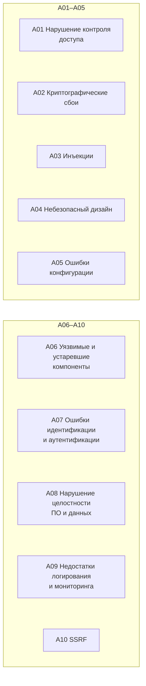

:::tldr
- **OWASP Top 10** — рейтинг самых критичных рисков веб-приложений (редакция 2021; готовится обновление), основанный на данных реальных уязвимостей.
- **A01 Broken Access Control** (№1!) — IDOR (доступ к чужому заказу по id), отсутствие проверки прав, обход авторизации. В .NET: `[Authorize]` + **resource-based** проверки + **FallbackPolicy**.
- **A02 Cryptographic Failures** — данные без шифрования, слабые алгоритмы, пароли без хэширования. **A03 Injection** — SQL, команды ОС, LDAP, XSS (теперь в этой категории). **A04 Insecure Design** — уязвимость в самой логике (нет rate limit на восстановление пароля).
- **A05 Security Misconfiguration** — Developer Exception Page в продакшене, открытый Swagger, CORS `*` с credentials, дефолтные пароли, подробные ошибки. **A06 Vulnerable Components** — устаревшие NuGet-пакеты с CVE.
- **A07 Identification & Authentication Failures** — слабые пароли, нет защиты от перебора, небезопасные сессии/JWT. **A08 Software & Data Integrity** — небезопасная десериализация (`BinaryFormatter`, `TypeNameHandling.All`), неподписанные обновления, уязвимый CI/CD.
- **A09 Logging & Monitoring Failures** — атаку не видно (нет логов входа, алертов). **A10 SSRF** — сервер делает запрос на URL от пользователя (доступ к метаданным облака, внутренним сервисам).
:::

## Обзор категорий



## A01: Broken Access Control

```csharp Уязвимо: IDOR — любой аутентифицированный пользователь читает любой заказ
[Authorize]
[HttpGet("orders/{id}")]
public async Task<IActionResult> Get(Guid id) => Ok(await db.Orders.FindAsync(id));
```

```csharp Исправлено: проверка владельца (или resource-based авторизация)
[Authorize]
[HttpGet("orders/{id}")]
public async Task<IActionResult> Get(Guid id, CancellationToken ct)
{
    var userId = User.GetUserId();
    var order = await db.Orders.AsNoTracking().FirstOrDefaultAsync(o => o.Id == id && o.CustomerId == userId, ct);
    return order is null ? NotFound() : Ok(order.ToDto());      // 404, а не 403 — не раскрываем существование
}

// Защитный дефолт: всё закрыто, если явно не открыто
builder.Services.AddAuthorizationBuilder()
    .SetFallbackPolicy(new AuthorizationPolicyBuilder().RequireAuthenticatedUser().Build());
```

Также: проверка прав на **каждом** эндпоинте (не только скрытие кнопок в UI), фильтрация по тенанту (query filters), запрет изменения чужих данных через массовое присваивание (over-posting → DTO).

## A02: Cryptographic Failures

- HTTPS везде, **HSTS**, TLS 1.2+.
- Пароли — **Argon2/bcrypt/PBKDF2** (ASP.NET Core Identity `PasswordHasher`), никогда MD5/SHA1/SHA256 без соли и растяжения.
- Чувствительные данные в БД — шифрование (Always Encrypted, pgcrypto, шифрование на уровне приложения), ключи — в Key Vault.
- Не изобретать криптографию: `System.Security.Cryptography` (AES-GCM, `RandomNumberGenerator`), Data Protection API.

## A03: Injection

```csharp
// SQL-инъекция
var users = db.Users.FromSqlRaw($"SELECT * FROM users WHERE name = '{name}'");       // УЯЗВИМО
var users2 = db.Users.FromSql($"SELECT * FROM users WHERE name = {name}");           // параметризовано

// Командная инъекция
Process.Start("bash", $"-c \"convert {fileName} out.png\"");                          // УЯЗВИМО: fileName = "x; rm -rf /"
Process.Start(new ProcessStartInfo("convert") { ArgumentList = { fileName, "out.png" } });   // аргументы без shell
```

XSS — тоже инъекция (в HTML/JS). Подробно — в следующем вопросе.

## A05: Security Misconfiguration

```csharp Безопасная конфигурация по умолчанию
if (app.Environment.IsDevelopment())
{
    app.UseDeveloperExceptionPage();
    app.MapOpenApi();                                    // Swagger/OpenAPI — только в dev или за авторизацией
}
else
{
    app.UseExceptionHandler();                           // ProblemDetails без стека
    app.UseHsts();
}
app.UseHttpsRedirection();

builder.WebHost.ConfigureKestrel(o => o.AddServerHeader = false);   // не раскрывать "Server: Kestrel"

app.Use(async (ctx, next) =>                             // заголовки безопасности
{
    ctx.Response.Headers["X-Content-Type-Options"] = "nosniff";
    ctx.Response.Headers["X-Frame-Options"] = "DENY";
    ctx.Response.Headers["Referrer-Policy"] = "strict-origin-when-cross-origin";
    ctx.Response.Headers["Content-Security-Policy"] = "default-src 'self'; frame-ancestors 'none'";
    await next();
});
```

Типичные ошибки: `ASPNETCORE_ENVIRONMENT=Development` в продакшене, CORS `SetIsOriginAllowed(_ => true)` + credentials, дефолтные учётные записи, открытые health/metrics эндпоинты с деталями, секреты в `appsettings.json`.

## A06: Vulnerable Components

```bash
dotnet list package --vulnerable --include-transitive
# + Dependabot / Renovate, NuGetAudit при restore (.NET 8+), сканирование образов (Trivy)
```

Подробно — в вопросе про сканирование зависимостей.

## A07: Authentication Failures

- Защита от перебора: **rate limiting** на логин, блокировка (`LockoutOptions` в Identity), CAPTCHA после неудач.
- **MFA** для чувствительных операций и админов.
- Проверка паролей по базам утечек (Have I Been Pwned k-anonymity API), разумная политика (длина важнее «сложности»).
- Безопасные cookie (`HttpOnly`, `Secure`, `SameSite`), инвалидация сессий при смене пароля (SecurityStamp), короткоживущие JWT с проверкой `iss/aud/exp`.
- Одинаковые ответы и время ответа для «неверный логин» и «неверный пароль» (не раскрывать существование пользователей).

## A08: Software and Data Integrity Failures

```csharp
// Опасно: десериализация с информацией о типе из входных данных → выполнение произвольного кода
var settings = new JsonSerializerSettings { TypeNameHandling = TypeNameHandling.All };   // Newtonsoft — уязвимо
var obj = JsonConvert.DeserializeObject(untrustedJson, settings);

// BinaryFormatter — удалён/отключён в .NET 9 из-за небезопасности
// Безопасно: System.Text.Json с конкретными типами, полиморфизм только через [JsonDerivedType] (белый список)
```

Сюда же: подпись пакетов и образов (Sigstore/cosign), защищённые CI-пайплайны (pinned actions, минимальные права токенов), проверка целостности обновлений.

## A09: Logging & Monitoring Failures

- Логировать: входы (успешные и неуспешные), смену паролей и прав, отказ в доступе (403), ошибки валидации токенов, административные действия.
- Не логировать: пароли, токены, полные номера карт, персональные данные сверх необходимого.
- Алерты: всплеск 401/403, массовые неудачные логины, аномальные объёмы данных.
- Журналы — защищённые от изменения, с достаточным сроком хранения.

## A10: SSRF

```csharp Уязвимо: сервер скачивает «аватар» по URL пользователя
app.MapPost("/avatar/import", async (string url, HttpClient http) => await http.GetByteArrayAsync(url));
// url = http://169.254.169.254/latest/meta-data/iam/security-credentials/  → ключи облака
// url = http://orders-api.internal/admin/...                                → внутренние сервисы
```

```csharp Защита
static async Task<bool> IsSafeAsync(Uri uri)
{
    if (uri.Scheme != Uri.UriSchemeHttps) return false;
    if (!AllowedHosts.Contains(uri.Host)) return false;                 // белый список доменов — лучший вариант
    foreach (var ip in await Dns.GetHostAddressesAsync(uri.Host))       // запрет приватных и link-local адресов
        if (IPAddress.IsLoopback(ip) || ip.IsIPv6LinkLocal || IsPrivate(ip) || ip.ToString().StartsWith("169.254.")) return false;
    return true;
}
// + отключить редиректы (AllowAutoRedirect = false) или проверять каждый, отдельный egress-прокси, NetworkPolicy
```

## Инструменты

| Инструмент | Для чего |
|---|---|
| Анализаторы Roslyn (CA-правила безопасности), SonarQube, CodeQL | SAST — поиск уязвимостей в коде |
| OWASP ZAP, Burp Suite | DAST — сканирование работающего приложения |
| `dotnet list package --vulnerable`, Dependabot, Snyk | Уязвимые зависимости (SCA) |
| Trivy, Grype | Уязвимости образов и IaC |
| gitleaks, GitHub secret scanning | Секреты в репозитории |
| OWASP ASVS, Cheat Sheet Series | Требования и руководства |

## Вопросы на засыпку

:::qa Почему Broken Access Control на первом месте?
Он встречается чаще всего: фреймворки хорошо защищают от инъекций по умолчанию, но проверку «принадлежит ли этот ресурс этому пользователю» за разработчика никто не сделает. IDOR, пропущенный `[Authorize]`, проверки только на фронтенде — массовые ошибки.
:::

:::qa Что такое IDOR?
Insecure Direct Object Reference — доступ к объекту по идентификатору без проверки прав: `/api/invoices/1043` → меняем на `1044` и видим чужой счёт. Случайные GUID вместо последовательных id **не являются** защитой — нужна проверка владельца/прав на сервере.
:::

:::qa Чем SAST отличается от DAST?
SAST анализирует исходный код без запуска (находит, например, конкатенацию SQL, небезопасную десериализацию). DAST атакует работающее приложение снаружи (находит мисконфигурации, XSS, открытые эндпоинты). Они дополняют друг друга; плюс SCA для зависимостей и ручной пентест.
:::

:::qa Почему 404 лучше 403 для чужого ресурса?
403 подтверждает, что ресурс существует, — это утечка информации (перебором можно узнать число заказов, существование пользователей). 404 не раскрывает ничего. Для ресурсов, существование которых не секрет, 403 допустим.
:::

## Итог

OWASP Top 10 — карта основных рисков. Для .NET главное: авторизация на каждом ресурсе (A01), параметризованные запросы и экранирование (A03), безопасная конфигурация продакшена (A05), обновление зависимостей (A06), защита аутентификации (A07), отказ от небезопасной десериализации (A08), логирование событий безопасности (A09) и защита от SSRF (A10). Безопасность встраивается в процесс: анализаторы, сканеры и ревью в CI.
