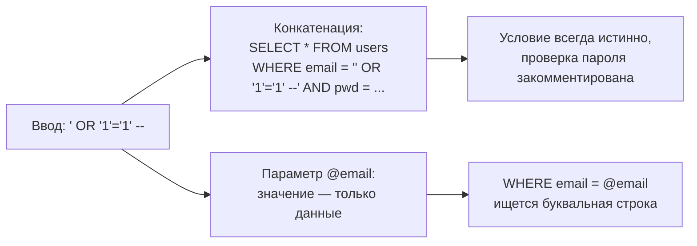
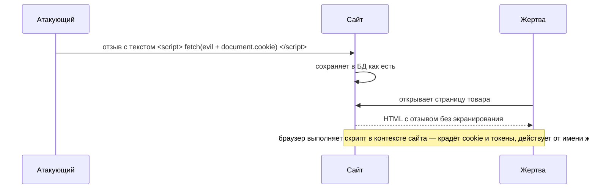
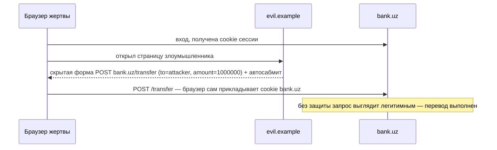

:::tldr
- **SQL Injection** — пользовательский ввод становится частью SQL-кода. Защита: **параметризованные запросы** (EF Core LINQ, `FromSql($"...")`, Dapper-параметры, `SqlParameter`); никогда не склеивать строки SQL; для динамических идентификаторов — **белые списки**; минимальные права пользователя БД.
- **XSS (Cross-Site Scripting)** — злоумышленник внедряет JavaScript, который выполняется в браузере других пользователей (кража сессии, действия от их имени). Виды: stored, reflected, DOM-based. Защита: **кодирование вывода** по контексту (Razor экранирует по умолчанию; не использовать `Html.Raw`/`MarkupString` с пользовательскими данными), **санитизация** HTML (HtmlSanitizer), **Content-Security-Policy**, `HttpOnly`-cookie.
- **CSRF (Cross-Site Request Forgery)** — чужой сайт заставляет браузер жертвы отправить запрос к вашему сайту **с её cookie**. Защита: **antiforgery-токены** (встроены в Razor Pages/MVC формы, `[ValidateAntiForgeryToken]`, для Minimal API — `app.UseAntiforgery()`), cookie **`SameSite=Lax/Strict`**, проверка `Origin`. API с **Bearer-токенами** в заголовке к CSRF не уязвимы.
:::

## SQL Injection



```csharp Уязвимо
var sql = $"SELECT * FROM users WHERE email = '{email}' AND password_hash = '{hash}'";
var user = await db.Users.FromSqlRaw(sql).FirstOrDefaultAsync();               // интерполяция ДО FromSqlRaw — строка уже склеена
using var cmd = new NpgsqlCommand("SELECT * FROM orders WHERE id = " + id, conn);
```

```csharp Безопасно
// EF Core LINQ — всегда параметризован
var user = await db.Users.FirstOrDefaultAsync(u => u.Email == email);

// Raw SQL с интерполяцией FormattableString — значения становятся параметрами
var orders = await db.Orders.FromSql($"SELECT * FROM orders WHERE customer_id = {customerId}").ToListAsync();

// ADO.NET / Dapper
using var cmd = new NpgsqlCommand("SELECT * FROM orders WHERE id = @id", conn);
cmd.Parameters.AddWithValue("id", id);
var list = await conn.QueryAsync<Order>("SELECT * FROM orders WHERE status = @status", new { status });

// Динамическая сортировка — белый список, параметризовать имена столбцов нельзя
var column = sortBy switch { "date" => "created_at", "total" => "total", _ => "id" };
```

Дополнительные слои: учётная запись БД приложения **без DDL и прав суперпользователя**, отдельные read-only учётки для отчётов, WAF.

## XSS



| Вид | Где живёт payload | Пример |
|---|---|---|
| **Stored** | В БД, показывается всем | Отзыв, комментарий, имя профиля |
| **Reflected** | В запросе, отражается в ответе | `/search?q=<script>...` в тексте «Результаты по …» |
| **DOM-based** | Обрабатывается JS на клиенте | `element.innerHTML = location.hash` |

### Защита в ASP.NET Core

```cshtml Razor экранирует по умолчанию
<p>@review.Text</p>                       @* <script> → &lt;script&gt; — безопасно *@
<p>@Html.Raw(review.Text)</p>             @* ОПАСНО: вывод без экранирования *@
```

```csharp Когда нужен пользовательский HTML (редактор с форматированием) — санитизация по белому списку
var sanitizer = new HtmlSanitizer();                     // пакет HtmlSanitizer (Ganss.Xss)
sanitizer.AllowedTags.Clear();
foreach (var tag in new[] { "p", "b", "i", "ul", "ol", "li", "a", "br" }) sanitizer.AllowedTags.Add(tag);
var safeHtml = sanitizer.Sanitize(userHtml);             // удаляет <script>, onerror=, javascript:-ссылки
```

- **Кодирование по контексту**: HTML-тело, атрибут, JavaScript, URL, CSS — разные правила. Используйте `HtmlEncoder`, `JavaScriptEncoder`, `UrlEncoder` из `System.Text.Encodings.Web`.
- **SPA** (React, Angular, Blazor) экранируют по умолчанию; опасны `dangerouslySetInnerHTML`, `[innerHTML]`, `bypassSecurityTrust*`, `MarkupString`.
- **API**, возвращающие JSON с `Content-Type: application/json`, сами по себе XSS не создают — важна обработка на клиенте.

### Content-Security-Policy

```csharp
app.Use(async (ctx, next) =>
{
    ctx.Response.Headers.ContentSecurityPolicy =
        "default-src 'self'; script-src 'self'; object-src 'none'; base-uri 'self'; frame-ancestors 'none'";
    await next();
});
```

CSP запрещает браузеру выполнять inline-скрипты и скрипты с чужих доменов — даже если XSS-payload попал на страницу, он не выполнится. Для необходимых inline-скриптов — nonce или hash. Плюс `HttpOnly`-cookie: JavaScript не может прочитать cookie сессии.

## CSRF



### Antiforgery-токены

```cshtml Razor Pages / MVC: токен добавляется в формы автоматически
<form method="post" asp-action="Transfer">
    @* <input name="__RequestVerificationToken" type="hidden" value="..."> генерируется tag helper-ом *@
    <input asp-for="Amount" />
    <button>Перевести</button>
</form>
```

```csharp
builder.Services.AddControllersWithViews(o => o.Filters.Add(new AutoValidateAntiforgeryTokenAttribute()));   // все POST/PUT/DELETE

// Minimal API (.NET 8+): формы проверяются автоматически при UseAntiforgery
builder.Services.AddAntiforgery();
app.UseAntiforgery();
app.MapPost("/transfer", ([FromForm] TransferForm form) => Results.Ok());

// SPA с cookie-аутентификацией: отдать токен в cookie, фронтенд возвращает его заголовком
builder.Services.AddAntiforgery(o => o.HeaderName = "X-XSRF-TOKEN");
```

Токен (synchronizer token): сервер кладёт секрет в cookie и связанный токен в форму/заголовок; злоумышленник с чужого сайта не может прочитать токен (Same-Origin Policy), поэтому не может сформировать валидный запрос.

### SameSite cookie

| Значение | Отправка cookie с чужого сайта | Замечание |
|---|---|---|
| `Strict` | Никогда | Максимальная защита, но переход по ссылке с другого сайта — без сессии |
| `Lax` (по умолчанию в браузерах) | Только навигационные GET (переход по ссылке) | Защищает от CSRF через POST-формы |
| `None` (+ `Secure`) | Всегда | Нужно для сторонних встраиваний (iframe, OAuth-сценарии); без antiforgery — уязвимо |

### Когда CSRF не угрожает

API, аутентифицирующее запросы через заголовок `Authorization: Bearer ...`: браузер не добавляет этот заголовок автоматически, чужой сайт не знает токен. Но если токен хранится в cookie — снова нужна защита.

## Сводная таблица

| Атака | Суть | Главная защита в ASP.NET Core |
|---|---|---|
| SQL Injection | Ввод становится SQL-кодом | EF Core LINQ, `FromSql` с интерполяцией, параметры; белые списки |
| XSS | Ввод становится JS-кодом в браузере | Экранирование Razor, санитизация HTML, CSP, HttpOnly |
| CSRF | Чужой сайт использует cookie жертвы | Antiforgery-токены, SameSite, Bearer в заголовке |

## Вопросы на засыпку

:::qa Защищает ли ORM полностью от SQL-инъекций?
Только при использовании LINQ и параметризованных API. `FromSqlRaw`/`ExecuteSqlRaw` с заранее склеенной строкой, динамические имена столбцов, хранимые процедуры, собирающие SQL внутри (`EXEC(@sql)`), остаются уязвимыми.
:::

:::qa Почему валидация ввода не главная защита от XSS?
Опасность зависит от **контекста вывода**: одно и то же значение безопасно в HTML-тексте и опасно в атрибуте `href` или внутри `<script>`. Правильная защита — кодирование при выводе в конкретный контекст; валидация ввода — дополнительный слой.
:::

:::qa Нужна ли CSRF-защита для GET-запросов?
GET по стандарту должен быть безопасным (не изменять состояние). Если GET-эндпоинт что-то меняет (`/logout`, `/delete?id=`), он уязвим и к CSRF (через ``), и к prefetch. Решение — изменения только через POST/PUT/DELETE.
:::

:::qa Как XSS обходит CSRF-защиту?
Скрипт, выполняющийся на вашем же домене, может прочитать antiforgery-токен со страницы и отправить «правильный» запрос. Поэтому XSS обесценивает CSRF-защиту — от XSS нужно защищаться в первую очередь.
:::

## Итог

SQL-инъекции предотвращаются параметризацией (EF Core LINQ, `FromSql` с интерполяцией) и белыми списками, XSS — экранированием вывода, санитизацией HTML и CSP, CSRF — antiforgery-токенами, SameSite-cookie и Bearer-токенами в заголовках. ASP.NET Core делает безопасный вариант вариантом по умолчанию — главное не обходить его через `FromSqlRaw` со склейкой, `Html.Raw` и отключение antiforgery.
