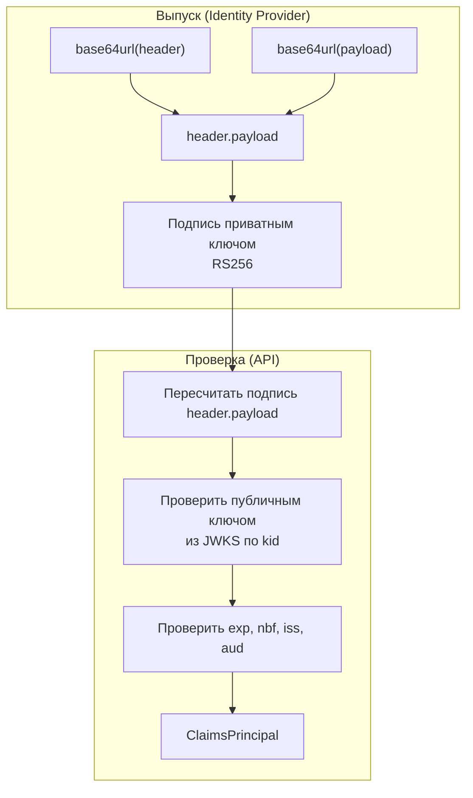
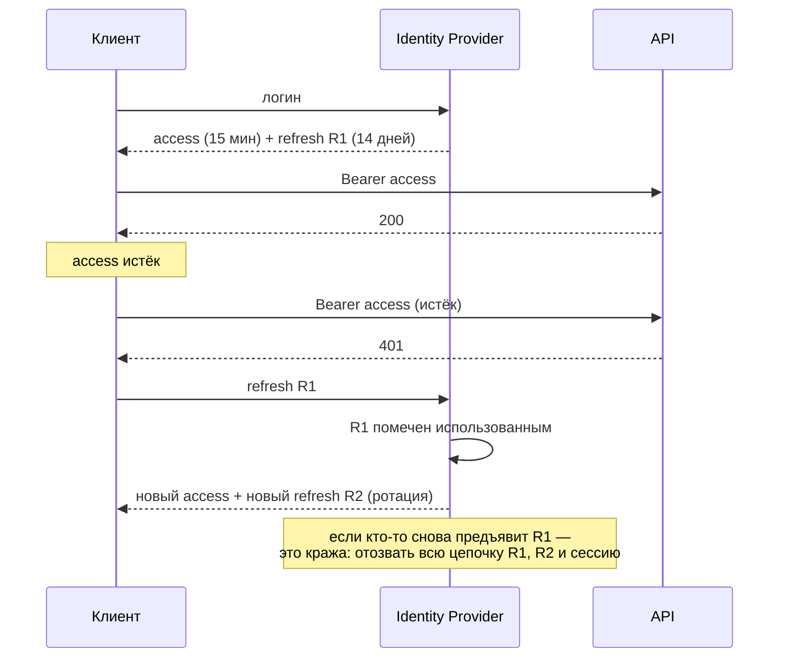
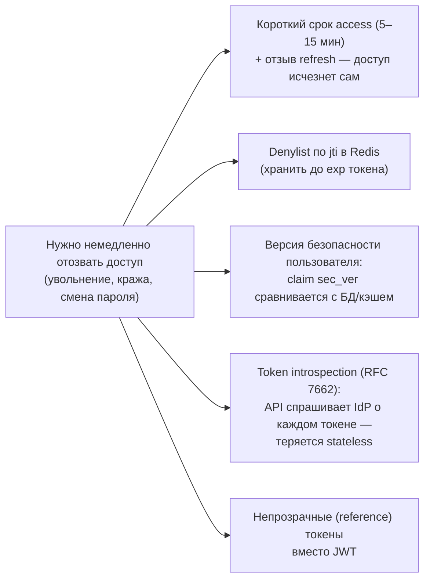

:::tldr
- **JWT** = `header.payload.signature` — три части в Base64Url. **Header**: алгоритм (`alg`) и тип, ключ (`kid`). **Payload**: claims — `sub`, `iss`, `aud`, `exp`, `iat`, `nbf`, `jti` + свои (`role`, `scope`). **Signature**: подпись header+payload.
- JWT **подписан, но не зашифрован**: любой прочитает payload (jwt.io). Не кладите туда секреты и лишние персональные данные. Шифрование — JWE (редко нужно).
- Алгоритмы: **HS256** (симметричный — один секрет для подписи и проверки; все проверяющие могут и выпускать токены), **RS256/ES256** (асимметричный — IdP подписывает приватным ключом, сервисы проверяют публичным из **JWKS**). Для микросервисов — асимметричные.
- Проверять **всегда**: подпись, `exp`, `iss`, `aud`, алгоритм (запрет `none` и подмены RS→HS).
- **Access token** — короткий (5–15 мин), stateless-проверка. **Refresh token** — долгий, хранится на сервере/IdP, используется для получения нового access, **ротируется** при каждом использовании с обнаружением повторного использования.
- **Отзыв**: stateless JWT нельзя «отменить» до `exp` — поэтому короткий срок жизни, отзыв refresh-токенов, при необходимости — denylist по `jti`/версии пользователя, introspection. Хранение в браузере: не localStorage; лучше **BFF + HttpOnly cookie**.
:::

## Структура

```text
eyJhbGciOiJSUzI1NiIsImtpZCI6IjIwMjUtMDkifQ.eyJzdWIiOiI0MiIsIm5hbWUiOiJBbm4iLCJyb2xlIjoibWFuYWdlciIsImlzcyI6Imh0dHBzOi8vYXV0aC5leGFtcGxlLnV6IiwiYXVkIjoib3JkZXJzLWFwaSIsImV4cCI6MTc1OTIyNjUwMH0.Kx3v...подпись...
└──────────────── header ──────────────────┘ └──────────────────────────────── payload ────────────────────────────────────────────┘ └ signature ┘
```

```json Header
{ "alg": "RS256", "typ": "JWT", "kid": "2025-09" }
```

```json Payload (claims)
{
  "iss": "https://auth.example.uz",          // кто выпустил
  "aud": "orders-api",                        // для кого предназначен
  "sub": "42",                                // субъект (id пользователя)
  "exp": 1759226500,                          // истекает (Unix time)
  "iat": 1759225600,                          // выпущен
  "nbf": 1759225600,                          // не раньше
  "jti": "7f3a9c2e-...",                      // уникальный id токена
  "scope": "orders.read orders.write",
  "role": "manager"
}
```



Если злоумышленник изменит payload (например, `role: admin`), подпись не совпадёт — токен отклоняется.

## HS256 против RS256

| | HS256 (HMAC) | RS256 / ES256 |
|---|---|---|
| Ключ | Один общий секрет | Пара: приватный (подпись) + публичный (проверка) |
| Кто может выпускать токены | **Любой**, кто может проверять | Только владелец приватного ключа (IdP) |
| Распространение ключа | Секрет нужно передать каждому сервису | Публичный ключ открыт (JWKS endpoint) |
| Ротация | Синхронная замена во всех сервисах | `kid` + несколько ключей в JWKS |
| Когда | Один сервис выпускает и проверяет | IdP + много API, микросервисы |

## Проверка в ASP.NET Core

```csharp
builder.Services.AddAuthentication(JwtBearerDefaults.AuthenticationScheme)
    .AddJwtBearer(o =>
    {
        o.Authority = "https://auth.example.uz";          // → /.well-known/openid-configuration → JWKS (кэшируется)
        o.Audience = "orders-api";
        o.MapInboundClaims = false;                        // сохранить имена claims (sub, role) как есть
        o.TokenValidationParameters = new TokenValidationParameters
        {
            ValidateIssuer = true,
            ValidateAudience = true,
            ValidateLifetime = true,
            ValidateIssuerSigningKey = true,
            ValidAlgorithms = [SecurityAlgorithms.RsaSha256],   // запрет подмены алгоритма
            ClockSkew = TimeSpan.FromSeconds(30),               // по умолчанию 5 минут — много
            NameClaimType = "sub",
            RoleClaimType = "role"
        };
    });
```

:::warning Классические уязвимости JWT
- **`alg: none`** — токен без подписи принимается библиотекой (старые реализации).
- **Algorithm confusion**: сервер ожидает RS256, атакующий присылает HS256 и подписывает публичным ключом как HMAC-секретом. Защита — фиксированный список `ValidAlgorithms`.
- **Не проверяется `aud`**: токен для другого сервиса принимается вашим.
- **Слабый HMAC-секрет** подбирается офлайн. Минимум 256 бит случайных данных.
- **Долгоживущие access-токены** (сутки, месяц) — украденный токен работает долго и не отзывается.
:::

## Access и refresh токены



| | Access token | Refresh token |
|---|---|---|
| Срок жизни | Минуты | Дни / недели (со скользящим продлением) |
| Кому отправляется | API (ресурс-серверам) | Только IdP / серверу авторизации |
| Проверка | Stateless (подпись, exp) | По хранилищу на сервере |
| Формат | Обычно JWT | Обычно непрозрачная случайная строка |
| Отзыв | Сложно (до exp) | Легко: удалить из хранилища |

**Refresh token rotation**: каждый refresh-токен одноразовый; повторное использование старого — признак кражи → отозвать всё семейство токенов.

## Отзыв токенов

JWT проверяется без обращения к серверу — это его главная сила и главная слабость. Варианты:



```csharp Проверка denylist в событии JwtBearer
o.Events = new JwtBearerEvents
{
    OnTokenValidated = async ctx =>
    {
        var jti = ctx.Principal!.FindFirstValue(JwtRegisteredClaimNames.Jti);
        var denylist = ctx.HttpContext.RequestServices.GetRequiredService<ITokenDenylist>();
        if (jti is not null && await denylist.IsRevokedAsync(jti, ctx.HttpContext.RequestAborted))
            ctx.Fail("Токен отозван");
    }
};
```

## Где хранить токены в браузере

| Хранилище | XSS | CSRF | Комментарий |
|---|---|---|---|
| `localStorage` / `sessionStorage` | **Уязвимо** — любой внедрённый скрипт прочитает | Не уязвимо | Популярно, но рискованно |
| Память JS (переменная) | Уязвимо в меньшей степени, теряется при перезагрузке | Не уязвимо | + refresh в HttpOnly cookie |
| `HttpOnly` cookie | Не прочитать из JS | Нужна защита (SameSite, antiforgery) | Хороший вариант |
| **BFF** (токены на сервере, браузеру — сессионная cookie) | Токены недоступны в браузере | SameSite + antiforgery | **Рекомендуется** для SPA (OAuth 2.0 for Browser-Based Apps) |

## Вопросы на засыпку

:::qa Можно ли хранить в JWT персональные данные?
Минимально: payload читается кем угодно, у кого есть токен (браузер, прокси, логи). Кладите идентификатор и необходимые для авторизации claims; остальное — через API или userinfo. Большие токены ещё и увеличивают каждый запрос.
:::

:::qa Зачем kid в заголовке?
Key ID указывает, каким ключом из набора (JWKS) подписан токен. Это позволяет ротировать ключи: IdP публикует новый ключ заранее, начинает подписывать им, а старый оставляет в JWKS, пока не истекут выпущенные им токены.
:::

:::qa Чем JWT отличается от сессионной cookie?
Сессия — случайный идентификатор, по которому сервер находит состояние у себя (легко отозвать, нужно хранилище). JWT — самодостаточный токен с данными и подписью (не нужно хранилище для проверки, трудно отозвать). Cookie — лишь транспорт: в cookie можно хранить и сессионный id, и JWT.
:::

:::qa Почему ClockSkew по умолчанию 5 минут — проблема?
Токен со сроком 15 минут фактически живёт 20: библиотека допускает расхождение часов. Для коротких токенов уменьшайте ClockSkew до 30–60 секунд и синхронизируйте время серверов (NTP).
:::

## Итог

JWT — подписанный (не зашифрованный) набор claims, проверяемый без обращения к серверу. Используйте асимметричные алгоритмы с JWKS, строго проверяйте подпись, алгоритм, `iss`, `aud` и `exp`, выдавайте короткие access-токены и ротируемые refresh-токены, планируйте отзыв и не храните токены в localStorage — для SPA лучше BFF.
