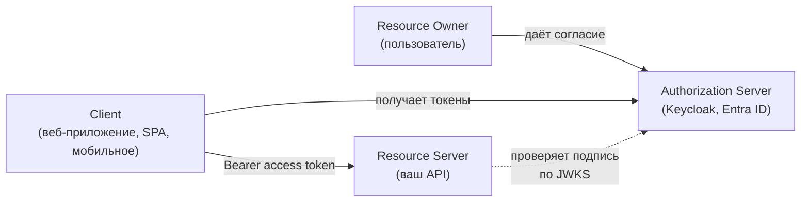
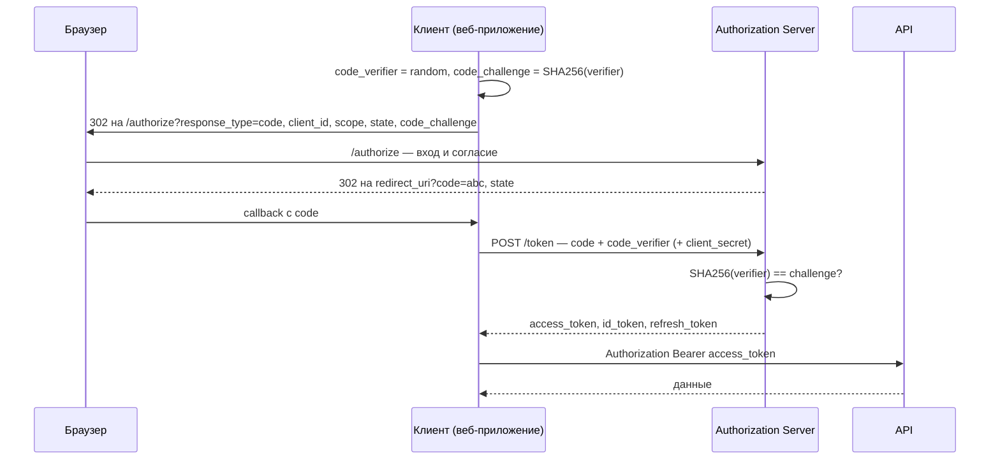
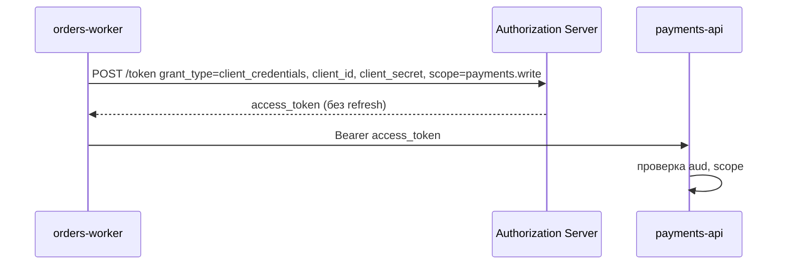
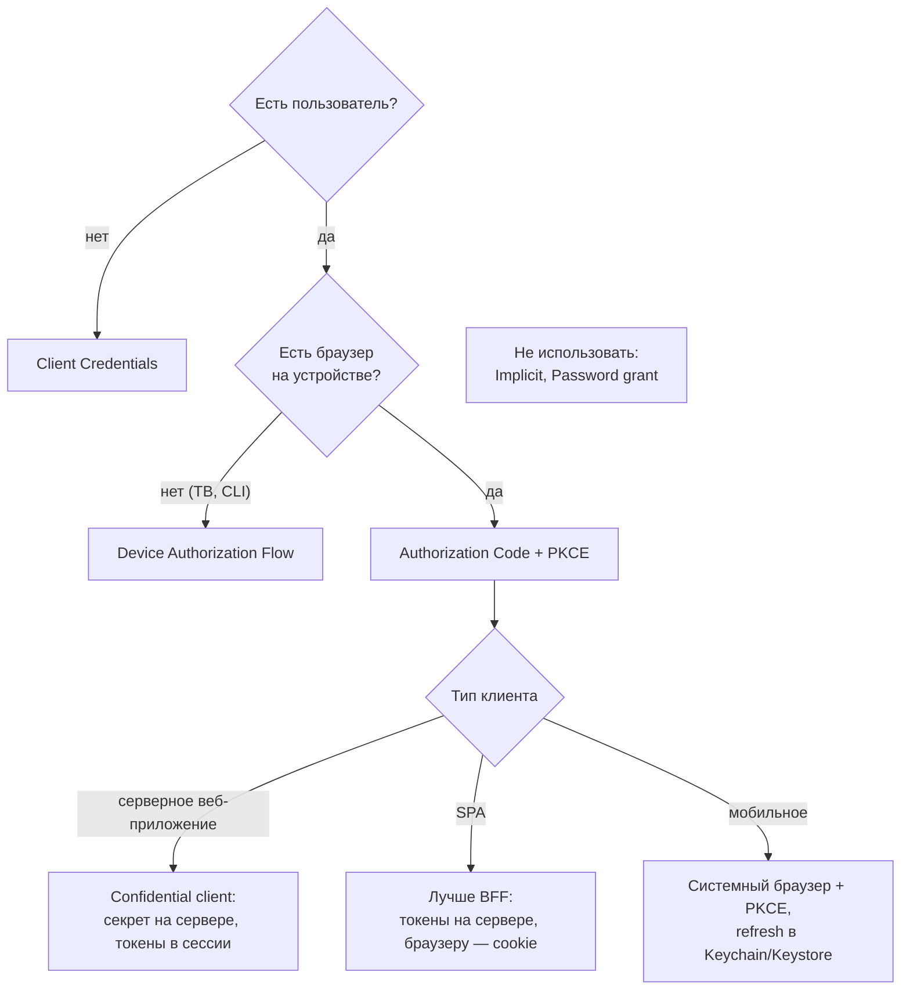
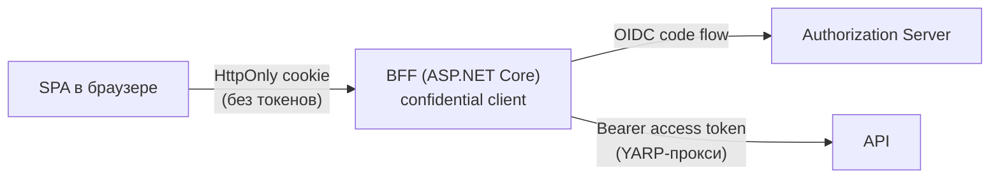

:::tldr
- **OAuth 2.0** — протокол **делегированной авторизации**: пользователь разрешает приложению (client) доступ к своим ресурсам на resource server, не передавая пароль. Результат — **access token**. OAuth ничего не говорит о том, **кто** пользователь.
- **OpenID Connect (OIDC)** — слой **аутентификации** поверх OAuth 2.0: добавляет **ID token** (JWT с данными о пользователе: `sub`, `name`, `email`), scope `openid`, эндпоинты `userinfo` и discovery (`/.well-known/openid-configuration`).
- Роли: **Resource Owner** (пользователь), **Client** (приложение), **Authorization Server** / IdP (Keycloak, Entra ID, Auth0, Duende IdentityServer, OpenIddict), **Resource Server** (ваш API).
- Flow: **Authorization Code + PKCE** — для всех приложений с пользователем (веб, SPA, мобильные); **Client Credentials** — сервис-сервис без пользователя; **Device Code** — ТВ/CLI. **Implicit** и **Resource Owner Password** — устарели, не использовать (OAuth 2.1 их удаляет).
- **ID token** — для клиента (узнать, кто вошёл), **никогда** не отправляется в API. **Access token** — для API. **Refresh token** — для получения новых access токенов.
- В ASP.NET Core: `AddOpenIdConnect()` + cookie для веб-приложений/BFF, `AddJwtBearer()` для API.
:::

## Проблема, которую решает OAuth

До OAuth приложения просили у пользователя пароль от чужого сервиса («введите пароль от Gmail, чтобы мы нашли ваших друзей»). Приложение получало **полный** доступ навсегда, отозвать можно было только сменой пароля.

OAuth заменяет пароль на **токен** с ограниченными правами (**scope**) и сроком жизни, который пользователь выдаёт сам и может отозвать.



## OAuth 2.0 против OpenID Connect

| | OAuth 2.0 | OpenID Connect |
|---|---|---|
| Назначение | Авторизация: **что** приложению можно делать | Аутентификация: **кто** пользователь |
| Главный артефакт | Access token | **ID token** + access token |
| Формат токена | Не определён (часто JWT, может быть непрозрачным) | ID token — **всегда JWT** |
| Информация о пользователе | Нет стандарта | Стандартные claims, эндпоинт `/userinfo` |
| Scope | Любые (`orders.read`) | Обязательный `openid` + `profile`, `email` |
| Discovery | Нет (RFC 8414 — расширение) | `/.well-known/openid-configuration` |

:::warning Частая ошибка: «логин через OAuth»
Использовать чистый OAuth access token как доказательство входа небезопасно: токен мог быть выпущен **другому** приложению (атака подмены токена). OIDC решает это ID-токеном с `aud` = ваш client_id и `nonce`. «Войти через Google» — это OIDC, а не просто OAuth.
:::

## Authorization Code + PKCE

Основной flow для любого приложения с пользователем.



Ключевые идеи:
- Через браузер (front channel) передаётся только **одноразовый код**, а не токены. Токены клиент получает напрямую от сервера (**back channel**).
- **PKCE** (Proof Key for Code Exchange): даже если код перехвачен (вредоносное приложение на телефоне, логи, Referer), без `code_verifier` его нельзя обменять на токены. Обязателен для публичных клиентов, рекомендуется для всех.
- **state** — защита от CSRF в callback; **nonce** — привязка ID token к запросу (защита от replay).
- **redirect_uri** должен точно совпадать с зарегистрированным.

## Client Credentials: сервис-сервис



```csharp Автоматическое получение и кэширование токена (Duende.AccessTokenManagement)
builder.Services.AddClientCredentialsTokenManagement()
    .AddClient("payments", c =>
    {
        c.TokenEndpoint = "https://auth.example.uz/connect/token";
        c.ClientId = "orders-worker";
        c.ClientSecret = builder.Configuration["Auth:ClientSecret"];
        c.Scope = "payments.write";
    });

builder.Services.AddHttpClient<PaymentsClient>(c => c.BaseAddress = new("https://payments.internal"))
    .AddClientCredentialsTokenHandler("payments");    // токен кэшируется до истечения и обновляется сам
```

Вместо секрета надёжнее **private_key_jwt** (клиент подписывает assertion своим ключом) или mTLS, а в облаке — workload identity.

## Какой flow выбрать



| Flow | Когда | Статус |
|---|---|---|
| Authorization Code + PKCE | Веб, SPA, мобильные, десктоп | **Рекомендован** |
| Client Credentials | Сервис-сервис, фоновые задачи | Рекомендован |
| Device Code | Устройства без браузера или клавиатуры | Рекомендован |
| Refresh Token | Продление сессии | Используется со всеми выше |
| Implicit | Раньше для SPA (токен в URL-фрагменте) | **Устарел** — утечки через историю и Referer |
| Resource Owner Password | Приложение собирает пароль | **Устарел** — ломает саму идею OAuth, не работает с MFA |

## ID token против access token

| | ID token | Access token |
|---|---|---|
| Для кого | Для **клиента** | Для **API** (resource server) |
| `aud` | client_id приложения | Идентификатор API (`orders-api`) |
| Содержит | Кто вошёл, когда, как (`sub`, `auth_time`, `amr`) | Права: `scope`, роли |
| Отправлять в API | **Никогда** | Да, в заголовке `Authorization` |
| Формат | Всегда JWT | JWT или непрозрачный |

## ASP.NET Core: веб-приложение (OIDC-клиент)

```csharp
builder.Services.AddAuthentication(o =>
    {
        o.DefaultScheme = CookieAuthenticationDefaults.AuthenticationScheme;
        o.DefaultChallengeScheme = OpenIdConnectDefaults.AuthenticationScheme;
    })
    .AddCookie(o =>
    {
        o.Cookie.HttpOnly = true;
        o.Cookie.SecurePolicy = CookieSecurePolicy.Always;
        o.Cookie.SameSite = SameSiteMode.Lax;
    })
    .AddOpenIdConnect(o =>
    {
        o.Authority = "https://auth.example.uz";
        o.ClientId = "shop-web";
        o.ClientSecret = builder.Configuration["Auth:ClientSecret"];
        o.ResponseType = "code";                        // Authorization Code; PKCE включён по умолчанию
        o.Scope.Add("openid"); o.Scope.Add("profile"); o.Scope.Add("orders.read");
        o.Scope.Add("offline_access");                  // refresh token
        o.SaveTokens = true;                            // токены сохраняются в зашифрованной cookie-сессии
        o.MapInboundClaims = false;
        o.GetClaimsFromUserInfoEndpoint = true;
    });

// в коде: var accessToken = await HttpContext.GetTokenAsync("access_token");
```

## ASP.NET Core: API (resource server)

```csharp
builder.Services.AddAuthentication().AddJwtBearer(o =>
{
    o.Authority = "https://auth.example.uz";
    o.Audience = "orders-api";                          // принимать только токены для этого API
    o.MapInboundClaims = false;
});

builder.Services.AddAuthorizationBuilder()
    .AddPolicy("orders:write", p => p.RequireAssertion(ctx =>
        ctx.User.FindFirst("scope")?.Value.Split(' ').Contains("orders.write") == true));

app.MapPost("/orders", CreateOrder).RequireAuthorization("orders:write");
```

## SPA: почему BFF



Токены в браузере (localStorage, память) доступны любому XSS. В схеме BFF браузер хранит только сессионную cookie, а токены живут на сервере; BFF проксирует вызовы API и подставляет access token (Duende BFF, YARP). Это рекомендация спецификации *OAuth 2.0 for Browser-Based Applications*.

## Вопросы на засыпку

:::qa Зачем PKCE, если у клиента есть client_secret?
PKCE защищает от перехвата и внедрения authorization code (например, код попал в логи или его подсунул атакующий в callback). Секрет подтверждает клиента, PKCE — что код обменивает тот же экземпляр, который начал вход. OAuth 2.1 требует PKCE для всех клиентов.
:::

:::qa Что такое scope и чем он отличается от роли?
Scope — право, которое **пользователь делегировал приложению** (`orders.read`): приложение не может больше, чем разрешено. Роль — что **пользователю** разрешено в системе (`manager`). Итоговое право = пересечение: приложение с `orders.read` не удалит заказ, даже если пользователь — администратор.
:::

:::qa Можно ли свой IdP не писать?
Почти всегда нужно не писать: используйте Keycloak, Entra ID / Azure AD B2C, Auth0, Okta, Duende IdentityServer или OpenIddict (библиотека для своего сервера авторизации на ASP.NET Core). Реализация протокола — сложная область с множеством тонкостей безопасности.
:::

:::qa Что происходит при выходе (logout)?
Локальный выход удаляет cookie приложения, но сессия у IdP остаётся — следующий вход пройдёт без пароля. Полный выход: `SignOutAsync` для cookie и OIDC-схемы → редирект на `end_session_endpoint` IdP. Для выхода из всех приложений — front-channel/back-channel logout.
:::

## Итог

OAuth 2.0 — про делегированный доступ (access token для API), OpenID Connect — про вход (ID token для клиента). Для пользователей используйте Authorization Code + PKCE, для сервисов — Client Credentials, забудьте Implicit и Password grant. В ASP.NET Core веб-клиент — это `AddOpenIdConnect` + cookie, API — `AddJwtBearer` с проверкой audience и scope, а SPA лучше подключать через BFF.
