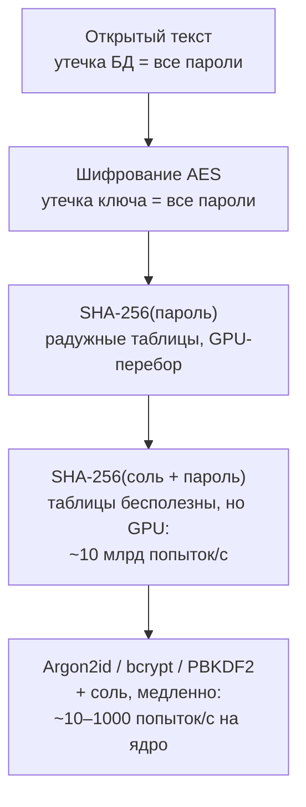
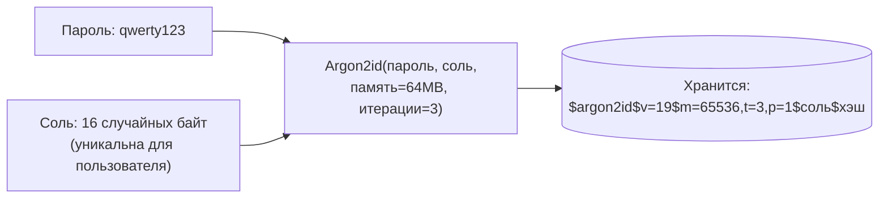
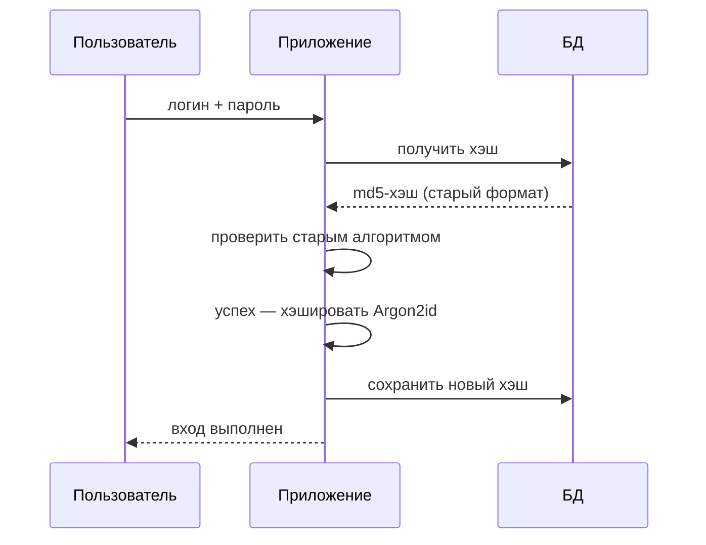

:::tldr
- Пароли **не шифруют** (шифрование обратимо — утечёт ключ, утекут все пароли), а **хэшируют** специальной **медленной** функцией с **солью**.
- **Соль** — уникальная случайная строка для каждого пароля, хранится рядом с хэшем. Делает одинаковые пароли разными хэшами и обесценивает **радужные таблицы**.
- Обычные хэши (**MD5, SHA-1, SHA-256**) созданы быть **быстрыми**: GPU перебирает миллиарды SHA-256 в секунду. Парольные функции намеренно **медленные и настраиваемые** (work factor).
- Выбор (OWASP): **Argon2id** (лучший, memory-hard) → **scrypt** → **bcrypt** (cost ≥ 10, ограничение 72 байта) → **PBKDF2-HMAC-SHA256/512** (600 000+ итераций; FIPS-совместим).
- В .NET: **ASP.NET Core Identity `PasswordHasher<T>`** (PBKDF2-HMAC-SHA512, 100 000 итераций в .NET 7+), `Rfc2898DeriveBytes.Pbkdf2`, библиотеки **BCrypt.Net-Next**, **Konscious.Security.Cryptography.Argon2**.
- Сравнение хэшей — за **постоянное время** (`CryptographicOperations.FixedTimeEquals`). Храните формат с версией/параметрами — это позволяет **повышать стоимость** и перехэшировать при входе.
:::

## Почему не шифрование и не SHA-256



Злоумышленник, укравший БД, атакует **офлайн** — без rate limiting и блокировок. Единственная защита — сделать каждую попытку дорогой.

| Функция | Скорость перебора на GPU (порядок) | Для паролей |
|---|---|---|
| MD5 | Десятки миллиардов/с | Нет |
| SHA-256 | Миллиарды/с | Нет |
| PBKDF2-SHA256, 600k итераций | Тысячи/с | Да |
| bcrypt, cost 12 | Сотни/с | Да |
| Argon2id, 64 MB памяти | Единицы–десятки/с | **Лучший** |

## Соль и pepper



- **Соль** не секрет: хранится вместе с хэшем. Её цель — чтобы у двух пользователей с паролем `qwerty123` были разные хэши и нельзя было атаковать всех сразу одной таблицей.
- **Pepper** — дополнительный секрет, общий для всех паролей, хранящийся **не в БД** (Key Vault, HSM). Если украдена только БД, хэши без pepper бесполезны. Реализуется как HMAC(pepper, пароль) перед хэшированием или шифрование хэша. Опционально, усложняет ротацию.

## Сравнение алгоритмов

| | Argon2id | bcrypt | scrypt | PBKDF2 |
|---|---|---|---|---|
| Год | 2015 (победитель PHC) | 1999 | 2009 | 2000 |
| Устойчивость к GPU/ASIC | **Высокая** (memory-hard) | Средняя | Высокая | Низкая |
| Параметры | Память, итерации, параллелизм | Cost (2^cost раундов) | N, r, p | Итерации, хэш-функция |
| Ограничения | — | Пароль до **72 байт** | — | Нужно много итераций |
| FIPS | Нет | Нет | Нет | **Да** |
| В .NET | Библиотеки | BCrypt.Net-Next | Библиотеки | **Встроен** (`Rfc2898DeriveBytes`) |
| Рекомендация OWASP | m=19 MiB, t=2, p=1 (минимум) | cost ≥ 10 | N=2^17, r=8, p=1 | 600 000 итераций SHA-256 |

## ASP.NET Core Identity

```csharp PasswordHasher работает и без всего Identity
var hasher = new PasswordHasher<User>();
string hash = hasher.HashPassword(user, "S3cure!pass");
// "AQAAAAIAAYagAAAAE..." — base64: [версия формата][алгоритм][итерации][соль][хэш]

var result = hasher.VerifyHashedPassword(user, hash, providedPassword);
switch (result)
{
    case PasswordVerificationResult.Success: break;
    case PasswordVerificationResult.SuccessRehashNeeded:          // старый формат или мало итераций
        user.PasswordHash = hasher.HashPassword(user, providedPassword);
        await db.SaveChangesAsync();
        break;
    case PasswordVerificationResult.Failed: return Unauthorized();
}
```

```csharp Повышение числа итераций
builder.Services.Configure<PasswordHasherOptions>(o => o.IterationCount = 600_000);
```

## PBKDF2 вручную

```csharp
public static class Pbkdf2Hasher
{
    private const int SaltSize = 16, HashSize = 32, Iterations = 600_000;
    private static readonly HashAlgorithmName Algorithm = HashAlgorithmName.SHA256;

    public static string Hash(string password)
    {
        byte[] salt = RandomNumberGenerator.GetBytes(SaltSize);          // криптостойкий ГСЧ, не Random
        byte[] hash = Rfc2898DeriveBytes.Pbkdf2(password, salt, Iterations, Algorithm, HashSize);
        return $"pbkdf2-sha256${Iterations}${Convert.ToBase64String(salt)}${Convert.ToBase64String(hash)}";
    }

    public static bool Verify(string password, string stored)
    {
        var parts = stored.Split('$');
        int iterations = int.Parse(parts[1]);
        byte[] salt = Convert.FromBase64String(parts[2]);
        byte[] expected = Convert.FromBase64String(parts[3]);
        byte[] actual = Rfc2898DeriveBytes.Pbkdf2(password, salt, iterations, Algorithm, expected.Length);
        return CryptographicOperations.FixedTimeEquals(actual, expected);   // не SequenceEqual и не ==
    }
}
```

:::note Почему FixedTimeEquals
Обычное сравнение выходит на первом несовпавшем байте: по времени ответа можно побайтно подбирать значение (timing attack). `FixedTimeEquals` всегда сравнивает все байты.
:::

## bcrypt и Argon2

```csharp BCrypt.Net-Next
string hash = BCrypt.Net.BCrypt.EnhancedHashPassword(password, workFactor: 12);   // "$2a$12$соль+хэш"
bool ok = BCrypt.Net.BCrypt.EnhancedVerify(password, hash);
// Enhanced — предварительно хэширует SHA-384, снимая ограничение 72 байта
```

```csharp Argon2id (Konscious.Security.Cryptography)
byte[] salt = RandomNumberGenerator.GetBytes(16);
using var argon = new Argon2id(Encoding.UTF8.GetBytes(password))
{
    Salt = salt,
    MemorySize = 65536,          // KiB = 64 MB
    Iterations = 3,
    DegreeOfParallelism = 1
};
byte[] hash = await argon.GetBytesAsync(32);
```

## Миграция со старых хэшей



Пользователи, которые давно не входили, остаются со старыми хэшами. Решение — **обёртка**: сразу вычислить `Argon2id(md5_hash)` для всех записей (слабый хэш больше не хранится), а при входе проверять `Argon2id(md5(пароль))` и заменять на чистый `Argon2id(пароль)`.

## Выбор параметров

- Ориентир: хэширование одного пароля занимает **~100–500 мс** на вашем сервере при нагрузке.
- Помните о **DoS**: медленное хэширование — CPU-дорогой эндпоинт. Rate limiting на логин обязателен.
- Храните параметры в строке хэша, чтобы повышать их со временем без поломки старых записей.

## Вопросы на засыпку

:::qa Почему не использовать просто много итераций SHA-256?
Это и есть PBKDF2 — допустимо при достаточном числе итераций. Но SHA-256 почти не требует памяти, поэтому GPU и ASIC перебирают его очень эффективно. Argon2 и scrypt требуют много памяти на каждую попытку, что резко ограничивает параллелизм атакующего.
:::

:::qa Нужна ли отдельная соль, если использовать id пользователя?
Нет, id — плохая соль: он предсказуем, одинаков в разных системах и не меняется при смене пароля. Соль должна быть случайной (`RandomNumberGenerator`), 16+ байт, новой при каждом хэшировании. Все нормальные библиотеки генерируют её сами.
:::

:::qa Какие требования к самим паролям разумны?
По NIST SP 800-63B: минимум 8 символов (лучше 12+), разрешать длинные парольные фразы и любые символы, проверять по спискам утёкших паролей (HIBP), не требовать периодической смены без причины и искусственных правил «заглавная + цифра + символ». Плюс MFA.
:::

:::qa Что делать с API-ключами и токенами восстановления?
Они длинные и случайные (высокая энтропия), поэтому для них достаточно быстрого хэша: храните SHA-256 от токена, а не сам токен. Медленные функции нужны именно для паролей, потому что пароли, придуманные людьми, имеют низкую энтропию.
:::

## Итог

Пароли хэшируют медленной функцией с уникальной солью: Argon2id — лучший выбор, bcrypt и PBKDF2 — допустимы (PBKDF2 встроен в .NET и используется в Identity). Никогда — открытый текст, шифрование, MD5 и SHA без растяжения. Сравнивайте за постоянное время, храните параметры вместе с хэшем, повышайте стоимость со временем и перехэшируйте при входе.
