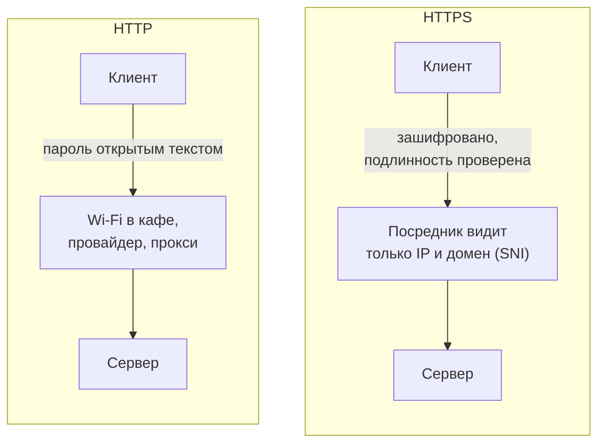
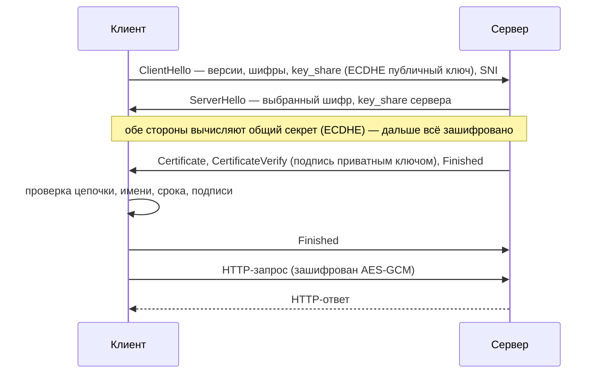
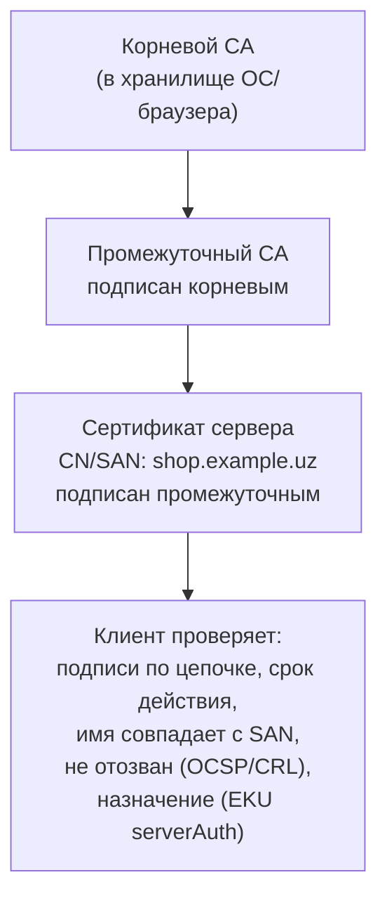
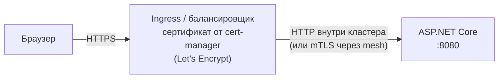

:::tldr
- **TLS** обеспечивает три вещи: **конфиденциальность** (шифрование), **целостность** (данные не изменены) и **аутентификацию сервера** (вы говорите именно с bank.uz). HTTPS = HTTP поверх TLS.
- **Handshake** (TLS 1.3 — один round-trip): клиент и сервер согласуют шифры, обмениваются ключами по **ECDHE** (асимметрично), сервер предъявляет **сертификат**, дальше данные шифруются **симметрично** (AES-GCM, ChaCha20).
- **Сертификат X.509** связывает доменное имя с публичным ключом и подписан **центром сертификации (CA)**. Клиент проверяет **цепочку доверия** до корневого CA, срок действия, имя (SAN) и отзыв.
- В ASP.NET Core: `UseHttpsRedirection()`, **`UseHsts()`**, dev-сертификат (`dotnet dev-certs https --trust`), Kestrel с сертификатом из файла/хранилища — или (чаще) **TLS-терминация на ingress/балансировщике**, тогда нужны **Forwarded Headers**.
- Используйте **TLS 1.2+** (лучше 1.3), не отключайте проверку сертификата (`ServerCertificateCustomValidationCallback = (...) => true` — классическая дыра), автоматизируйте выпуск и продление (**Let's Encrypt**, cert-manager).
- **mTLS** — взаимная аутентификация: клиент тоже предъявляет сертификат (сервис-сервис, service mesh).
:::

## Что даёт TLS



## TLS 1.3 handshake



- **Асимметричная криптография** (ECDHE, подпись сертификата) — только для установки соединения: она медленная.
- **Симметричная** (AES-GCM) — для данных: быстрая, аппаратно ускоренная.
- **Forward secrecy**: ключи сессии эфемерные — даже если приватный ключ сервера украдут позже, записанный трафик не расшифровать. В TLS 1.3 обязательна.
- TLS 1.2 требует 2 round-trip, TLS 1.3 — 1 (и 0-RTT для повторных соединений, с оговорками про replay).

## Цепочка доверия



Сервер должен отдавать **полную цепочку** (свой + промежуточные). Частая ошибка — не отдан промежуточный сертификат: браузеры иногда достраивают цепочку сами, а `HttpClient` в Linux-контейнере — нет, и запросы падают.

## ASP.NET Core: базовая настройка

```csharp
var app = builder.Build();

if (!app.Environment.IsDevelopment())
    app.UseHsts();               // Strict-Transport-Security: браузер будет ходить только по HTTPS

app.UseHttpsRedirection();       // 307/308 с http на https
```

```csharp Параметры HSTS
builder.Services.AddHsts(o =>
{
    o.MaxAge = TimeSpan.FromDays(365);
    o.IncludeSubDomains = true;
    o.Preload = true;            // для включения в preload-список браузеров
});
```

:::warning HSTS — осторожно
После получения заголовка браузер **весь срок `max-age`** не пойдёт на сайт по HTTP. Если HTTPS сломается (истёк сертификат), сайт станет недоступен. Начинайте с малого `max-age`, `includeSubDomains` включайте, только если **все** поддомены на HTTPS.
:::

## Kestrel с сертификатом

```json appsettings.json
{
  "Kestrel": {
    "Endpoints": {
      "Https": {
        "Url": "https://0.0.0.0:8443",
        "Certificate": { "Path": "/certs/tls.crt", "KeyPath": "/certs/tls.key" }
      }
    }
  }
}
```

```csharp Программно: TLS 1.2/1.3 и перезагрузка сертификата
builder.WebHost.ConfigureKestrel(k =>
{
    k.ConfigureHttpsDefaults(h =>
    {
        h.SslProtocols = SslProtocols.Tls12 | SslProtocols.Tls13;
        h.ServerCertificateSelector = (ctx, name) => certStore.GetCurrent(name);   // горячая замена при продлении
    });
});
```

Разработка: `dotnet dev-certs https --trust` создаёт и добавляет в доверенные локальный сертификат для `localhost`.

## TLS-терминация на ingress



Приложение видит HTTP-запрос от прокси, поэтому без настройки ломаются `Request.Scheme`, редиректы, генерация ссылок и OIDC redirect_uri:

```csharp
builder.Services.Configure<ForwardedHeadersOptions>(o =>
{
    o.ForwardedHeaders = ForwardedHeaders.XForwardedFor | ForwardedHeaders.XForwardedProto;
    o.KnownNetworks.Clear();                     // доверять только известным прокси
    o.KnownNetworks.Add(new IPNetwork(IPAddress.Parse("10.0.0.0"), 8));
});

app.UseForwardedHeaders();                       // самым первым в конвейере
```

## HttpClient: не отключайте проверку

```csharp Никогда в продакшене
var handler = new HttpClientHandler
{
    ServerCertificateCustomValidationCallback = HttpClientHandler.DangerousAcceptAnyServerCertificateValidator
};
// шифрование есть, а аутентификации сервера нет — MITM подменит сертификат незаметно
```

Правильные решения для «своего» CA (внутренние сервисы): добавить корневой сертификат компании в хранилище доверия образа (`update-ca-certificates`) или проверять конкретный CA/отпечаток (certificate pinning) в callback.

## mTLS: взаимная аутентификация

```csharp Сервер требует клиентский сертификат
builder.WebHost.ConfigureKestrel(k => k.ConfigureHttpsDefaults(h =>
    h.ClientCertificateMode = ClientCertificateMode.RequireCertificate));

builder.Services.AddAuthentication(CertificateAuthenticationDefaults.AuthenticationScheme)
    .AddCertificate(o =>
    {
        o.AllowedCertificateTypes = CertificateTypes.Chained;
        o.RevocationMode = X509RevocationMode.Online;
    });
```

```csharp Клиент предъявляет сертификат
var handler = new SocketsHttpHandler();
handler.SslOptions.ClientCertificates = [X509Certificate2.CreateFromPemFile("client.crt", "client.key")];
```

В Kubernetes mTLS между сервисами обычно берёт на себя **service mesh** (Istio, Linkerd): sidecar-прокси выпускают и ротируют сертификаты автоматически, приложение ничего не знает.

## Вопросы на засыпку

:::qa Почему не шифровать всё асимметрично?
Асимметричные операции в сотни и тысячи раз медленнее симметричных и ограничены по размеру данных. Поэтому асимметрия используется только для обмена ключами и аутентификации, а поток данных шифруется симметричным ключом сессии.
:::

:::qa Что видно наблюдателю при HTTPS?
IP-адреса, порт, объём и время трафика, а также доменное имя в SNI (пока не используется Encrypted Client Hello) и DNS-запросы (если не DoH/DoT). Путь URL, query string, заголовки и тело — зашифрованы.
:::

:::qa Сертификат истёк ночью. Как не допустить?
Автоматизировать: ACME (Let's Encrypt) с cert-manager или встроенным продлением облака, сроки 90 дней и меньше (отрасль движется к 47 дням), мониторинг срока действия (алерт за 14–30 дней, blackbox exporter), горячая перезагрузка сертификата без рестарта.
:::

:::qa Чем самоподписанный сертификат отличается от выданного CA?
Криптографически — ничем. Разница в доверии: самоподписанный никто не подписал, клиенту нечем проверить, что ключ принадлежит серверу. Для внутренних систем используют свой корпоративный CA, чей корень добавлен в доверенные на всех клиентах.
:::

## Итог

TLS защищает конфиденциальность, целостность и подлинность сервера: асимметрия для рукопожатия, симметрия для данных, сертификат с цепочкой доверия для идентификации. В ASP.NET Core — HTTPS-редирект и HSTS, TLS 1.2+, сертификаты от автоматизированного CA; при терминации на ingress — Forwarded Headers; никогда не отключайте проверку сертификатов в `HttpClient`, а для сервис-сервис рассматривайте mTLS или service mesh.
