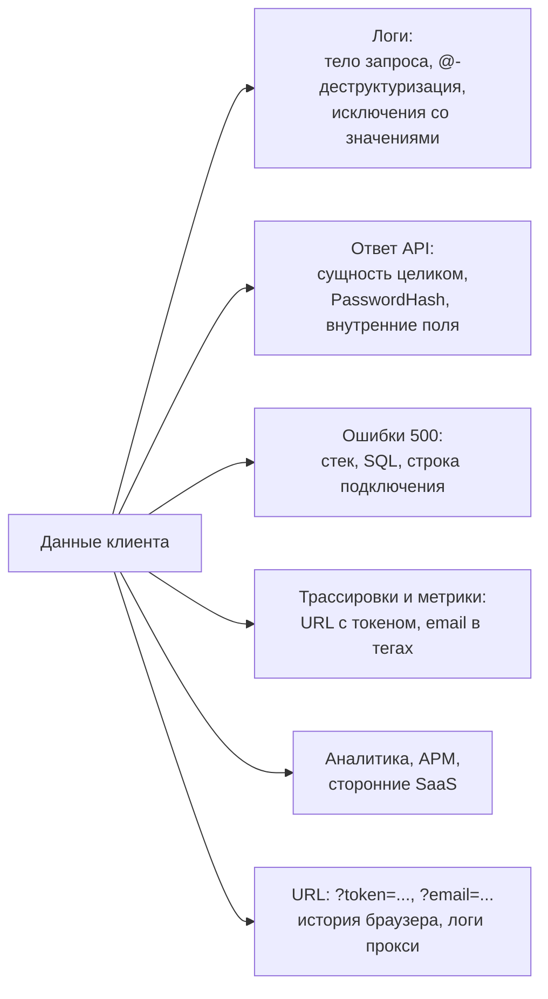
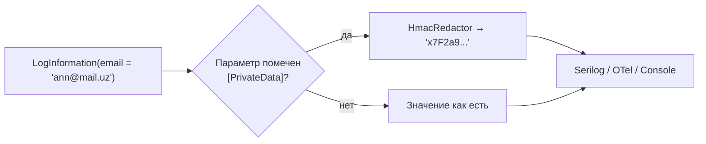

:::tldr
- **Чувствительные данные**: пароли, токены, API-ключи, строки подключения, номера карт (PCI DSS), паспортные данные, телефоны, email, адреса, медицинские данные — всё, что по закону (GDPR, закон о персональных данных) или по здравому смыслу нельзя раскрывать.
- Утечки чаще всего случаются **не через взлом**, а через: логи (`_logger.LogInformation("Request {@Body}", body)`), **сериализацию сущностей целиком** в ответ API, подробные **ошибки 500** со стеком и SQL, трассировки, дампы, аналитику.
- В ответах API: **только DTO** (явный список полей), никогда сущности EF; `ProblemDetails` без деталей исключения в продакшене; проверка прав на уровне полей.
- В логах: логировать **идентификаторы, а не данные**; **Microsoft.Extensions.Compliance.Redaction** (`[PrivateData]`, `[SensitiveData]` + редактор) в .NET 8+; маскирование через `Destructure` в Serilog; не логировать тела запросов и заголовки `Authorization` / `Cookie`.
- Принципы: **минимизация** (не собирать и не хранить лишнее), **классификация** данных, ограниченный срок хранения логов, доступ к логам — тоже по правам.
:::

## Где утекают данные



## Ответы API: только DTO

```csharp Плохо: сущность уходит в JSON целиком
[HttpGet("users/{id}")]
public async Task<User> Get(Guid id) => await db.Users.FindAsync(id);
// { "id": "...", "email": "...", "passwordHash": "AQAAAA...", "securityStamp": "...",
//   "isAdmin": false, "internalNotes": "проблемный клиент", "passportNumber": "AA1234567" }
```

```csharp Хорошо: явный контракт
public sealed record UserProfileDto(Guid Id, string DisplayName, string MaskedEmail, DateOnly MemberSince);

[HttpGet("users/{id}")]
public async Task<ActionResult<UserProfileDto>> Get(Guid id, CancellationToken ct) =>
    await db.Users.AsNoTracking()
        .Where(u => u.Id == id)
        .Select(u => new UserProfileDto(u.Id, u.DisplayName, Mask.Email(u.Email), u.CreatedAt))
        .FirstOrDefaultAsync(ct) is { } dto ? dto : NotFound();
```

Почему DTO, а не `[JsonIgnore]` на сущности: новое поле в сущности (добавленное через полгода другим разработчиком) **автоматически** уйдёт наружу. С DTO новое поле нужно добавить явно — безопасный дефолт. То же касается входных данных: DTO защищает от **over-posting** (`"isAdmin": true` в теле запроса).

```csharp Маскирование для отображения
public static class Mask
{
    public static string Email(string email)
    {
        var at = email.IndexOf('@');
        return at <= 1 ? "***" + email[at..] : $"{email[0]}***{email[(at - 1)..]}";   // a***n@mail.uz
    }
    public static string Card(string pan) => $"**** **** **** {pan[^4..]}";             // только последние 4 цифры
}
```

## Ошибки без утечек

```csharp
builder.Services.AddProblemDetails();

if (app.Environment.IsDevelopment())
    app.UseDeveloperExceptionPage();
else
    app.UseExceptionHandler();                   // клиент получит { "title": "An error occurred", "status": 500, "traceId": "..." }
```

Клиенту — `traceId` для обращения в поддержку, разработчику — полная информация в логах по этому `traceId`. Сообщения исключений (`ex.Message`) не возвращайте клиенту: в них бывают SQL, пути к файлам, значения параметров.

## Логи: что писать и что нет

| Логировать | Не логировать |
|---|---|
| Id пользователя, заказа, корреляции | Пароли (даже неверные — это часто почти верный пароль) |
| Тип операции, результат, длительность | Токены, cookie, заголовок `Authorization`, API-ключи |
| Коды ошибок, тип исключения | Номера карт, CVV, паспорт, ИНН/ПИНФЛ |
| Маскированные значения (`a***n@mail.uz`) | Полные тела запросов и ответов |
| События безопасности (вход, отказ в доступе) | Строки подключения, конфигурацию целиком |

```csharp Опасные паттерны
_logger.LogInformation("Login {@Request}", request);                // деструктуризация — включая Password
_logger.LogInformation("Calling {Url}", $"{baseUrl}?apiKey={key}");  // ключ в URL
_logger.LogError(ex, "Failed for {Customer}", customer);            // ToString() сущности со всеми полями
app.UseHttpLogging();                                               // без настройки полей может писать тела и заголовки
```

```csharp Безопасно
_logger.LogInformation("Login attempt for user {UserId} from {Ip}", user.Id, ip);
```

## Redaction в .NET 8+

`Microsoft.Extensions.Compliance.Redaction` — стандартный механизм: данные **классифицируются** атрибутами, а при логировании автоматически пропускаются через редактор.

```csharp Классификация
public static class DataTaxonomy
{
    public static DataClassification Private => new("Shop", "Private");      // PII
    public static DataClassification Sensitive => new("Shop", "Sensitive");  // секреты, платёжные данные
}
public sealed class PrivateDataAttribute() : DataClassificationAttribute(DataTaxonomy.Private);
public sealed class SensitiveDataAttribute() : DataClassificationAttribute(DataTaxonomy.Sensitive);
```

```csharp Использование в source-generated логировании
public static partial class Log
{
    [LoggerMessage(LogLevel.Information, "Customer {CustomerId} updated email to {Email}")]
    public static partial void EmailChanged(ILogger logger, Guid customerId, [PrivateData] string email);
}

// Program.cs
builder.Logging.EnableRedaction();
builder.Services.AddRedaction(r =>
{
    r.SetRedactor<ErasingRedactor>(new DataClassificationSet(DataTaxonomy.Sensitive));   // полностью удалить
    r.SetHmacRedactor(o =>                                                                // заменить на HMAC — можно
    {                                                                                    // коррелировать, но не прочитать
        o.Key = builder.Configuration["Redaction:Key"];
        o.KeyId = 1;
    }, new DataClassificationSet(DataTaxonomy.Private));
});
```



HMAC-редактор даёт одинаковый результат для одинакового значения — можно искать все записи по одному клиенту, не раскрывая его email.

## Serilog: деструктуризация с маскированием

```csharp
Log.Logger = new LoggerConfiguration()
    .Destructure.ByTransforming<LoginRequest>(r => new { r.UserName, Password = "***" })
    .Destructure.With<SensitivePropertyMasker>()         // своя политика: маскировать свойства с атрибутом
    .Enrich.FromLogContext()
    .WriteTo.Console(new RenderedCompactJsonFormatter())
    .CreateLogger();
```

## HTTP-логирование и трассировка

```csharp
builder.Services.AddHttpLogging(o =>
{
    o.LoggingFields = HttpLoggingFields.RequestMethod | HttpLoggingFields.RequestPath
                    | HttpLoggingFields.ResponseStatusCode | HttpLoggingFields.Duration;   // без тел и заголовков
    o.RequestHeaders.Remove("Authorization");
});
```

- OpenTelemetry: не добавлять PII в теги спанов; проверить, что `url.full` не содержит токенов в query string (передавайте токены в заголовках, а не в URL).
- APM и сторонние сервисы: настроить скрытие полей до отправки (данные уходят третьей стороне).

## Организационные меры

- **Классификация данных**: какие поля — PII, какие — секреты; отражено в коде (атрибуты) и схеме БД.
- **Минимизация**: не собирать то, что не нужно; удалять по истечении срока (retention).
- **Доступ к логам** — по ролям; логи продакшена не выгружать в чаты и тикеты.
- **Шифрование** особо чувствительных полей в БД (паспорт, карта) — отдельными ключами из Key Vault; для карт — токенизация у платёжного провайдера (вы вообще не храните номер).
- Ревью: вопрос «что попадёт в лог/ответ?» — в чек-листе code review; автоматические проверки (анализаторы, поиск по логам на паттерны карт и email).

## Вопросы на засыпку

:::qa Почему нельзя логировать даже неверные пароли?
Неверный пароль часто отличается от верного одной опечаткой или является паролем от другого сервиса; пользователь иногда вводит пароль в поле логина. Всё это оседает в логах, к которым доступ шире, чем к БД, и которые хранятся в сторонних системах.
:::

:::qa Чем маскирование отличается от псевдонимизации и анонимизации?
Маскирование скрывает часть значения для отображения (`**** 1234`). Псевдонимизация заменяет значение на идентификатор/HMAC — связь с человеком можно восстановить при наличии ключа (по GDPR это всё ещё персональные данные). Анонимизация необратимо удаляет связь с человеком.
:::

:::qa Как проверить, что в ответе нет лишних полей?
Контрактные тесты / snapshot-тесты ответов API (Verify), OpenAPI-схема, генерируемая из DTO, и ревью. Если сущность вообще не может попасть в ответ (всегда проекция в DTO), класс ошибок исчезает.
:::

:::qa Секрет попал в лог. Что делать?
Считать секрет скомпрометированным и ротировать; удалить или ограничить доступ к записям в системе логирования; найти и исправить источник (фильтр, redaction); проверить, куда ещё уходили логи (архивы, SIEM, сторонние сервисы).
:::

## Итог

Большинство утечек — побочный эффект удобства: сериализовали сущность целиком, залогировали объект запроса, вернули текст исключения. Защита — безопасные дефолты: только DTO в ответах, ProblemDetails без деталей, логирование идентификаторов вместо данных, redaction по классификации (`Microsoft.Extensions.Compliance.Redaction`), никаких секретов в URL и минимизация хранимых данных.
