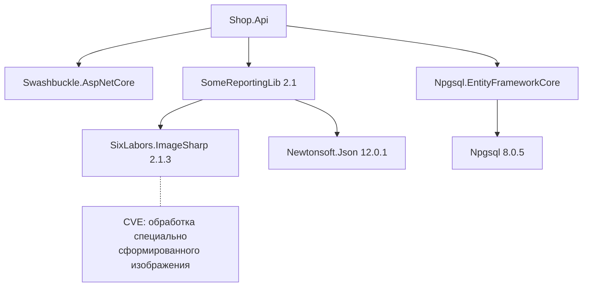
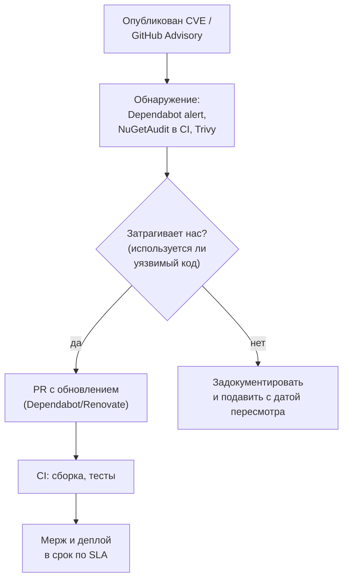

:::tldr
- Код приложения — это на 80–90% **чужой код**: NuGet-пакеты и их **транзитивные** зависимости, базовые Docker-образы, сам .NET runtime. Уязвимость в любом из них — уязвимость приложения (Log4Shell, уязвимые версии `System.Text.Encodings.Web`, `Newtonsoft.Json`).
- Обнаружение (**SCA**, Software Composition Analysis): **NuGetAudit** — предупреждения `NU1901–NU1904` при `dotnet restore` (.NET 8+, по умолчанию и для транзитивных в .NET 9+), `dotnet list package --vulnerable --include-transitive`, **GitHub Dependabot alerts**, Snyk, OWASP Dependency-Check, **Trivy** для образов.
- Обновление: **Dependabot** / **Renovate** автоматически создают PR с обновлениями; CI с тестами решает, можно ли мержить. **Central Package Management** (`Directory.Packages.props`) — одна версия пакета на решение.
- Политика: блокировать сборку на **high/critical** (`<WarningsAsErrors>NU1903;NU1904</WarningsAsErrors>`), регулярно обновлять runtime и базовые образы, **lock-файлы** для воспроизводимости, **SBOM** для инвентаризации.
- **Supply chain**: typosquatting и вредоносные пакеты — проверять издателя, **package source mapping**, подписанные пакеты, минимум зависимостей.
:::

## Откуда берутся уязвимости



Вы не добавляли `ImageSharp` напрямую, но он попал в приложение транзитивно — и уязвимость ваша. Поэтому сканировать нужно **всё дерево**, а не только `PackageReference` в `.csproj`.

## Обнаружение

### NuGetAudit при restore

```xml Directory.Build.props
<Project>
  <PropertyGroup>
    <NuGetAudit>true</NuGetAudit>
    <NuGetAuditMode>all</NuGetAuditMode>             <!-- direct | all (включая транзитивные) -->
    <NuGetAuditLevel>low</NuGetAuditLevel>           <!-- с какой серьёзности предупреждать -->
    <!-- ломать сборку на high и critical -->
    <WarningsAsErrors>$(WarningsAsErrors);NU1903;NU1904</WarningsAsErrors>
  </PropertyGroup>
</Project>
```

| Код | Серьёзность |
|---|---|
| NU1901 | Low |
| NU1902 | Moderate |
| NU1903 | High |
| NU1904 | Critical |

Данные берутся из **GitHub Advisory Database** через источник nuget.org.

### CLI

```bash
dotnet list package --vulnerable --include-transitive
# Project `Shop.Api` has the following vulnerable packages
#    [net9.0]:
#    Transitive Package        Resolved   Severity   Advisory URL
#    > SixLabors.ImageSharp    2.1.3      High       https://github.com/advisories/GHSA-...

dotnet list package --outdated              # что вообще устарело
dotnet list package --deprecated            # пакеты, помеченные автором как устаревшие
```

### Образы и всё остальное

```bash
trivy image registry.example.uz/shop-api:1.4.2          # ОС-пакеты базового образа + .NET-зависимости
trivy fs --scanners vuln,secret,misconfig .             # репозиторий: зависимости, секреты, Dockerfile, k8s-манифесты
```

## Процесс: от уведомления до исправления



Ориентиры SLA на исправление: critical — дни, high — 1–2 недели, medium — месяц, low — в плановом обновлении.

## Обновление транзитивной зависимости

Если уязвим транзитивный пакет, а родитель ещё не выпустил исправленную версию, — **поднимите версию напрямую**:

```xml Directory.Packages.props (Central Package Management)
<Project>
  <PropertyGroup>
    <ManagePackageVersionsCentrally>true</ManagePackageVersionsCentrally>
    <CentralPackageTransitivePinningEnabled>true</CentralPackageTransitivePinningEnabled>
  </PropertyGroup>
  <ItemGroup>
    <PackageVersion Include="Npgsql.EntityFrameworkCore.PostgreSQL" Version="9.0.4" />
    <PackageVersion Include="Serilog.AspNetCore" Version="9.0.0" />
    <!-- закрепляем исправленную версию транзитивного пакета -->
    <PackageVersion Include="SixLabors.ImageSharp" Version="3.1.7" />
  </ItemGroup>
</Project>
```

Без CPM — добавить явный `<PackageReference>` на исправленную версию в проект. NuGet выбирает **минимальную** подходящую версию транзитивного пакета, поэтому сам он не обновится.

## Автоматизация: Dependabot

```yaml .github/dependabot.yml
version: 2
updates:
  - package-ecosystem: nuget
    directory: "/"
    schedule: { interval: weekly }
    open-pull-requests-limit: 10
    groups:
      microsoft:
        patterns: ["Microsoft.*", "System.*"]      # одна PR на семейство пакетов
      test-deps:
        patterns: ["xunit*", "FluentAssertions", "NSubstitute", "Testcontainers*"]
  - package-ecosystem: docker
    directory: "/src/Shop.Api"
    schedule: { interval: weekly }
  - package-ecosystem: github-actions
    directory: "/"
    schedule: { interval: monthly }
```

**Renovate** — альтернатива с более гибкими правилами (automerge для patch-версий при зелёном CI, расписания, dashboard). Ключевое условие для обоих: **хорошие тесты** — без них никто не решится мержить обновления, и они копятся.

## Воспроизводимость и SBOM

```xml Lock-файл: точные версии всего дерева
<PropertyGroup>
  <RestorePackagesWithLockFile>true</RestorePackagesWithLockFile>
</PropertyGroup>
<!-- в CI: dotnet restore --locked-mode — упадёт, если дерево изменилось без обновления packages.lock.json -->
```

**SBOM** (Software Bill of Materials) — перечень всех компонентов сборки в формате CycloneDX или SPDX. Когда выходит новая критическая уязвимость, SBOM за минуты отвечает: «в каких сервисах и версиях есть этот пакет?».

```bash
dotnet CycloneDX Shop.sln -o sbom/                     # или: syft registry.example.uz/shop-api:1.4.2 -o cyclonedx-json
```

## Атаки на цепочку поставок

| Угроза | Защита |
|---|---|
| **Typosquatting**: `Newtonsoft.Jsom`, `Microsft.Extensions...` | Проверять имя и издателя, prefix reservation на nuget.org (галочка у `Microsoft.*`) |
| **Dependency confusion**: внутренний пакет `Shop.Common` подменяется публичным с большей версией | **Package Source Mapping** в `nuget.config` |
| Скомпрометированный аккаунт автора | Подписанные пакеты, `trustedSigners`, осторожность с новыми версиями малоизвестных пакетов |
| Вредоносный код в MSBuild targets / install-скриптах | Минимум зависимостей, ревью новых пакетов перед добавлением |

```xml nuget.config: пакеты компании — только из внутреннего фида
<configuration>
  <packageSources>
    <clear />
    <add key="nuget.org" value="https://api.nuget.org/v3/index.json" />
    <add key="company" value="https://nuget.example.uz/v3/index.json" />
  </packageSources>
  <packageSourceMapping>
    <packageSource key="company"><package pattern="Shop.*" /></packageSource>
    <packageSource key="nuget.org"><package pattern="*" /></packageSource>
  </packageSourceMapping>
</configuration>
```

## Не забывайте про runtime

- Обновляйте **.NET runtime** и SDK: ежемесячные patch-релизы (Patch Tuesday) закрывают уязвимости Kestrel, `System.Text.Json` и др. В контейнере это значит — **пересобирать образ** на свежем базовом образе, даже если код не менялся.
- Используйте поддерживаемые версии: LTS (8, 10) — 3 года, STS (9) — 2 года (с .NET 9). Неподдерживаемый runtime не получает исправлений.
- Минимальные базовые образы (chiseled, distroless) — меньше пакетов ОС, меньше уязвимостей.

## Вопросы на засыпку

:::qa Уязвимость в пакете, но мы не используем уязвимую функцию. Надо ли обновлять?
Лучше обновить: анализ «достижимости» ошибается, код меняется, а незакрытые предупреждения приучают игнорировать сканер. Если обновление невозможно (ломающие изменения), задокументируйте анализ, подавите предупреждение точечно (`NuGetAuditSuppress`) с датой пересмотра и запланируйте миграцию.
:::

:::qa Почему накопление отставания по версиям опасно?
Когда выходит критическая уязвимость, исправление обычно есть только в последних версиях. Если вы отстали на три мажорные версии, срочное обновление превращается в миграцию с ломающими изменениями под давлением времени. Регулярные мелкие обновления дешевле.
:::

:::qa Что такое SCA и чем он отличается от SAST?
SCA анализирует сторонние компоненты (какие пакеты и версии используются и есть ли в них известные уязвимости и проблемы лицензий). SAST анализирует ваш собственный код на ошибки безопасности. Нужны оба, плюс сканирование образов и секретов.
:::

:::qa Стоит ли включать automerge обновлений?
Для patch-версий и dev-зависимостей при хорошем покрытии тестами — да, это экономит много времени. Для мажорных версий и критичных пакетов (ORM, аутентификация) — ручное ревью changelog и ломающих изменений.
:::

## Итог

Зависимости — большая часть вашего кода и вашей поверхности атаки. Включите NuGetAudit (с ошибкой сборки на high/critical), сканируйте транзитивные пакеты и образы (Trivy), автоматизируйте обновления через Dependabot/Renovate с хорошими тестами, закрепляйте исправленные транзитивные версии через Central Package Management, ведите SBOM, защищайтесь от supply-chain атак через package source mapping и регулярно обновляйте .NET runtime и базовые образы.
