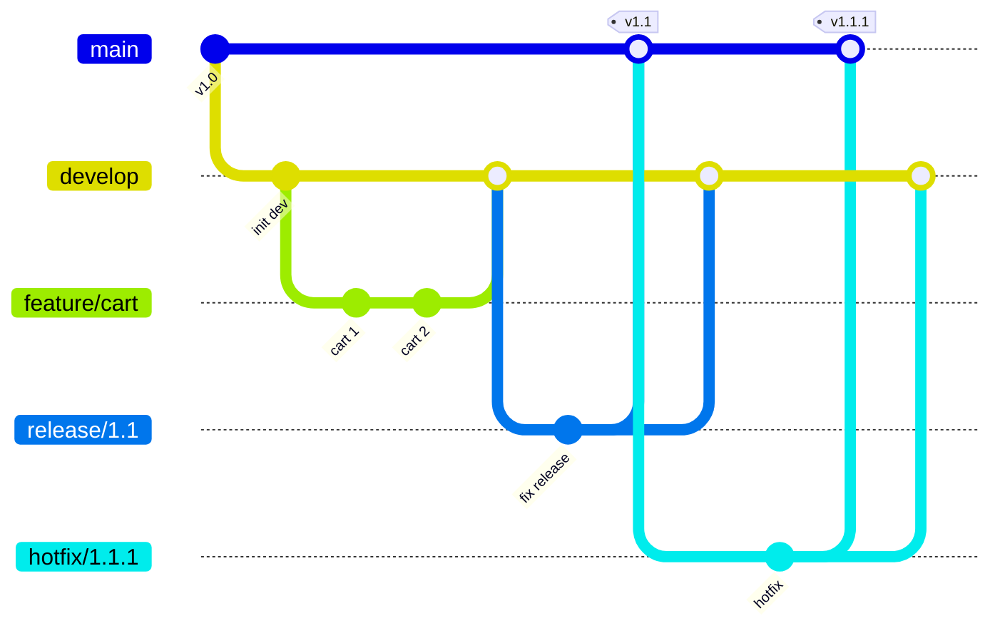
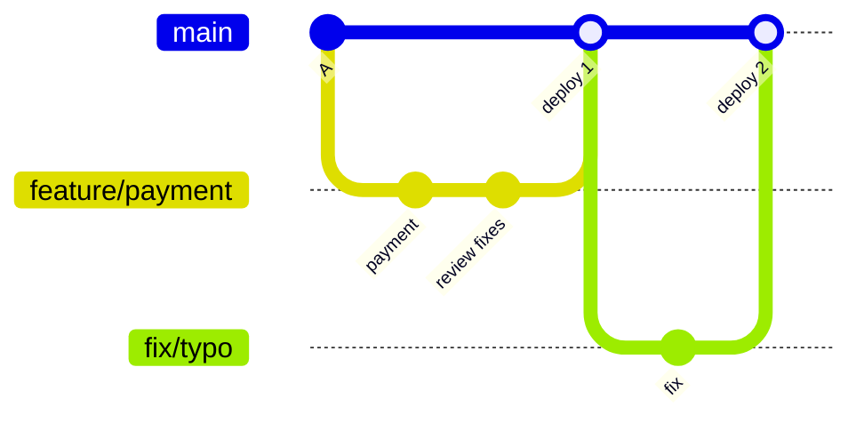
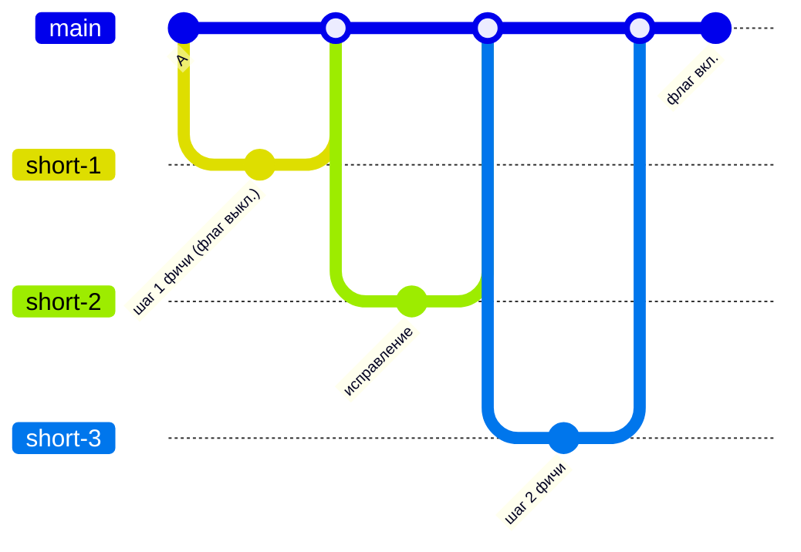
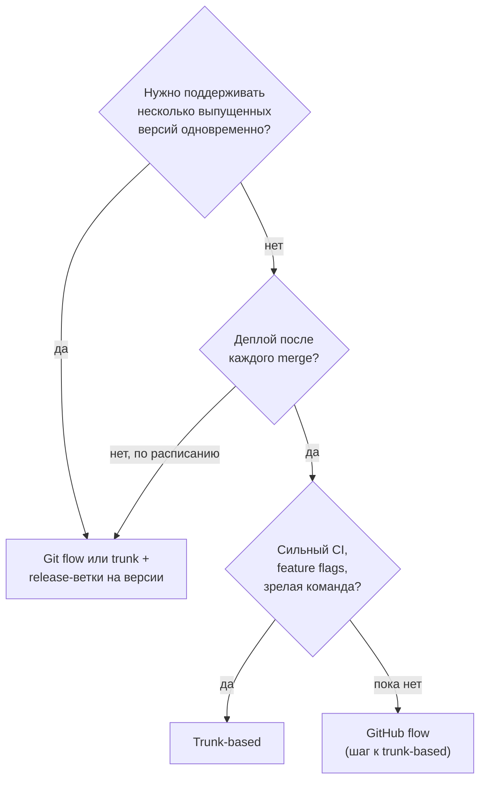

:::tldr
- **Git flow**: долгоживущие ветки `main` (релизы) и `develop` (интеграция), плюс `feature/*`, `release/*`, `hotfix/*`. Подходит для **версионируемых релизов** (коробочный продукт, мобильные приложения, библиотеки с поддержкой нескольких версий). Минусы: сложность, долгие ветки, болезненные merge.
- **GitHub flow**: одна `main`, всегда готовая к деплою; короткие feature-ветки → PR → ревью → merge → **деплой**. Простой и популярный для веб-сервисов.
- **Trunk-based development (TBD)**: все интегрируются в `main` (trunk) **как минимум ежедневно**; ветки живут часы, максимум 1–2 дня; незаконченная работа скрыта за **feature flags**. Основа **continuous integration/delivery**, рекомендация DORA для высокопроизводительных команд.
- Главный фактор выбора — **как вы релизите**: непрерывный деплой веб-сервиса → GitHub flow / TBD; редкие версионные релизы с поддержкой старых версий → Git flow или release-ветки.
- Долгоживущие ветки — корень конфликтов и «merge hell». Чем чаще интеграция, тем меньше боль.
:::

## Git flow



| Ветка | Живёт | Назначение |
|---|---|---|
| `main` | Всегда | Только выпущенные версии (теги) |
| `develop` | Всегда | Интеграция готовых фич для следующего релиза |
| `feature/*` | Дни–недели | Разработка фичи, от `develop` |
| `release/*` | Дни | Стабилизация релиза: только исправления |
| `hotfix/*` | Часы | Срочное исправление продакшена, от `main` |

Когда уместен: мобильное приложение с ревью в сторе, коробочное ПО с версиями у клиентов, релизы по расписанию, нужно параллельно поддерживать несколько версий.

## GitHub flow



Правила: `main` всегда в рабочем состоянии; любая работа — в ветке от `main`; PR + ревью + зелёный CI; после merge — деплой (автоматически или сразу вручную).

## Trunk-based development



Незаконченная фича уже в `main`, но выключена:

```csharp Feature flag (Microsoft.FeatureManagement)
builder.Services.AddFeatureManagement();

app.MapPost("/checkout", async (IFeatureManager features, CheckoutRequest req, ICheckoutService svc) =>
{
    if (await features.IsEnabledAsync("NewCheckout"))
        return await svc.CheckoutV2Async(req);      // новый путь — пока только для тестировщиков
    return await svc.CheckoutAsync(req);
});
```

```json appsettings.json
{
  "FeatureManagement": {
    "NewCheckout": {
      "EnabledFor": [{ "Name": "Percentage", "Parameters": { "Value": 10 } }]
    }
  }
}
```

Техники TBD: **feature flags**, **branch by abstraction** (ввести интерфейс, реализовать новое за ним, переключить, удалить старое), **expand/contract** для БД, маленькие инкрементальные коммиты, сильный автоматический CI.

## Сравнение

| | Git flow | GitHub flow | Trunk-based |
|---|---|---|---|
| Долгоживущие ветки | `main` + `develop` | Только `main` | Только `main` (trunk) |
| Жизнь feature-ветки | Дни–недели | Дни | Часы–1-2 дня |
| Частота релизов | Редкие, версионные | Часто, после каждого merge | Непрерывно |
| Незаконченная работа | В ветке | В ветке | В `main` за флагом |
| Конфликты слияния | Частые и крупные | Умеренные | Мелкие |
| Требования | Дисциплина процессов | CI, ревью | Отличный CI, флаги, тесты, культура |
| Поддержка нескольких версий | **Да** | Нет | Через release-ветки |



## Merge, squash или rebase?

| Стратегия | История | Когда |
|---|---|---|
| **Merge commit** | Сохраняет все коммиты ветки + коммит слияния | Важна точная история, долгие ветки |
| **Squash merge** | Вся ветка — один коммит в `main` | Самый популярный для PR: чистая история, 1 PR = 1 коммит, легко откатить |
| **Rebase merge** | Коммиты ветки линейно поверх `main` | Коммиты ветки осмысленные и аккуратные |

:::warning Золотое правило rebase
Не делайте rebase (и force-push) веток, с которыми работают другие: это переписывает историю, и у коллег возникнут конфликты и потерянные коммиты. Rebase своей локальной ветки на свежий `main` — нормально; для общей — `--force-with-lease` только по договорённости.
:::

## Хорошие практики независимо от модели

- **Conventional Commits**: `feat(orders): add cancellation`, `fix(auth): refresh token race` — читаемая история, автоматические changelog и версии.
- Защищённая `main`: запрет прямого push, обязательные PR, ревью и зелёный CI.
- Короткие ветки: чем дольше ветка, тем дороже слияние (не только по конфликтам, но и по «семантическим» конфликтам в логике).
- Регулярно подтягивайте `main` в свою ветку, если она живёт больше дня.
- Удаляйте ветки после merge; называйте ветки по задаче: `feature/SHOP-123-cart-discounts`.

## Вопросы на засыпку

:::qa Почему долгоживущие ветки — это плохо?
Чем дольше ветка изолирована, тем сильнее расходятся код и представления о нём: конфликты растут нелинейно, интеграционные ошибки находятся поздно, рефакторинг в `main` ломает ветку. «Continuous integration» буквально означает частое слияние в общую ветку — долгие ветки ему противоречат.
:::

:::qa Как в trunk-based не выкатить незаконченное?
Через feature flags (код есть, но выключен), branch by abstraction (новая реализация за интерфейсом, пока не подключена), «тёмные» эндпоинты без маршрутизации из UI. Важно удалять флаги после завершения — иначе они превращаются в технический долг.
:::

:::qa Что такое release-ветки в trunk-based?
Когда нужно стабилизировать версию (мобильный релиз), от trunk отрезается `release/2.3`, куда попадают только cherry-pick исправлений из trunk. Разработка продолжается в trunk; исправления всегда сначала идут в trunk, затем переносятся в релиз.
:::

:::qa Сколько feature flags — нормально?
Столько, сколько вы способны отслеживать. У каждого флага должен быть владелец и срок удаления. Тысячи старых флагов создают комбинаторный взрыв состояний и мёртвый код. Разделяйте короткоживущие release-флаги и постоянные операционные (kill switch, тарифные).
:::

## Итог

Git flow — для версионных релизов и поддержки нескольких версий, GitHub flow — простая модель для веб-сервисов с деплоем после merge, trunk-based — самая частая интеграция с feature flags, требующая сильного CI и культуры. Для большинства современных .NET-бэкендов подходит GitHub flow с движением к trunk-based: короткие ветки, squash merge, защищённая `main` и автоматический деплой.
