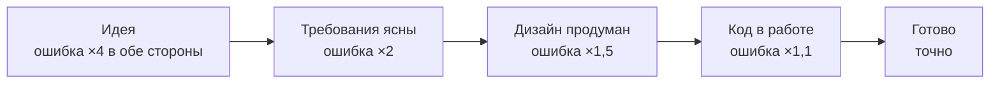
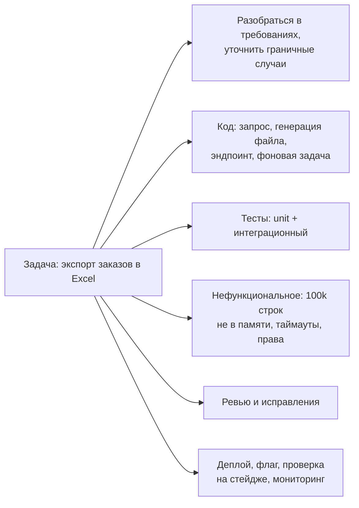
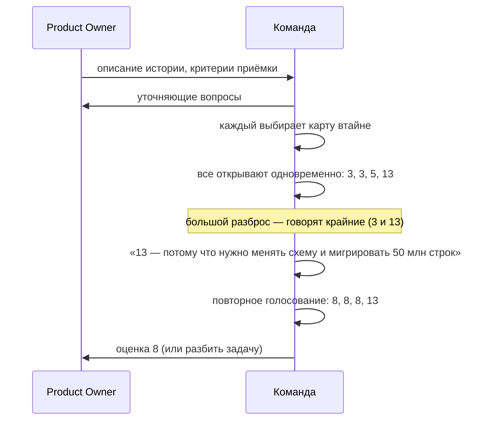

:::tldr
- Оценка — это **прогноз с неопределённостью**, а не обещание. Хорошая оценка честно показывает **диапазон** и **риски**: «3–5 дней, если API партнёра работает как в документации».
- **Story points** — относительная мера **сложности + объёма + неопределённости** по сравнению с эталонной задачей (шкала Фибоначчи 1, 2, 3, 5, 8, 13). Не часы. Превращаются в сроки через **velocity** команды.
- **T-shirt sizes** (XS–XL) — грубая оценка крупных эпиков на этапе планирования roadmap. **Planning poker** — все оценивают одновременно и открывают карты вместе, чтобы избежать **якорения**; расхождение — повод обсудить, а не усреднить.
- Главный инструмент точности — **декомпозиция**: задачу больше 1–2 дней (или 8+ SP) разбивают. Неизвестное — отдельной задачей-исследованием (**spike**) с ограниченным временем.
- Типичные ошибки: забыть про тесты, ревью, деплой, миграции, интеграцию; оценивать только «счастливый путь»; давать оценку под давлением «а если быстрее?»; не пересматривать оценку, когда появились новые данные.
:::

## Почему оценки ошибаются



Чем раньше оценка, тем шире разброс. Поэтому roadmap оценивают грубо (T-shirt), а спринт — точнее (story points или часы по разбитым задачам).

Систематические причины недооценки:
- **Оптимизм**: оцениваем путь, где всё идёт гладко. Реальная работа включает отладку, неожиданности, переключения.
- **Забытая работа**: тесты, ревью и исправления после него, миграции, конфигурация, документация, деплой, мониторинг.
- **Неизвестное**: «интеграция с банком — пара дней», а API не документирован и тестовый стенд не работает.
- **Давление**: ожидаемая оценка звучит в вопросе («это же на день?»), и её трудно оспорить.

## Что входит в оценку



Код — часто только **половина** времени. Оценка «написать код за 4 часа» превращается в 2 дня реальной работы.

## Story points

**Относительная** оценка: команда выбирает эталонную задачу («добавить поле в форму и API — 2 SP») и сравнивает с ней новые. Люди плохо оценивают абсолютные величины, но хорошо сравнивают: «эта задача примерно в 2–3 раза сложнее той».

| SP | Смысл (пример договорённости) |
|---|---|
| 1 | Тривиально, понятно, почти без риска |
| 2 | Маленькая задача, всё известно |
| 3 | Небольшая задача с парой нюансов |
| 5 | Средняя, есть неопределённость |
| 8 | Крупная — стоит подумать о разбиении |
| 13+ | Слишком большая или слишком неясная — **разбить** или сделать spike |

Шкала Фибоначчи растёт нелинейно специально: для крупных задач различие между 8 и 9 бессмысленно — неопределённость больше.

**Velocity** — сколько SP команда в среднем завершает за спринт (по последним 3–5 спринтам). Используется для планирования ёмкости спринта и прогноза («эпик на 60 SP при velocity 20 — примерно 3 спринта»).

:::warning Анти-паттерны story points
- Перевод SP в часы («1 SP = 4 часа») — теряется смысл относительной оценки.
- Сравнение velocity разных команд или использование её как KPI — команды начнут «раздувать» оценки.
- Оценка в SP одним человеком без обсуждения — теряется главная ценность: общее понимание задачи.
:::

## Planning poker



Зачем одновременно: чтобы не было **якорения** — если сеньор первым скажет «3», остальные подстроятся. Разброс оценок — ценный сигнал: кто-то знает о риске, которого не видят другие. Именно обсуждение, а не число, — главный результат.

## T-shirt sizes и #NoEstimates

- **T-shirt** (XS, S, M, L, XL) — для roadmap и приоритизации эпиков: «это S — делаем в этом квартале, это XL — нужна декомпозиция и обсуждение ценности».
- **#NoEstimates** — вместо оценки разбивать всё на задачи примерно одного небольшого размера и прогнозировать по **количеству** завершённых задач (throughput). Работает при хорошей декомпозиции и стабильном потоке.
- **Вероятностное прогнозирование** (Monte Carlo по историческому throughput): «с вероятностью 85% закончим к 15 ноября» — честнее, чем одна дата.

## Как давать оценку как Middle

1. **Уточнить** задачу: критерии приёмки, граничные случаи, нефункциональные требования.
2. **Декомпозировать** на части по полдня–день.
3. Оценить части, **сложить** и добавить работу вокруг кода (тесты, ревью, деплой).
4. Выделить **риски и допущения** явно.
5. Дать **диапазон** и уровень уверенности.
6. При изменении обстоятельств — **сообщать сразу**, а не в последний день.

```text Пример хорошего ответа на «сколько это займёт?»
«Базовый экспорт — 2 дня: запрос и генерация файла — день, фоновая задача с уведомлением — полдня,
тесты и ревью — полдня. Но есть риск: если нужен экспорт больше 100 тысяч строк, придётся делать
потоковую генерацию — плюс день. Предлагаю сначала выяснить объёмы у аналитиков.
Итого 2–3 дня, уточню к завтрашнему дню после разговора».
```

## Вопросы на засыпку

:::qa Что делать, если менеджер просит оценку «прямо сейчас»?
Дать грубый диапазон с оговорками («от 3 дней до 2 недель, основной риск — интеграция») и предложить срок для точной оценки после изучения («уточню завтра к обеду»). Не называть одну цифру наугад: она станет обязательством.
:::

:::qa Оценка оказалась сильно заниженной. Как поступить?
Сообщить как можно раньше, с причинами и новым прогнозом, и предложить варианты: урезать объём (MVP), перенести срок, добавить помощь. Плохая новость, сказанная рано, — управляемый риск; сказанная в последний день — сорванный срок. После — разобрать на ретроспективе, что упустили.
:::

:::qa Зачем spike и как его оценивать?
Spike — исследовательская задача для снятия неопределённости (проверить API партнёра, сделать прототип, замерить производительность). Оценивается не по объёму, а **фиксированным временем** (timebox: «2 дня»). Результат — знания и точная оценка основной задачи, а не продакшн-код.
:::

:::qa Почему оценку должна давать команда, а не тимлид?
Оценивают те, кто будет делать: они знают код и свои риски. Коллективная оценка вскрывает разные взгляды на задачу и создаёт общее понимание и ответственность. Оценка «сверху» чаще оптимистична и не принимается командой как своя.
:::

## Итог

Оценка — прогноз с неопределённостью. Делайте её точнее через уточнение требований и декомпозицию, учитывайте всю работу вокруг кода, называйте диапазоны и риски. Story points и planning poker ценны прежде всего обсуждением и общим пониманием задачи, а не числами. Когда прогноз меняется — сообщайте сразу.
