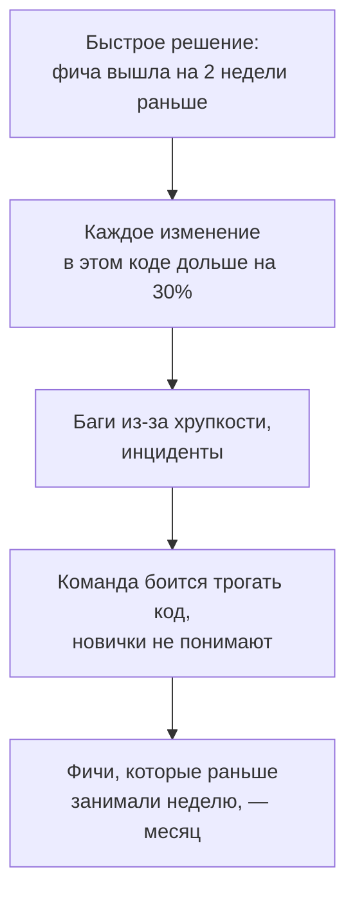
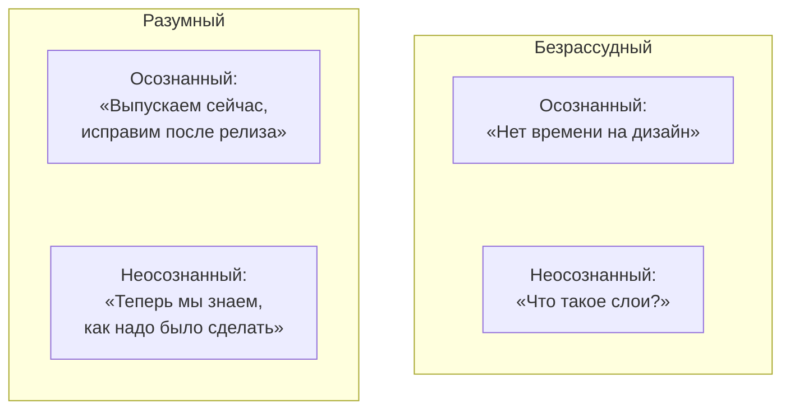
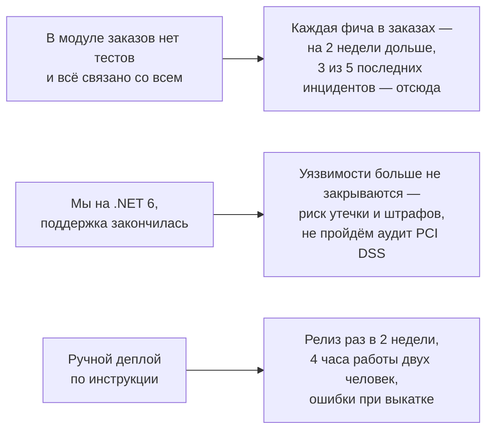
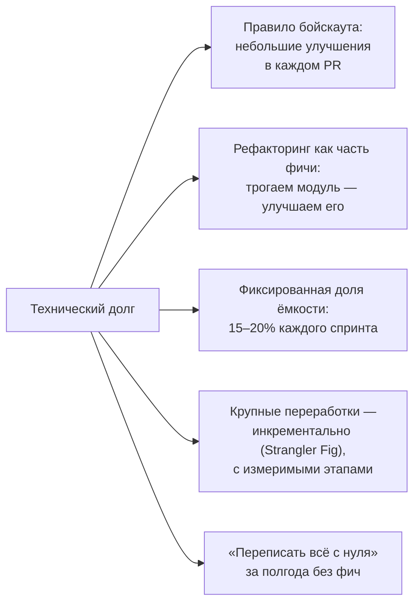

:::tldr
- **Технический долг** — метафора Уорда Каннингема: быстрое решение сейчас — это «заём», за который потом платятся **проценты** в виде замедления разработки, багов и инцидентов. Долг не всегда плох: осознанный долг ради выхода на рынок — нормальное бизнес-решение, если его **возвращают**.
- Виды (квадрант Фаулера): **осознанный/неосознанный** × **разумный/безрассудный**. Плюс «долг устаревания»: код был хорош, но мир изменился (версия .NET, нагрузка, требования).
- Бизнесу нужно говорить **на языке бизнеса**: не «код плохой», а **время выхода фич**, **число инцидентов**, **стоимость**, **риски** (безопасность, неподдерживаемый runtime), **найм и онбординг**. С цифрами.
- Стратегии: правило **бойскаута** (оставь код чище), **фиксированный процент** ёмкости (15–20% спринта), рефакторинг **в составе фичи**, которая трогает проблемный код, крупные переработки — **инкрементально** (Strangler Fig), а не «переписать всё».
- Вести **реестр долга**: что, где, какой ущерб, сколько стоит исправить. Приоритет = ущерб × частота изменения кода / стоимость.
:::

## Что такое технический долг



Долг — это не только «плохой код»:

| Вид долга | Примеры |
|---|---|
| Код | Дублирование, God-классы на 3000 строк, отсутствие границ между модулями |
| Архитектура | Общая БД у сервисов, синхронные цепочки вызовов, отсутствие идемпотентности |
| Тесты | Нет тестов на критичную логику, флакающие тесты, которые все игнорируют |
| Инфраструктура | Ручной деплой, нет мониторинга, конфигурация на серверах вручную |
| Зависимости | .NET Core 3.1 без поддержки, пакеты с уязвимостями, заброшенные библиотеки |
| Знания | Только один человек понимает биллинг, нет документации |

## Квадрант технического долга



Разумный осознанный долг — инструмент: взяли, записали, вернули. Проблема — долг, который никто не фиксирует и не возвращает.

## Как объяснить бизнесу

Бизнесу не интересно, что «код некрасивый». Интересно: **деньги, скорость, риски**.



Структура аргумента:
1. **Проблема в цифрах**: сколько времени/денег теряем сейчас (время на фичи в модуле, число инцидентов и их стоимость, время на ручные операции).
2. **Риск**: что будет, если не делать (безопасность, соответствие требованиям, отказ ключевого клиента, уход людей).
3. **Предложение**: что конкретно сделать, сколько стоит, в какие сроки — лучше **поэтапно**.
4. **Результат**: как изменится метрика («фичи в заказах быстрее на 30%», «деплой 10 раз в день вместо раза в 2 недели»).
5. **Связь с целями бизнеса**: «в следующем квартале план — 5 фич в модуле заказов; без рефакторинга это 5 месяцев, с ним — 3,5 месяца, включая сам рефакторинг».

:::example Пример
«За последний квартал 40% времени команды ушло на исправление ошибок в модуле расчёта скидок, 3 инцидента привели к неверным ценам (прямые потери ~X сум). Предлагаю в течение 2 спринтов покрыть расчёт тестами и выделить его в отдельный компонент. Ожидаем снизить инциденты в этом модуле в разы и ускорить запланированные фичи программы лояльности».
:::

## Метрики, которые помогают

| Метрика | Что показывает |
|---|---|
| Lead time / cycle time фич по модулям | Где разработка тормозит |
| Доля времени на баги и незапланированную работу | «Налог» долга |
| Инциденты и их причины (постмортемы) | Где долг приводит к потерям |
| Change failure rate, MTTR (DORA) | Надёжность изменений |
| **Hotspots**: частота изменений × сложность файла | Где долг стоит дороже всего |
| Время онбординга новичка | Долг знаний |

**Hotspot-анализ** (подход Адама Торнхилла): сложный код, который **редко меняется**, почти не мешает. Сложный код, который меняется **каждую неделю**, — главный кандидат на рефакторинг.

```bash Частота изменения файлов за год
git log --since="1 year ago" --name-only --pretty=format: -- '*.cs' | sort | uniq -c | sort -rn | head -20
```

## Стратегии возврата долга



- **Не просите «спринт на рефакторинг»** без результата: бизнес видит паузу без ценности. Лучше встраивать улучшения в фичи и показывать эффект.
- **«Переписать с нуля»** почти всегда дольше и рискованнее, чем кажется: старая система содержит годы исправленных граничных случаев, а бизнес не может ждать. Strangler Fig — постепенная замена по частям.
- **Реестр долга**: задачи в трекере с меткой, описанием ущерба и оценкой. Регулярно пересматривать и включать в планирование.
- **Не допускать нового** безрассудного долга: ревью, Definition of Done (тесты, мониторинг), архитектурные правила в тестах (NetArchTest).

## Вопросы на засыпку

:::qa Всегда ли технический долг плох?
Нет. Прототип для проверки гипотезы, MVP к важной дате, код, который скоро будет удалён, — разумные поводы взять долг. Плохо, когда долг неосознанный, не зафиксированный или никогда не возвращается, а проценты по нему съедают всю скорость команды.
:::

:::qa Бизнес всё равно говорит «сейчас не время». Что делать?
Принять решение как осознанный риск и задокументировать его (кто решил, какие последствия). Продолжать улучшать в рамках фич (правило бойскаута), собирать данные о потерях и возвращаться к разговору с цифрами. Часто аргументом становится первый серьёзный инцидент — важно, чтобы риск был озвучен заранее.
:::

:::qa Как не превратить рефакторинг в бесконечный процесс?
Рефакторинг должен иметь цель, связанную с изменениями: «упростить добавление новых способов оплаты», а не «сделать красиво». Ставьте измеримый результат и границы, делайте маленькими безопасными шагами под тестами, останавливайтесь, когда цель достигнута.
:::

:::qa Чем рефакторинг отличается от переписывания?
Рефакторинг — изменение структуры кода **без изменения поведения**, маленькими шагами, с работающей системой после каждого шага (и тестами как страховкой). Переписывание — создание новой реализации с нуля; поведение воспроизводится заново, со всеми рисками потерять неочевидные детали.
:::

## Итог

Технический долг — это заём с процентами в виде замедления, багов и рисков. Фиксируйте его в реестре, приоритизируйте по реальному ущербу (hotspots, инциденты), возвращайте постоянно — правилом бойскаута, долей ёмкости и рефакторингом в составе фич, крупное — инкрементально. С бизнесом говорите языком денег, скорости и рисков, с цифрами и поэтапным планом.
