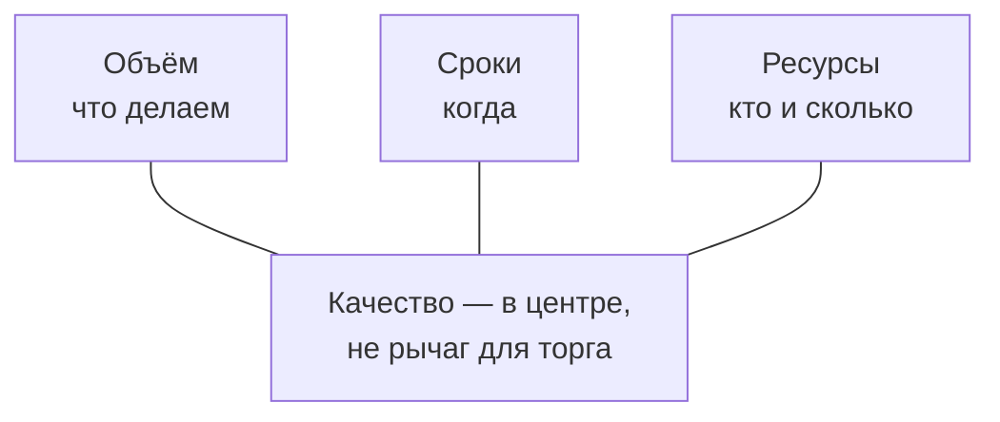
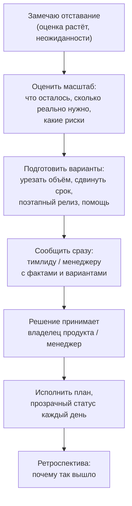
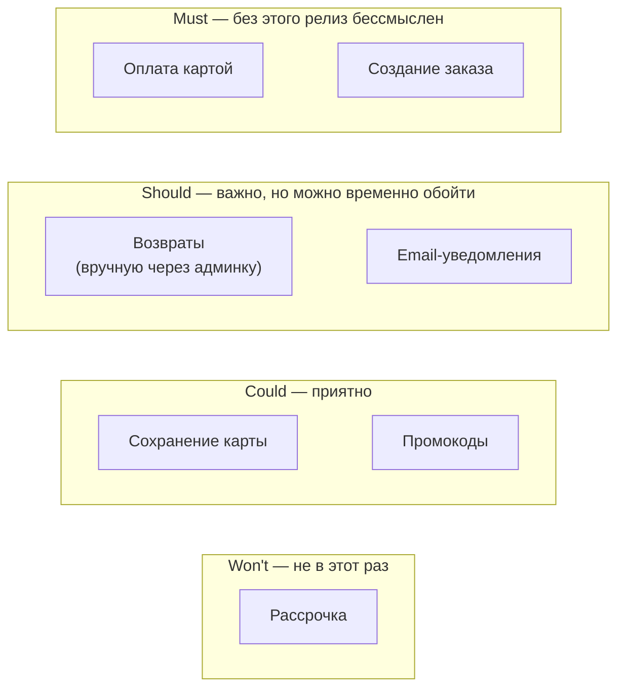

:::tldr
- Главное правило: **сообщить рано**. Проблема, о которой узнали за 2 недели, — управляемый риск; за день до срока — провал и потеря доверия.
- **Железный треугольник**: объём (scope) — сроки — ресурсы, качество в центре. Если срок фиксирован, меняют **объём**: MVP, отложенные «nice to have», поэтапный релиз. Добавить людей в горящий проект обычно **не помогает** (закон Брукса).
- Не жертвуйте молча **качеством**: отказ от тестов и ревью ради срока приводит к багам в продакшене и ещё большим задержкам. Если срезаете — осознанно, записав долг.
- Приоритизация: **MoSCoW** (Must, Should, Could, Won't), вертикальные срезы (сквозная фича с минимумом функций лучше, чем идеальный один слой), feature flags для выпуска частями.
- Приходить к менеджеру не с проблемой, а с **вариантами**: «успеваем X к сроку, или всё — к +1 неделе, или всё к сроку без Y».
- После — **ретроспектива без поиска виноватых**: почему ошиблись в оценке, что изменить в процессе.
:::

## Железный треугольник



Если одна сторона зафиксирована (дата релиза объявлена клиентам), меняется другая. Самый эффективный рычаг — **объём**: сроки часто внешние, ресурсы быстро не добавить.

:::warning Закон Брукса
«Добавление людей в опаздывающий проект только увеличивает задержку». Новым людям нужно время на погружение, опытные отвлекаются на объяснения, растут коммуникационные издержки (n·(n-1)/2 каналов). Помогает, только если работа хорошо делится и новички уже знакомы с кодом.
:::

## Алгоритм действий



### 1. Оценить масштаб честно

- Что **осталось** сделать (разбить на задачи и переоценить)?
- Какие **неизвестные** остались? Что может ещё пойти не так?
- Какова реальная скорость по факту последних дней, а не по плану?

### 2. Подготовить варианты

| Вариант | Пример |
|---|---|
| Урезать объём (MVP) | Экспорт только в CSV, Excel — в следующем релизе |
| Упростить решение | Отчёт генерируется синхронно с ограничением 10 000 строк; асинхронная генерация — потом |
| Поэтапный релиз | Функция включается для 10% пользователей (feature flag), остальное — после доработки |
| Сдвинуть срок | Вся фича — на неделю позже |
| Ручной процесс вместо автоматизации | Возвраты первое время обрабатывает поддержка через админку |
| Помощь | Коллега, знакомый с модулем, берёт интеграционные тесты |

### 3. Сообщить с вариантами

```text Пример сообщения
«К пятнице не успеваем полностью: интеграция с платёжным шлюзом заняла на 3 дня больше —
их тестовая среда не поддерживала возвраты, выясняли с поддержкой.

Варианты:
1) К пятнице — оплата картой без возвратов (возвраты вручную через админку), возвраты — к среде.
2) Всё целиком — к среде.
3) К пятнице всё, но без автотестов на возвраты — не рекомендую, это деньги клиентов.

Я бы выбрал вариант 1. Что скажете?»
```

Хорошее сообщение: **факты** (что случилось), **причина** (без оправданий и обвинений), **варианты** с последствиями, **рекомендация**. Решение по приоритетам принимает тот, кто отвечает за продукт, — ваша задача дать ему информацию.

## MoSCoW: что обязательно



**Вертикальный срез**: лучше рабочая сквозная функциональность с минимумом возможностей (UI → API → БД → интеграция), чем идеально сделанный слой API без интеграции. Так ценность появляется раньше, а интеграционные риски вскрываются в начале.

## Чем нельзя жертвовать молча

- **Тестами на критичную логику** (деньги, данные, безопасность): баг в продакшене обойдётся дороже, чем сдвиг срока.
- **Ревью**: можно ускорить (синхронное ревью в паре), но не пропустить для рискованного кода.
- **Миграциями данных и обратной совместимостью**: откатить сломанные данные трудно.
- **Мониторингом новой функции**: если что-то пойдёт не так, нужно узнать об этом раньше пользователей.

Если что-то всё же срезали — это **осознанный технический долг**: задача в трекере с описанием и сроком, согласованная с менеджером.

## Как не допускать горящих дедлайнов

- **Декомпозиция и ранняя интеграция**: самое рискованное — в начале (spike по неизвестной интеграции в первый день, а не в последний).
- **Прозрачность прогресса**: ежедневный статус с рисками, burndown, а не «на 90% готово» неделю подряд.
- **Буфер** на неопределённость в оценках, особенно для задач с внешними зависимостями.
- **Ограничение WIP**: доделывать начатое, а не начинать новое; переключения между задачами съедают время.
- **Защита фокуса**: срочные запросы со стороны — через тимлида, а не напрямую разработчику.

## Вопросы на засыпку

:::qa Стоит ли работать по ночам и выходным, чтобы успеть?
Как разовая мера в исключительной ситуации — возможно, осознанно и по договорённости. Как система — нет: усталость резко увеличивает число ошибок, приводит к выгоранию и маскирует проблемы планирования (менеджмент не видит реальной ёмкости команды). Лучше честно пересмотреть объём.
:::

:::qa Менеджер настаивает: «сделай к сроку, как хочешь». Что делать?
Письменно зафиксировать риски и компромиссы («к сроку без автотестов на возвраты; риск — ошибки в деньгах клиентов; предлагаю закрыть долг в следующем спринте»). Сделать максимум безопасным способом, выпустить за feature flag, если возможно. При серьёзных рисках (безопасность, потеря данных) — эскалировать тимлиду.
:::

:::qa Как говорить о задержке, если виноват я сам (плохо оценил)?
Так же — рано и с вариантами. Признать ошибку коротко, без самобичевания и оправданий («я не учёл миграцию данных»), сосредоточиться на плане. На ретро — разобрать, как оценивать точнее. Честность и раннее предупреждение укрепляют доверие; попытки скрыть до последнего — разрушают.
:::

:::qa Что обсуждать на ретроспективе после сорванного срока?
Факты без поиска виноватых (blameless): где оценка разошлась с реальностью и почему, какие риски можно было увидеть раньше, как их сигнализировали, что изменить (spike для интеграций, буферы, раннее информирование). Результат — 1–3 конкретных действия с ответственными.
:::

## Итог

Когда не успеваете — сообщайте рано, приходите с фактами и вариантами, а решение по объёму оставляйте владельцу продукта. Меняйте объём (MVP, этапы, feature flags), а не качество критичных частей; если что-то срезали — фиксируйте как долг. Предотвращайте такие ситуации ранним снятием рисков, прозрачным статусом и честными оценками, а после — проводите ретроспективу без поиска виноватых.
