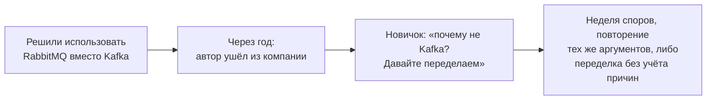
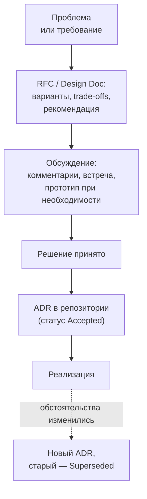
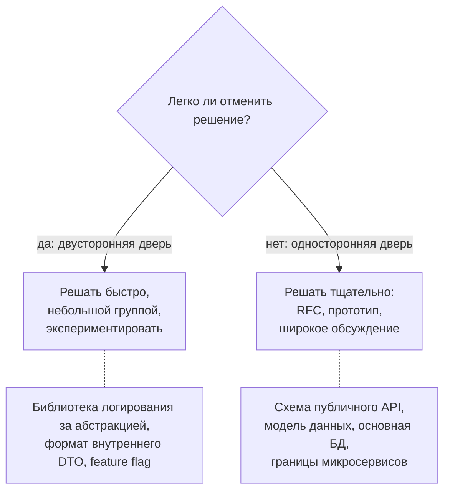

:::tldr
- Архитектурные решения (выбор БД, брокера, способа интеграции, границ сервисов) **дорого менять** — их принимают осознанно, обсуждают и **документируют**.
- **RFC / Design Doc** — документ **до** решения: проблема, контекст, варианты с плюсами и минусами, рекомендация. Цель — собрать обратную связь и принять решение. Для крупных изменений.
- **ADR (Architecture Decision Record)** — короткая запись **принятого** решения: контекст, решение, последствия, статус. Хранится **рядом с кодом** (`docs/adr/0007-use-postgresql-outbox.md`), не редактируется — при смене решения создаётся новый ADR, помечающий старый как **Superseded**.
- ADR отвечает на вопрос новичка через год: **«почему сделано именно так?»** — и предотвращает бесконечные повторные споры.
- Хорошие решения: сформулированная **проблема** и **критерии**, несколько **реальных** вариантов (включая «ничего не делать»), явные **trade-offs**, **обратимость** (двусторонняя дверь — решать быстро, односторонняя — тщательно), принцип **«disagree and commit»**.
:::

## Зачем документировать решения



Код показывает, **что** сделано. Комментарии — **как** работает. Но **почему** выбран именно этот путь, какие альтернативы рассматривались и какие ограничения были — теряется, если это не записать.

## Процесс: от проблемы до ADR



Не каждое решение требует RFC. Масштаб процесса соответствует цене ошибки:

| Решение | Процесс |
|---|---|
| Имя класса, структура метода | Ревью кода |
| Библиотека для маппинга, подход к валидации | Обсуждение в PR или короткий ADR |
| Выбор брокера сообщений, новой БД, схема аутентификации | RFC + обсуждение + ADR |
| Разделение монолита, смена облака | RFC, прототип, согласование с архитектурным комитетом, ADR |

## Обратимость решения



Подход Amazon (Джефф Безос): большинство решений — двусторонние двери, и медлить с ними — тоже ошибка. Тщательный процесс нужен для необратимых.

## Шаблон RFC / Design Doc

```markdown docs/rfc/0012-order-events.md
# RFC-0012: Публикация событий заказов для других сервисов

Автор: Анна К. · Статус: На обсуждении · Обсуждение до: 15.10

## Проблема
Сервисы доставки и аналитики опрашивают API заказов каждые 30 секунд (40% нагрузки на orders-api),
изменения приходят с задержкой, а при сбое опроса события теряются.

## Цели и не-цели
Цели: доставка изменений заказов за < 5 с, без потерь, без опроса.
Не цели: event sourcing, замена API заказов.

## Варианты
### A. Outbox + RabbitMQ (уже используется в компании)
+ Команда знает RabbitMQ, есть мониторинг. + Гарантия доставки через outbox.
− Нет повторного чтения истории для аналитики.
### B. Outbox + Kafka
+ Хранение истории, повторное чтение, высокая пропускная способность.
− Новый компонент в инфраструктуре: эксплуатация, обучение, стоимость.
### C. Change Data Capture (Debezium)
+ Не нужны изменения в коде сервиса. − Публикуются изменения таблиц, а не доменные события; связность со схемой БД.
### D. Ничего не менять
− Нагрузка и задержки растут вместе с числом потребителей.

## Рекомендация
Вариант A: соответствует текущим объёмам (~50 событий/с), не требует новой инфраструктуры.
Для аналитики — отдельный потребитель, складывающий события в хранилище.

## Риски и открытые вопросы
Если объёмы вырастут в 10+ раз — пересмотреть (переход на Kafka возможен, контракты событий не изменятся).
```

## Шаблон ADR (формат Майкла Найгарда)

```markdown docs/adr/0007-publish-order-events-via-outbox-rabbitmq.md
# 7. Публикация событий заказов через Outbox и RabbitMQ

Дата: 2025-10-16
Статус: Accepted (заменяет частично ADR-0003 «Интеграция через опрос API»)

## Контекст
Потребители опрашивают API заказов, что создаёт 40% нагрузки и задержки до 30 секунд.
Нужна надёжная доставка изменений за < 5 с. В компании уже эксплуатируется RabbitMQ.
Подробное сравнение вариантов — RFC-0012.

## Решение
Сервис заказов публикует доменные события (OrderPlaced, OrderPaid, OrderShipped)
через Transactional Outbox в exchange `orders.events` RabbitMQ.
Контракты событий версионируются, лежат в пакете Shop.Orders.Contracts.

## Последствия
+ Потребители получают изменения быстро, без опроса; нагрузка на API снижается.
+ Гарантия at-least-once: потребители обязаны быть идемпотентными.
− Нет повторного чтения истории: аналитике нужен отдельный архив событий.
− Новая таблица outbox и фоновый процесс в сервисе заказов — нужно мониторить отставание.
```

Хранение: папка `docs/adr` в репозитории, номера по порядку, Markdown. Изменения ADR проходят **ревью в PR**, как код. Инструменты: `adr-tools`, Log4brains (сайт из ADR). В ADR записывают и решения **не делать** что-то — это тоже ценно.

## Как договариваться

- **Сначала проблема, потом решение**: согласуйте, что именно решаете и по каким **критериям** сравниваете (стоимость, скорость разработки, надёжность, экспертиза команды). Половина споров — из-за разного понимания проблемы.
- **Аргументы, а не авторитет**: данные, замеры, прототипы, опыт эксплуатации. «В Netflix так делают» — не аргумент без учёта масштаба и контекста.
- **Честные trade-offs**: у любого варианта есть минусы; документ, где у рекомендуемого варианта нет минусов, вызывает недоверие.
- **Асинхронное обсуждение** (комментарии к документу) + короткая встреча для спорных вопросов. Дайте время подумать тем, кто не любит спорить на встречах.
- **Кто принимает решение** — должно быть понятно заранее (техлид, архитектор, команда консенсусом). Консенсус не означает единогласия.
- **Disagree and commit**: высказал несогласие, оно выслушано и записано — после решения поддерживаешь его в работе, не саботируешь.

## Вопросы на засыпку

:::qa Чем ADR отличается от обычной документации?
Документация описывает текущее состояние системы и меняется вместе с ней. ADR — неизменяемый журнал решений в момент их принятия, с контекстом того времени. Решение изменилось — добавляется новая запись, а старая остаётся как история: видно, почему и когда подход поменялся.
:::

:::qa Решение оказалось неудачным. Что делать с ADR?
Создать новый ADR с новым решением, где описано, что изменилось в контексте или что узнали, а старому поставить статус «Superseded by ADR-00XX». Это нормальная эволюция: решение было разумным при тогдашних знаниях. Такая история предотвращает повторение ошибки.
:::

:::qa Как Middle-разработчику участвовать в архитектурных решениях?
Писать RFC и ADR для решений в своей зоне (выбор подхода к кэшированию, интеграции), комментировать чужие RFC с конкретными вопросами о рисках и эксплуатации, делать прототипы и замеры для обоснования, приносить проблемы с данными. Умение ясно изложить варианты и trade-offs письменно — ключевой навык на пути к Senior.
:::

:::qa Что делать, если решение принимается без обсуждения «сверху»?
Спросить о контексте и причинах (часто есть ограничения, которых вы не видите), изложить риски письменно и конструктивно, предложить задокументировать решение в ADR — это полезно всем. Если риски серьёзные — эскалировать с данными. После решения — disagree and commit.
:::

## Итог

Архитектурные решения дорого менять, поэтому их принимают осознанно: RFC для обсуждения вариантов и trade-offs до решения, ADR для короткой неизменяемой записи принятого решения рядом с кодом. Масштаб процесса зависит от обратимости решения. Договаривайтесь через согласование проблемы и критериев, данные и прототипы, прозрачный порядок принятия решений и принцип «disagree and commit».
