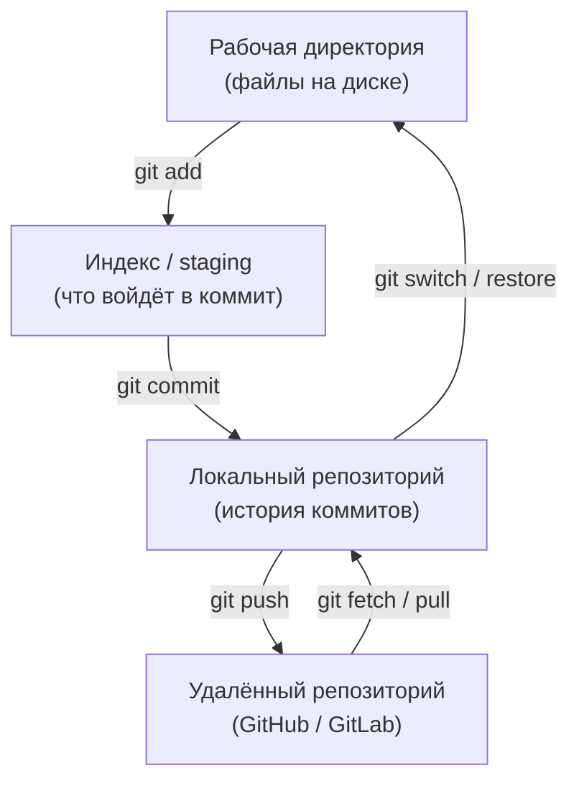
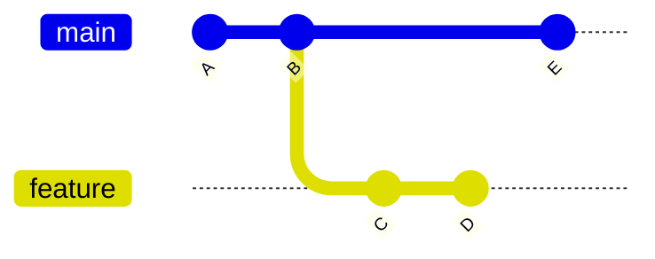
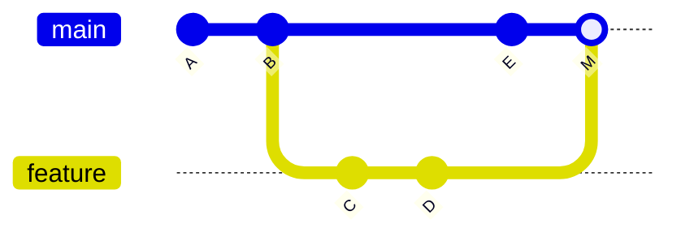
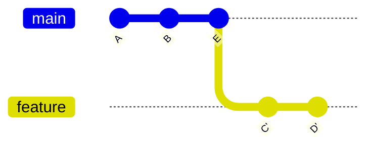
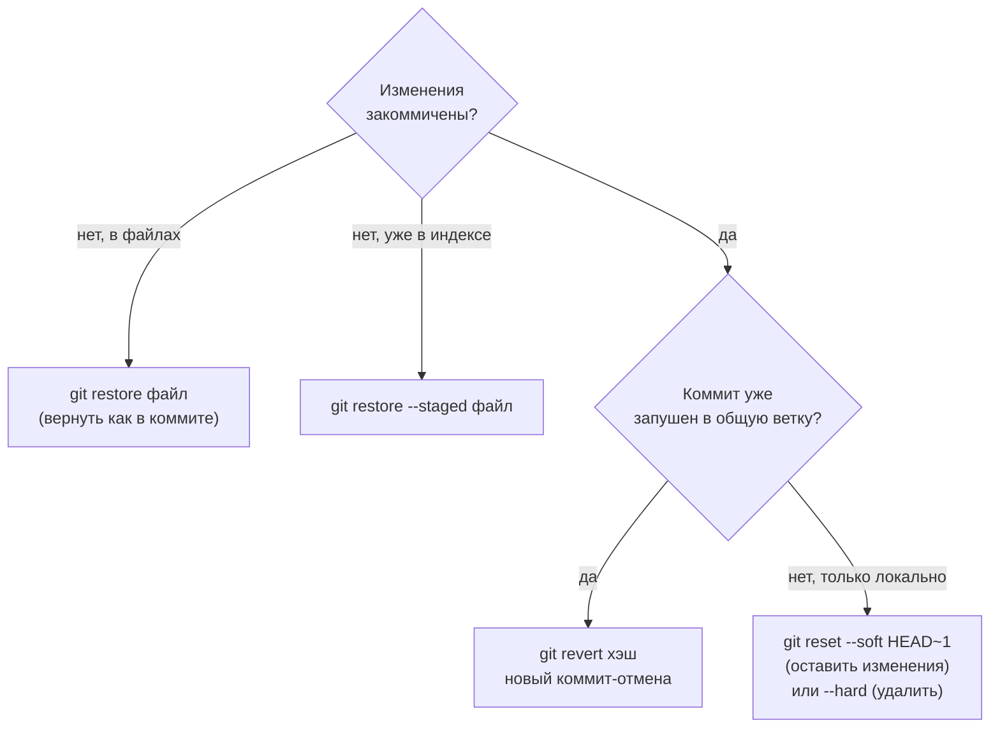

:::tldr
- **Git** — распределённая система контроля версий: у каждого разработчика полная копия истории. Три области: **рабочая директория** → `git add` → **индекс** (staging) → `git commit` → **локальный репозиторий** → `git push` → **удалённый** (GitHub, GitLab).
- **Коммит** — снимок состояния проекта с автором, сообщением и ссылкой на родителя. **Ветка** — подвижный указатель на коммит; `HEAD` — где вы сейчас.
- **Merge** объединяет ветки, сохраняя историю (может создать merge-коммит). **Rebase** переносит ваши коммиты поверх другой ветки — линейная история, но **переписывает** коммиты: не делайте rebase общих веток.
- **Конфликт** — обе ветки изменили одни и те же строки; Git помечает их `<<<<<<<`, `=======`, `>>>>>>>`, вы выбираете итог, затем `add` и продолжаете.
- Отмена: **`git revert`** — новый коммит, отменяющий старый (безопасно для общей истории); **`git reset`** — переместить ветку назад (только для локальных коммитов); `git restore` — отменить изменения в файлах; `git stash` — временно убрать незакоммиченное.
:::

## Три области и поток изменений



```bash Базовый цикл
git clone https://github.com/company/shop.git
cd shop
git switch -c feature/SHOP-123-cart-discount   # новая ветка от текущей
# ... правим код ...
git status                     # что изменено
git diff                       # сами изменения
git add src/Cart.cs            # добавить в индекс (git add -p — по частям)
git commit -m "feat(cart): add percentage discount"
git push -u origin feature/SHOP-123-cart-discount
# → открыть Pull Request на GitHub
```

## Коммиты и ветки



- Каждый коммит знает своего родителя — история образует граф.
- `main` и `feature` — просто имена, указывающие на последние коммиты своих линий. Создание ветки мгновенно и дёшево.
- Хороший коммит: одно логическое изменение, понятное сообщение в повелительном наклонении («add», «fix»), собирается и проходит тесты.

## Merge и rebase





```bash
# Merge: влить main в свою ветку (или ветку в main)
git switch feature
git merge main

# Rebase: переставить свои коммиты поверх свежего main
git fetch origin
git rebase origin/main
git push --force-with-lease      # история ветки изменилась — нужен force (только для СВОЕЙ ветки)
```

| | Merge | Rebase |
|---|---|---|
| История | Нелинейная, честная | Линейная, «чистая» |
| Коммиты | Сохраняются как есть | **Пересоздаются** (новые хэши) |
| Безопасно для общих веток | Да | **Нет** |
| Конфликты | Разрешаются один раз | Могут повторяться для каждого коммита |

## Конфликты

```text Файл с конфликтом
public decimal Discount()
{
<<<<<<< HEAD
    return Total * 0.10m;          // ваша версия
=======
    return Math.Min(Total * 0.15m, 500_000m);   // версия из main
>>>>>>> main
}
```

```bash Разрешение
# 1. Отредактировать файл: оставить правильный итог, удалить маркеры
# 2. Проверить сборку и тесты
git add src/Cart.cs
git commit                        # при merge
git rebase --continue             # при rebase
git merge --abort                 # или отменить слияние целиком
```

Как уменьшить конфликты: маленькие короткоживущие ветки, частое обновление из `main`, не смешивать рефакторинг и форматирование с функциональными изменениями.

## Отмена изменений



```bash
git stash                  # убрать незакоммиченное «в карман»
git switch main            # ... сделать срочное исправление ...
git switch -               # вернуться
git stash pop              # вернуть изменения

git commit --amend         # исправить последний (ещё не запушенный) коммит
git log --oneline --graph  # история
git reflog                 # журнал перемещений HEAD — спасение «потерянных» коммитов
```

:::warning Опасные команды
`git reset --hard` и `git push --force` уничтожают изменения. `--force` в общую ветку переписывает историю коллег. Используйте `--force-with-lease` и только для своих веток; для отмены в общей истории — `git revert`.
:::

## Pull Request

1. Ветка от актуального `main`, небольшое законченное изменение.
2. Push и PR с описанием: что, зачем, как проверить.
3. CI (сборка, тесты, линтеры) должен быть зелёным.
4. Ревью коллег, исправления новыми коммитами.
5. Слияние (чаще всего **squash merge** — один коммит в `main`), удаление ветки.

## .gitignore

```text
bin/
obj/
.vs/
*.user
appsettings.Development.local.json
.env
```

Не коммитьте артефакты сборки, настройки IDE и **секреты**. Создать стандартный файл: `dotnet new gitignore`.

## Вопросы на засыпку

:::qa Чем git fetch отличается от git pull?
`fetch` скачивает новые коммиты и обновляет удалённые ветки (`origin/main`), не трогая ваши файлы и локальные ветки. `pull` = `fetch` + `merge` (или `rebase` с `--rebase`) в текущую ветку. `fetch` безопасен всегда — можно посмотреть изменения перед слиянием.
:::

:::qa Что такое detached HEAD?
Состояние, когда `HEAD` указывает напрямую на коммит, а не на ветку (например, после `git checkout <хэш>`). Новые коммиты не принадлежат никакой ветке и могут «потеряться». Чтобы сохранить работу — создайте ветку: `git switch -c new-branch`.
:::

:::qa Что делать, если случайно закоммитил пароль?
Считать его скомпрометированным и немедленно сменить (ротировать). Удаление коммита или переписывание истории — вторично: копии могли уже разойтись. Затем добавить файл в `.gitignore` и настроить сканирование секретов.
:::

:::qa Зачем squash merge?
Все промежуточные коммиты ветки («fix typo», «review fixes») объединяются в один осмысленный коммит в `main`. История основной ветки читаема: один PR — один коммит, его легко найти и откатить через `revert`.
:::

## Итог

Git хранит историю как граф коммитов, ветки — лёгкие указатели. Рабочий цикл: ветка → изменения → `add` → `commit` → `push` → Pull Request → ревью → слияние. Merge сохраняет историю, rebase делает её линейной, но переписывает коммиты — только для своих веток. Конфликты разрешайте вручную с проверкой сборки, отменяйте общие изменения через `revert` и никогда не коммитьте секреты.
