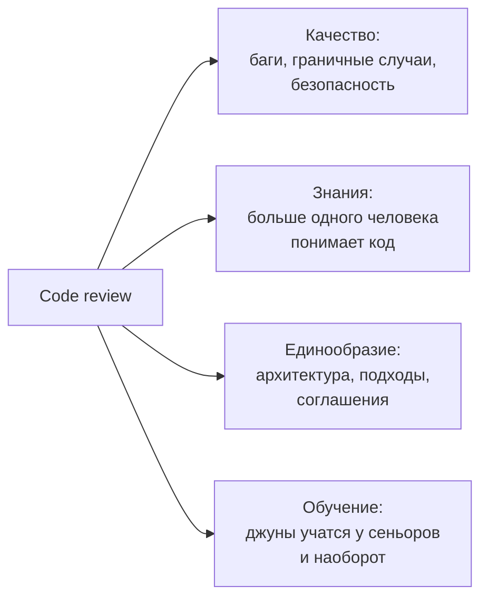
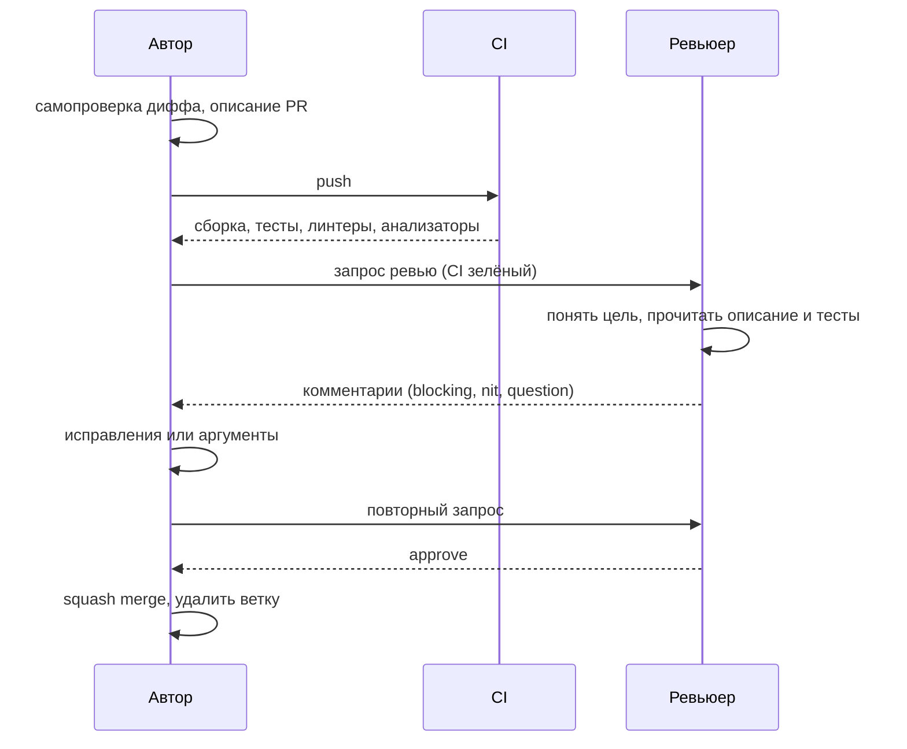
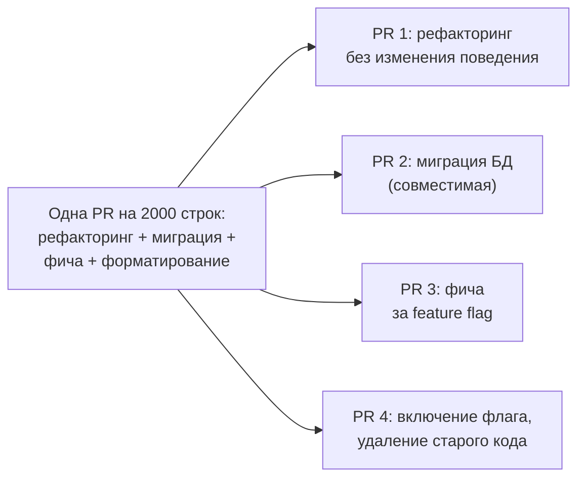
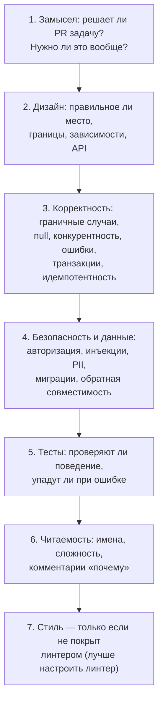

:::tldr
- **Цели ревью** (по убыванию важности): найти **ошибки и риски** (корректность, безопасность, данные, производительность), сохранить **поддерживаемость** кода, **распространить знания** (bus factor), выровнять стиль и подходы. Ревью — не экзамен и не место для самоутверждения.
- **Автору**: маленькие PR (**до ~400 строк** изменений), одна цель на PR, понятное описание (**что, зачем, как проверить**), самопроверка перед отправкой, зелёный CI. Рефакторинг — отдельным PR.
- **Ревьюеру**: быстро реагировать (в пределах рабочего дня), сначала понять **замысел**, затем проверять **дизайн → корректность → тесты → читаемость**; стиль — дело линтера. Комментировать **код, а не человека**, объяснять **почему**, предлагать варианты, помечать **важность** (blocking / nit / question).
- **Принимать замечания**: не воспринимать лично, уточнять непонятное, соглашаться или аргументированно возражать; спор из 3+ сообщений — перейти в звонок. Итог обсуждения — фиксировать в PR.
- Автоматизировать всё, что можно: форматирование (`dotnet format`, `.editorconfig`), анализаторы, тесты, покрытие, сканеры безопасности — люди должны думать о том, чего не увидит машина.
:::

## Зачем нужен code review



Исследования (Microsoft, Google) показывают: главная польза ревью — не столько пойманные баги, сколько **распространение знаний** и улучшение **понятности** кода. Если ревьюер не понял код без объяснений автора, будущий читатель не поймёт тем более.

## Жизненный цикл pull request



## Автору: как сделать PR удобным для ревью

**Размер.** Качество ревью резко падает после нескольких сотен строк: 50 строк внимательно проверят, 2000 строк — пролистают и одобрят. Крупную задачу разбивайте:



**Описание PR** — шаблон:

```markdown Шаблон описания
## Что и зачем
Добавлен повтор отправки уведомлений при таймауте SMS-провайдера. Задача: SHOP-1432.
Раньше при таймауте уведомление терялось (~0,3% заказов, см. дашборд).

## Как сделано
- Polly retry: 3 попытки с экспоненциальной задержкой и jitter
- Идемпотентность через ключ `notification_id` (провайдер поддерживает)

## Как проверить
- Unit-тесты `NotificationSenderTests`
- Локально: `docker compose up sms-mock` и `SMS_MOCK_TIMEOUT=1`

## На что обратить внимание
Не уверен в значении таймаута (5 с) — провайдер не документирует SLA.
```

**Самопроверка**: прочитайте свой дифф в интерфейсе PR до отправки — половина замечаний (забытый `Console.WriteLine`, закомментированный код, лишний файл) найдётся сразу. Оставьте комментарии к неочевидным местам заранее.

## Ревьюеру: на что смотреть



Специфичные для .NET вопросы на ревью:
- `async void`, `.Result`/`.Wait()`, забытый `CancellationToken`, `ConfigureAwait` в библиотеках.
- `IDisposable` без `using`, `HttpClient` через `new` вместо `IHttpClientFactory`.
- N+1 запросы в EF Core, отсутствие `AsNoTracking` для чтения, загрузка всей таблицы в память (`ToList()` до `Where`).
- Время жизни сервисов в DI (scoped внутри singleton), captive dependencies.
- Миграции: блокирующие изменения больших таблиц, совместимость со старой версией кода при rolling deployment.
- Логи: чувствительные данные, уровни, структурированность.

## Как писать комментарии

| Плохо | Хорошо |
|---|---|
| «Это неправильно» | «Здесь при пустом `items` будет `InvalidOperationException` из `First()`. Может, `FirstOrDefault` + проверка?» |
| «Зачем ты так сделал?» | «Помоги понять: почему здесь отдельный запрос, а не `Include`? Может, я упускаю причину» |
| «Переделай на паттерн Стратегия» | «nit: если типов станет больше трёх, switch разрастётся — можно вынести в стратегии. Сейчас не блокирует» |
| 20 комментариев про пробелы | Настроить `.editorconfig` и `dotnet format` в CI |

**Conventional Comments** — префиксы, снимающие неопределённость:

```text
blocking: SQL собирается конкатенацией — риск инъекции, нужен параметр.
suggestion: можно заменить цикл на `GroupBy`, будет короче.
question: этот метод вызывается из фоновой задачи? Тогда нужен свой scope.
nit: опечатка в имени переменной `recieved`.
praise: отличный тест на граничный случай с часовыми поясами!
```

Отмечайте и хорошее (**praise**): ревью, состоящее только из претензий, демотивирует, а похвала закрепляет правильные практики.

## Как принимать замечания

- **Код ≠ личность.** Замечание к коду — не оценка вас как специалиста.
- Предполагайте **добрые намерения**: краткий комментарий часто написан в спешке, а не со злостью.
- Не понимаете замечание — **спросите**. Не согласны — **аргументируйте** (данные, ссылки, компромиссы), а не «мне так нравится».
- Переписка затянулась (3+ итерации) — **созвонитесь** на 10 минут и запишите итог в PR.
- Замечание справедливое, но не в рамках задачи — заведите **задачу на потом** и напишите ссылку.
- Не исправляйте молча: отвечайте «Исправил в abc123» или «Оставил, потому что…».

## Командные договорённости

| Практика | Зачем |
|---|---|
| SLA на первый ответ (например, 4 рабочих часа) | PR не висят днями, нет переключений контекста |
| 1–2 обязательных approve, CODEOWNERS для критичных частей | Баланс скорости и контроля |
| Автор мержит сам после approve | Ответственность за выкатку у автора |
| Draft PR для раннего обсуждения подхода | Дизайн обсуждается до написания 1000 строк |
| Ротация ревьюеров | Знания распространяются, нет «единственного эксперта» |
| Линтеры, форматтер и анализаторы в CI | Люди не тратят время на стиль |

## Вопросы на засыпку

:::qa Что делать, если ревьюер и автор не могут договориться?
Сначала — синхронный разговор, часто разногласие исчезает при обсуждении контекста. Если нет — решает техлид или тот, кто отвечает за эту часть кода, либо принимается командная договорённость (ADR, style guide). Важно не блокировать PR бесконечно: вопросы вкуса — не повод для отказа.
:::

:::qa Должен ли джун ревьюить код сеньора?
Да. Джун учится, читая хороший код, и задаёт вопросы, которые выявляют неочевидные места («почему здесь lock?»). Если джун не понял код, возможно, код стоит упростить или прокомментировать. Approve джуна может не быть достаточным, но его ревью полезно.
:::

:::qa Как ревьюить, когда PR огромный и срочный?
Честно сказать, что качественное ревью невозможно, и договориться: проверить критичные части (безопасность, миграции, публичные API), попросить разбить в следующий раз. Одобрять не читая — худший вариант: создаётся ложное чувство проверенности.
:::

:::qa Pair programming заменяет code review?
Частично: при парном программировании ревью происходит непрерывно, и многие команды считают это достаточным. Но второй взгляд «со стороны», не погружённый в решение, находит другие проблемы — поэтому для критичного кода ревью часто сохраняют.
:::

## Итог

Code review — инструмент качества и распространения знаний. Автор отвечает за маленький, понятный, самопроверенный PR с описанием; ревьюер — за быстрый ответ и проверку от замысла к деталям, с доброжелательными комментариями, помеченными по важности. Стиль автоматизируйте, разногласия решайте разговором, а итоги фиксируйте.
