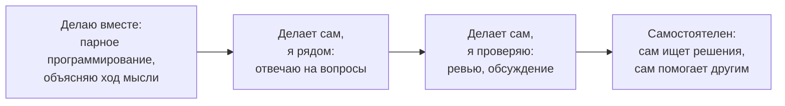
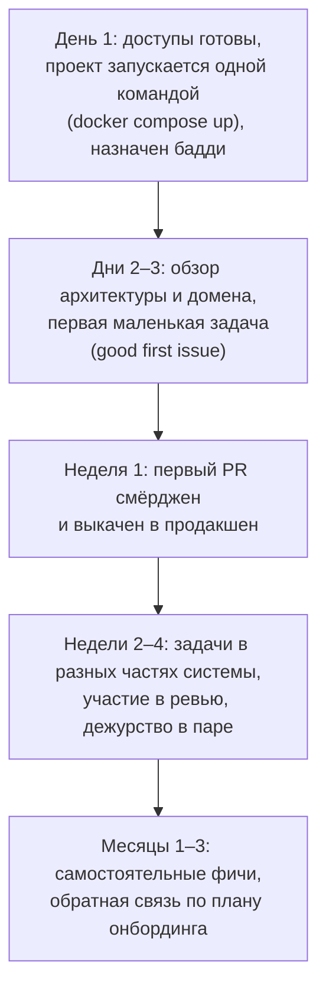
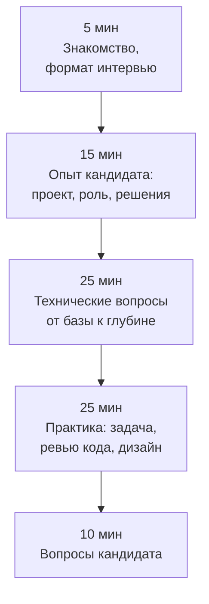
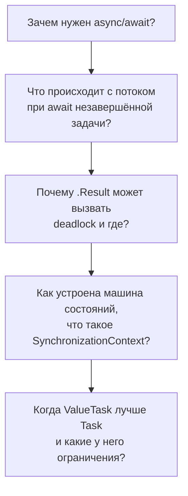

:::tldr
- **Менторинг** — помочь человеку стать **самостоятельным**, а не решать задачи за него. Главные инструменты: **вопросы вместо готовых ответов**, задачи **растущей сложности**, регулярная **обратная связь**, **парное программирование**, безопасная атмосфера, где не стыдно спросить.
- **Онбординг**: подготовленное окружение (запуск проекта одной командой), первая задача в первые дни (маленькая, реальная, до продакшена), «бадди» для вопросов, карта системы и глоссарий домена.
- **Обратная связь**: конкретно, по поведению и результату, своевременно, наедине для критики (модель **SBI**: Situation → Behavior → Impact).
- **Собеседование**: оценивать **навыки для работы**, а не эрудицию; **структурированный** формат (одинаковые вопросы и критерии для всех кандидатов), уровни вопросов «от простого к глубокому», практическая задача, близкая к реальной работе, **уважение** к кандидату.
- Middle-разработчик обычно уже участвует в собеседованиях: технический блок, code review задачи, оценка по чек-листу — и **письменный** фидбек сразу после интервью.
:::

## Цель менторинга



Модель ситуационного лидерства: степень помощи зависит от **компетентности в конкретной задаче**, а не от «уровня» человека. Опытный джун в знакомом CRUD — самостоятелен, но в первой задаче с очередями ему нужна плотная поддержка.

## Практики менторинга

**Вопросы вместо ответов.**

| Вместо | Попробуйте |
|---|---|
| «Тут нужен `Include`» | «Сколько SQL-запросов выполнится на этой странице? Как это проверить?» |
| «Сделай через `IHttpClientFactory`» | «Что будет с сокетами, если этот метод вызвать 10 000 раз?» |
| Исправить код за джуна | «Давай вместе запустим отладчик и посмотрим, что приходит в метод» |

Готовый ответ решает одну задачу, правильный вопрос учит **способу** решения.

**Правило 15–30 минут**: договоритесь, что джун пробует сам ограниченное время, а затем **обязательно** спрашивает, описав, что уже попробовал. Это защищает и от «застрял на 2 дня молча», и от «спрашиваю, не подумав».

**Задачи с растущей сложностью**: исправление бага → маленькая фича в знакомом модуле → фича через несколько слоёв → задача с неопределённостью → участие в дизайне.

**Регулярные встречи 1:1** (30 минут раз в 1–2 недели): что получилось, где было трудно, что хочется изучить, обратная связь в обе стороны.

## Онбординг



Что помогает: README «как запустить», карта сервисов и их ответственности, глоссарий домена (что такое «отгрузка», «резерв»), записи архитектурных решений (ADR), список «кого о чём спрашивать». Каждый новичок улучшает документацию онбординга по итогам — свежий взгляд лучше всего видит пробелы.

## Обратная связь: модель SBI

```text
Situation: «Вчера на ревью PR с экспортом заказов…»
Behavior:  «…ты исправил все замечания, но не ответил в комментариях, что именно изменилось»
Impact:    «…и мне пришлось заново просматривать весь дифф — это заняло час вместо 10 минут.
            Можешь в следующий раз отвечать „Исправил в коммите X“?»
```

- **Конкретно**: не «ты невнимательный», а что именно произошло.
- **Своевременно**: через день, а не на ревью через полгода.
- **Хвалить** публично и конкретно, **критиковать** — наедине.
- Спрашивать обратную связь **о себе**: «насколько понятно я объясняю?».

## Технические собеседования



### Принципы хорошего собеседования

- **Структурированность**: список тем и критериев оценки заранее, одинаковый для всех кандидатов на позицию. Снижает влияние симпатии и «первого впечатления».
- **Релевантность**: проверять то, что нужно в работе. Для бэкенда на .NET — асинхронность, EF Core, дизайн API, SQL, отладка проблем, а не разворот бинарного дерева на доске.
- **Глубина по спирали**: начать с простого и углубляться, пока кандидат уверенно отвечает. Так видна граница знаний.
- **Практика, близкая к реальности**: code review фрагмента с проблемами, небольшая задача в IDE, обсуждение дизайна сервиса.
- **Уважение**: кандидат нервничает; помогайте наводящими вопросами, не спорьте и не демонстрируйте превосходство. Кандидат оценивает компанию так же, как вы его.

### Пример спирального вопроса



Junior уверенно отвечает на 1–2, Middle — на 3–4, Senior — на всё с примерами из практики.

### Задача: code review

```csharp Найдите проблемы (типичное задание на интервью)
public class OrderService
{
    private static readonly HttpClient _client = new HttpClient();
    private readonly AppDbContext _db;

    public async void SendOrders()
    {
        var orders = _db.Orders.ToList().Where(o => o.Status == "New");
        foreach (var order in orders)
        {
            var customer = _db.Customers.First(c => c.Id == order.CustomerId);
            var result = _client.PostAsync("http://erp/api/orders?key=SECRET123",
                new StringContent(JsonSerializer.Serialize(order))).Result;
            order.Status = "Sent";
        }
        _db.SaveChanges();
    }
}
```

:::qa Что должен найти кандидат уровня Middle?
`async void` (исключения теряются, нельзя дождаться); `ToList()` до `Where` — загрузка всей таблицы; N+1 запрос за клиентами (и переменная `customer` не используется); `.Result` — блокировка потока и риск deadlock; не проверяется статус ответа; секрет в URL и коде, HTTP без TLS; нет `CancellationToken`; нет идемпотентности — при сбое на середине часть заказов уйдёт повторно; один `SaveChanges` в конце — при исключении статус не сохранится у уже отправленных; строковые статусы вместо enum; нет логирования.
:::

### Оценка и фидбек

| Критерий | 1 — нет | 2 — частично | 3 — уверенно | 4 — глубоко |
|---|---|---|---|---|
| C# и .NET runtime | | | | |
| ASP.NET Core, API | | | | |
| Данные: EF Core, SQL | | | | |
| Дизайн и архитектура | | | | |
| Качество кода, ревью | | | | |
| Коммуникация, рассуждение вслух | | | | |

Пишите фидбек **сразу** после интервью, с **фактами** («не смог объяснить разницу между `IEnumerable` и `IQueryable`, после подсказки понял»), а не впечатлениями («слабый»). Решение принимайте независимо от других интервьюеров, до обсуждения — чтобы не было группового влияния.

## Вопросы на засыпку

:::qa Джун постоянно просит помощи по мелочам. Что делать?
Выяснить причину: неуверенность, непонимание задачи, отсутствие знаний о том, где искать. Договориться о правиле «сначала 20 минут сам, потом вопрос с описанием, что пробовал», научить инструментам (отладчик, логи, поиск по коду), разбирать вопросы группами в фиксированное время. Поощрять самостоятельные находки.
:::

:::qa Как дать негативную обратную связь, не демотивируя?
Говорить о поведении и последствиях, а не о личности (SBI), наедине и своевременно, предложить конкретное изменение и помощь, проверить понимание («как ты это видишь?»). Соотношение позитивного и негативного должно быть в пользу позитивного — тогда критика воспринимается как забота, а не атака.
:::

:::qa Кандидат не знает ответа на вопрос. Как себя вести?
Дать подсказку или переформулировать, посмотреть, как он рассуждает; перейти к другой теме, не задерживаясь. Ответ «не знаю, но предполагаю, что… и проверил бы так…» — хороший сигнал. Не пытаться «завалить»: цель — найти, что человек умеет.
:::

:::qa Зачем Middle-разработчику менторить?
Объясняя, лучше понимаешь сам (эффект обучения через преподавание), растёт влияние на команду и качество кодовой базы, повышается bus factor. Менторинг и участие в найме — обычные ожидания на пути к Senior.
:::

## Итог

Менторинг — это путь к самостоятельности подопечного: вопросы вместо готовых ответов, задачи растущей сложности, регулярная конкретная обратная связь и безопасная атмосфера. Хорошее собеседование — структурированное, релевантное работе, с углублением по спирали и практической задачей, проводится с уважением и заканчивается письменным фидбеком на основе фактов.
